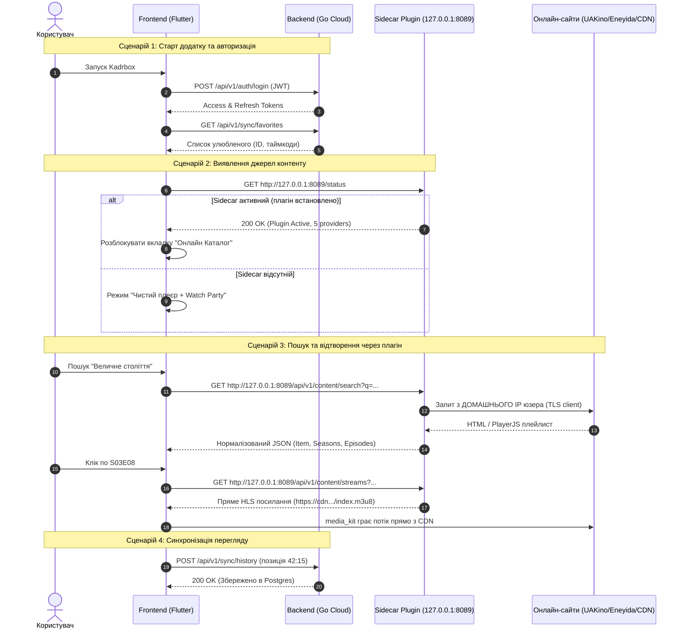

# 📖 АРХІТЕКТУРНИЙ ТА МІГРАЦІЙНИЙ ПЛАН: KADRBOX / OXIDE FILM V2
> **Технічна специфікація та посібник з реалізації для розробників та автономних AI-агентів**  
> **Дата оновлення:** 2026-10-05  
> **Гілка розробки:** `dev`  
> **Незмінний архів v1 (резервна копія):** `release-v1`  
> **Цільова платформа клієнта:** Windows (Microsoft Store / MSIX), Android, Linux, iOS  
> **Цільова інфраструктура сервера:** Docker / Portainer / Linux VPS  

---

## 📑 ЗМІСТ
1. [Стратегічна візія та бізнес-вимоги](#1-стратегічна-візія-та-бізнес-вимоги)
2. [Глобальна архітектура системи](#2-глобальна-архітектура-системи)
3. [Поточний стан кодової бази та виявлені розриви](#3-поточний-стан-кодової-бази-та-виявлені-розриви)
4. [Детальна специфікація підсистеми BACKEND](#4-детальна-специфікація-підсистеми-backend)
5. [Детальна специфікація підсистеми PLUGINS (Sidecar & Lampac)](#5-детальна-специфікація-підсистеми-plugins-sidecar--lampac)
6. [Детальна специфікація підсистеми FRONTEND (Flutter)](#6-детальна-специфікація-підсистеми-frontend-flutter)
7. [API Контракти та протоколи обміну даними](#7-api-контракти-та-протоколи-обміну-даними)
8. [Комплаєнс із правилами Microsoft Store](#8-комплаєнс-із-правилами-microsoft-store)
9. [Покроковий чекліст для субагентів](#9-покроковий-чекліст-для-субагентів)

---

## 1. СТРАТЕГІЧНА ВІЗІЯ ТА БІЗНЕС-ВИМОГИ

### 1.1. Проблема v1 (Монолітний сервер зі скраперами)
У першій версії всі запити на скрапінг піратських сайтів (UAKino, Eneyida, Lavakino, UASerials, Bandera) проходили через центральний Go-сервер (`server/`):
1. **Ризик масового блокування IP (Rate Limits / Cloudflare / DDoS-Guard):** Якщо 1000+ користувачів одночасно шукають контент, усі запити йдуть з однієї IP-адреси VPS. Сайти миттєво блокують сервер.
2. **Неможливість потрапити в Microsoft Store:** Сервер, який хостить і проксує контент сірих онлайн-кінотеатрів, автоматично дискваліфікує клієнтський додаток під час модерації.
3. **Вигорання від скрапінгу:** Одноосібна підтримка 5 парсерів, чий DOM постійно змінюється, забирає весь ресурс розробника.

### 1.2. Рішення v2 (Повний поділ відповідальності)
Система розділяється на три **абсолютно ізольовані** сутності:

```
[ FRONTEND ] ────(1) Auth / Sync / Watch Party WebSockets ────► [ BACKEND ]
(Чистий плеєр)                                                   (Хмарний сервер)
     │                                                          - Не знає про сайти
     │ (2) Локальні запити на 127.0.0.1 або Lampac URL          - Не проксує контент
     ▼                                                          - Легальний 100%
[ PLUGINS ]
 ├── sidecar-scrapers (Локальний Go-демон на ПК користувача, 15MB RAM)
 └── lampac-bridge (Клієнт до публічного/домашнього Lampac сервера)
```

- **Backend** стає на 100% "білим", легальним та дешевим у підтримці. Жодного байта медіатрафіку чи парсерів.
- **Frontend** з коробки є "соціальним медіаплеєром для особистих файлів та спільного перегляду". Дозволений у Microsoft Store.
- **Plugins** — відокремлені модулі. Якщо користувач бажає дивитися онлайн-каталоги, він підключає плагін, і всі парсери працюють **з домашнього IP користувача**.

---

## 2. ГЛОБАЛЬНА АРХІТЕКТУРА СИСТЕМИ

### 2.1. Потокова діаграма взаємодії



---

## 3. ПОТОЧНИЙ СТАН КОДОВОЇ БАЗИ ТА ВИЯВЛЕНІ РОЗРИВИ

У коміті `refactor: reorganize project into frontend, backend, and plugins` файли було переміщено у відповідні каталоги:
- `server/` → `backend/`
- `lib/`, `test/`, `windows/`, `android/` → `frontend/`
- `server/internal/provider/`, `server/internal/search/` → `plugins/sidecar-scrapers/internal/`

### ⚠️ Критичні розриви, які потребують виправлення прямо зараз:

### 3.1. У каталозі `backend/`:
1. **Зламані імпорти в `backend/cmd/api/main.go`**:
   - `main.go:18` імпортує `"github.com/edhases/oxide-server/internal/provider"`. Папку `provider` винесено до плагінів. Цей імпорт ламає компіляцію.
   - `main.go:180-250` створює `provider.NewRegistry()`, конфігурує клієнти UAKino/Eneyida та передає реєстр у `NewContentHandler`.
2. **Зламані імпорти та роутинг у `backend/internal/transport/http/router.go`**:
   - `router.go` очікує параметр `contentH *ContentHandler` у конструкторі.
   - `router.go:105-112` монтує роути `r.Route("/content", ...)`.
3. **Зайві файли скрапінгу в `backend/internal/transport/http/`**:
   - `content_handler.go`, `content_cache.go`, `content_validation.go`, `catalogue_handler.go`, `search_pipeline.go` все ще лежать у `backend/internal/transport/http/`. Вони більше не потрібні бекенду.
4. **Зламані тести `backend/internal/transport/http/`**:
   - `content_validation_coverage_test.go`, `content_cache_test.go`, `content_handler_coverage_test.go` посилаються на провайдери і контент-хендлер.

### 3.2. У каталозі `plugins/sidecar-scrapers/`:
1. **Відсутність `go.mod`**: Каталог не є самостійним Go-модулем.
2. **Відсутність точки входу**: Немає `cmd/sidecar/main.go`. Парсери є бібліотекою без виконуваного файлу.
3. **Залежність від пакетів `backend/internal/domain`**: Код у `plugins/sidecar-scrapers/internal/provider/` імпортує `"github.com/edhases/oxide-server/internal/domain"`. Плагін повинен або мати власні копії моделей домену, або посилатися на спільний контракт.

### 3.3. У каталозі `frontend/`:
1. **Жорстка прив'язка до одного сервера**:
   - `frontend/lib/data/providers/server_backed_provider.dart` наразі поєднує запити до бекенду (профіль/історія) із запитами на пошук/стріми контенту за тією ж базовою адресою.
   - Потрібно розвести: `AuthService` / `SyncService` ходять до віддаленого `backend`, а `ContentRepository` ходить до підключеного плагіна (Sidecar або Lampac).
2. **Шляхи та оточення**:
   - Flutter-проєкт тепер запускається з робочої директорії `frontend/`.

---

## 4. ДЕТАЛЬНА СПЕЦИФІКАЦІЯ ПІДСИСТЕМИ BACKEND

### 4.1. Призначення
Легкий хмарний бекенд для аутентифікації користувачів, безпечного збереження персональних даних, синхронізації історії переглядів між пристроями та координації кімнат спільного перегляду (Watch Party).

### 4.2. Файлова структура `backend/`
```
backend/
├── cmd/
│   ├── api/
│   │   └── main.go                  # Точка входу сервера (Auth, Sync, Hub)
│   └── migrate_pb/                  # Утиліта міграцій БД
├── config/
│   └── config.go                    # Завантаження змінних оточення (.env)
├── internal/
│   ├── auth/                        # JWT токени, хешування паролів, OAuth (Google, TG, Discord)
│   ├── domain/                      # Сутності: User, Session, Favorite, History, Room
│   ├── email/                       # Відправка пошти підтвердження (Resend)
│   ├── logging/                     # Структуроване логування
│   ├── repository/
│   │   ├── postgres/                # PostgreSQL драйвер (users, favorites, history)
│   │   └── redis/                   # Redis драйвер (сесії, індекси, pub/sub)
│   └── transport/
│       ├── http/
│       │   ├── auth_handler.go      # Обробка логіну, реєстрації, профілю
│       │   ├── sync_handler.go      # Обробка історії та улюбленого
│       │   ├── watch_party_handler.go # Видача тікетів до кімнат
│       │   ├── router.go            # Чистий роутинг Chi (БЕЗ /content)
│       │   └── middleware/          # JWT auth, CORS, RateLimit, Recover
│       └── ws/
│           ├── client.go            # WebSocket клієнт Watch Party
│           └── hub.go               # Redis Pub/Sub координатор кімнат
├── docker-compose.yml               # Стек: Go App + Postgres + Redis
├── Dockerfile                       # Чистий мінімальний multistage build
├── go.mod                           # Go 1.23+ модуль "github.com/edhases/oxide-server"
└── go.sum
```

### 4.3. Необхідні правки коду в `backend/`:
1. **У `backend/cmd/api/main.go`**:
   - Прибрати рядок `import "github.com/edhases/oxide-server/internal/provider"`.
   - Прибрати створення змінної `contentH := transporthttp.NewContentHandler(...)`.
   - Видалити рядки конфігурації `UPSTREAM_HOST_ALLOWLIST` та провайдерів.
   - Оновити виклик `transporthttp.NewRouter(authH, syncH, watchH, hub, ...)`.
2. **У `backend/internal/transport/http/router.go`**:
   - Прибрати параметр `contentH *ContentHandler` з сигнатури `NewRouter`.
   - Повністю видалити блок `r.Route("/content", ...)`.
   - Видалити застарілі файли `content_handler.go`, `content_cache.go`, `content_validation.go`, `catalogue_handler.go`, `search_pipeline.go`.
3. **У тестах `backend/internal/transport/http/`**:
   - Видалити або вимкнути тести, які тестували видалені ручки `/content/*`. Залишити тести на auth, sync, rate limiting та security.

---

## 5. ДЕТАЛЬНА СПЕЦИФІКАЦІЯ ПІДСИСТЕМИ PLUGINS (SIDECAR & LAMPAC)

### 5.1. Призначення `plugins/sidecar-scrapers`
Локальний автономний мікросервіс, який:
- Запускається на `127.0.0.1:8089` на пристрої користувача.
- Здійснює всі мережеві запити до онлайн-сайтів напряму з домашнього IP користувача.
- Надає стандартизований REST API для каталогу, пошуку та парсингу стрімів.

### 5.2. Файлова структура `plugins/sidecar-scrapers/`
```
plugins/sidecar-scrapers/
├── cmd/
│   └── sidecar/
│       └── main.go                  # Точка входу: слухає 127.0.0.1:8089
├── internal/
│   ├── domain/                      # Локальні моделі: MediaItem, Season, Episode, StreamSource
│   ├── provider/                    # Скрапери: uakino, eneyida, uaserials, lavakino, bandera
│   ├── search/                      # Локальний пошуковий агрегатор
│   └── transport/
│       └── http/
│           ├── handler.go           # Обробники /api/v1/content/*
│           └── router.go            # Легкий роутер Chi для локального сервера
├── go.mod                           # Go модуль "github.com/edhases/oxide-sidecar"
├── go.sum
└── Makefile                         # Команди збірки під Windows (.exe), Linux, macOS
```

### 5.3. Специфікація `plugins/lampac-bridge`
У майбутньому цей модуль представлятиме собою адаптер (або у Flutter, або у Go), який транслює стандартні запити клієнта до публічного чи домашнього інстансу Lampac:
- `GET /tracks` → список доступних балансерів
- `GET /online` → отримання стрімів з Lampac API

---

## 6. ДЕТАЛЬНА СПЕЦИФІКАЦІЯ ПІДСИСТЕМИ FRONTEND (FLUTTER)

### 6.1. Призначення
Кроссплатформений користувацький інтерфейс на базі Flutter. Головна вимога — **відповідність правилам Microsoft Store** (Clean App Principle).

### 6.2. Архітектура джерел даних у Flutter
```
lib/
├── core/
│   ├── di/                          # GetIt ін'єкція залежностей
│   ├── network/                     # Dio HTTP клієнти (Окремо для Cloud, окремо для Plugin)
│   └── router/                      # GoRouter маршрутизація
├── data/
│   ├── cloud/                       # Клієнт до віддаленого Backend (Auth, Sync, Watch Party)
│   │   ├── auth_service.dart
│   │   └── sync_service.dart
│   ├── plugins/                     # Плагінний рушій
│   │   ├── plugin_manager.dart      # Виявлення та перевірка доступності плагінів
│   │   ├── sidecar_client.dart      # Спілкування з 127.0.0.1:8089 (Sidecar)
│   │   └── lampac_client.dart       # Спілкування з Lampac сервером
│   └── repositories/
│       └── content_repository.dart  # Єдиний репозиторій контенту для UI
├── domain/                          # Чисті Dart моделі (MediaItem, StreamSource тощо)
└── presentation/
    ├── pages/
    │   ├── home/                    # Головна (Локальні файли / Продовжити перегляд / Тренди)
    │   ├── player/                  # Плеєр на media_kit
    │   ├── party/                   # Кімната Watch Party
    │   ├── settings/                # Налаштування (включно з Plugin Manager)
    │   └── details/                 # Деталі фільму/серіалу
    └── widgets/
```

### 6.3. Логіка роботи `PluginManager`:
1. При старті перевіряється наявність увімкнених джерел у `SharedPreferences`.
2. Якщо користувач вказав "Авто-детект Sidecar": Flutter надсилає пінг на `http://127.0.0.1:8089/status`.
   - Якщо відповідь `200`: реєструється провайдер `SidecarContentSource`.
3. Якщо користувач додав "Lampac URL": реєструється провайдер `LampacContentSource`.
4. Якщо жодне джерело не підключене:
   - Додаток пропонує відкрити будь-який локальний відеофайл з диска (MP4/MKV) або ввести URL прямого потоку.
   - Працює вкладка Watch Party (можна вставити файл і дивитися разом).
   - В інтерфейсі немає жодних згадок про сайти з піратським контентом.

---

## 7. API КОНТРАКТИ ТА ПРОТОКОЛИ ОБМІНУ ДАНИМИ

### 7.1. Cloud Backend REST API (Порт 8080)
Всі запити вимагають заголовок `Authorization: Bearer <JWT>` (крім публічних auth).

#### `POST /api/v1/sync/history`
Збереження прогресу перегляду:
```json
// Request Body
{
  "item_id": "custom-uuid-or-url",
  "title": "Інтерстеллар",
  "poster_url": "https://...",
  "season": 1,
  "episode": 3,
  "position_seconds": 1240,
  "duration_seconds": 3600
}
```

#### `GET /api/v1/sync/continue-watching`
Отримання списку незавершених переглядів для домашнього екрану.

#### `POST /api/v1/watch-party/tickets`
Отримання одноразового тікета для входу в WebSocket кімнату.

---

### 7.2. Plugin / Sidecar REST API (Порт 8089)
Запити локальні, не вимагають хмарної авторизації.

#### `GET /status`
Перевірка працездатності sidecar-демона.
```json
// Response 200 OK
{
  "status": "ok",
  "version": "2.0.0",
  "active_providers": ["uakino", "eneyida", "uaserials", "lavakino", "bandera"]
}
```

#### `GET /api/v1/content/search?q={query}`
Пошук контенту:
```json
// Response 200 OK
{
  "results": [
    {
      "id": "https://uakino.biz/...",
      "provider": "uakino",
      "title": "Дюна: Частина друга",
      "original_title": "Dune: Part Two",
      "year": 2024,
      "poster_url": "https://...",
      "type": "movie"
    }
  ]
}
```

#### `GET /api/v1/content/streams?provider={p}&url={url}&season={s}&episode={e}`
Отримання прямих потоків для плеєра:
```json
// Response 200 OK
{
  "streams": [
    {
      "url": "https://calypso.tortuga.tw/hls/.../index.m3u8",
      "quality": "1080p",
      "voiceover": "Цікава Ідея",
      "headers": {
        "Referer": "https://tortuga.tw/",
        "User-Agent": "Mozilla/5.0..."
      }
    }
  ]
}
```

---

## 8. КОМПЛАЄНС ІЗ ПРАВИЛАМИ MICROSOFT STORE

Щоб успішно пройти модерацію в Microsoft Store (та Google Play/App Store):

1. **Офіційна класифікація:**  
   Додаток заявляється як **"Local & Network Media Player with Social Watch Party"** (Медіаплеєр локальних та мережевих відео з кімнатами спільного перегляду).
2. **Скріншоти та банери для лістингу магазину:**  
   - Використовувати виключно відкриті або ліцензовані відео (Big Buck Bunny, Tears of Steel, Sintel тощо) або демонстрацію локальних MP4-файлів.
   - Жодних скріншотів голлівудських блокбастерів чи піратських брендів.
3. **Опис застосунку:**  
   *"Kadrbox дозволяє відтворювати будь-які відеоформати з вашого ПК чи домашнього сервера, синхронізувати прогрес між пристроями та дивитися відео разом з друзями в реальному часі."*
4. **Підтримка плагінів:**  
   Реалізується за принципом **Kodi / VLC**: механізм підключення кастомних джерел існує як відкритий API-інтерфейс, заповнення якого є виключною відповідальністю кінцевого користувача.

---

## 9. ПОКРОКОВИЙ ЧЕКЛІСТ ДЛЯ СУБАГЕНТІВ

### 🔹 Завдання для Агента 1 (Backend Engineer):
- [ ] Відкрити `backend/cmd/api/main.go`: видалити всі імпорти та ініціалізацію з видаленого пакету `internal/provider`.
- [ ] Очистити `backend/internal/transport/http/router.go`: прибрати маршрути `/api/v1/content/*`.
- [ ] Видалити застарілі контент-хендлери в `backend/internal/transport/http/` (`content_handler.go`, `content_cache.go`, `content_validation.go`, `catalogue_handler.go`, `search_pipeline.go`).
- [ ] Видалити тести видалених контент-хендлерів з `backend/internal/transport/http/`.
- [ ] Перевірити `go test ./...` у папці `backend/` — усі тести мають проходити.
- [ ] Перевірити `go build ./cmd/api` у папці `backend/` — бінарник успішно збирається.

### 🔹 Завдання для Агента 2 (Plugins & Sidecar Engineer):
- [ ] Перейти в `plugins/sidecar-scrapers/`.
- [ ] Виконати `go mod init github.com/edhases/oxide-sidecar`.
- [ ] Скопіювати необхідні визначення з `domain` (MediaItem, Season, Episode, StreamSource) у локальний пакет `plugins/sidecar-scrapers/internal/domain/`.
- [ ] Створити `plugins/sidecar-scrapers/cmd/sidecar/main.go` — HTTP-сервер на Chi/net/http (порт 8089).
- [ ] Реалізувати роутер та обробники для `/status` та `/api/v1/content/*`.
- [ ] Перевірити збірку `go build ./cmd/sidecar` та тести `go test ./...`.

### 🔹 Завдання для Агента 3 (Frontend / Flutter Engineer):
- [ ] Оновити залежності у `frontend/pubspec.yaml` за потреби.
- [ ] Реалізувати `PluginManager` у `frontend/lib/data/plugins/`.
- [ ] Відокремити виклики `AuthService` (до `backend`) від `ContentRepository` (до `PluginManager`).
- [ ] Додати в екран налаштувань UI для виявлення Sidecar (`http://127.0.0.1:8089`) та введення Lampac URL.
- [ ] Перевірити проходження тестів: `cd frontend && flutter test`.
