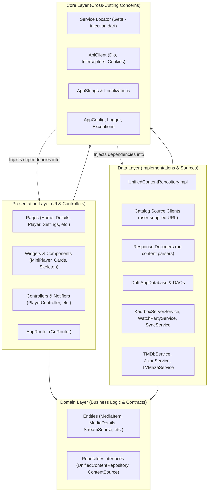
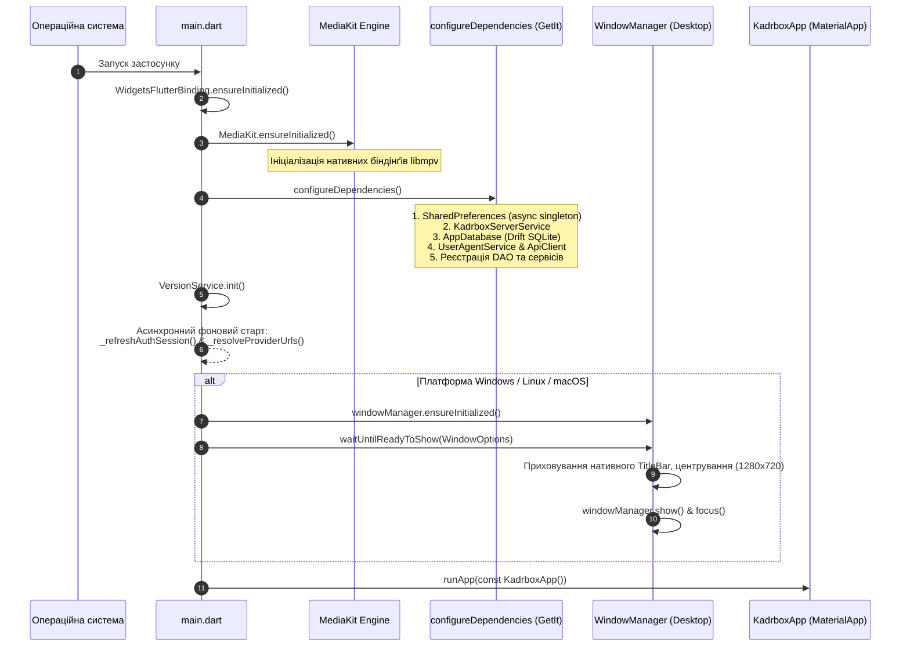
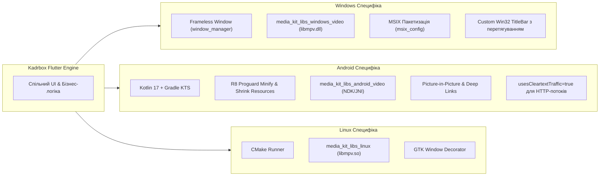
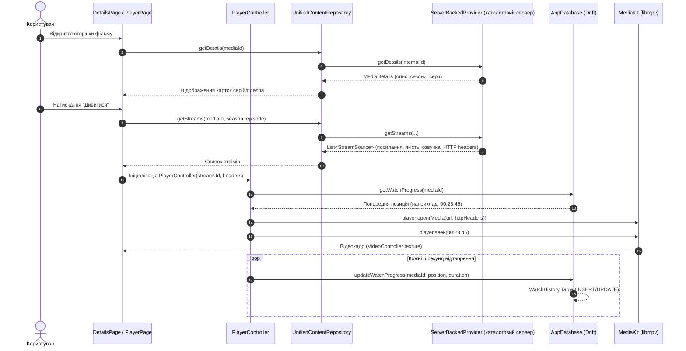

# 01. Архітектура платформи та технологічний стек (Tech Stack & Architecture)

Цей документ містить вичерпний технічний аналіз глобальної архітектури, технологічного стеку, конфігурацій цільових платформ та підсистем ініціалізації клієнтського застосунку **Kadrbox**.

> **Історичний документ.** Описані нижче шари контенту відповідають архітектурі до розділення
> відповідальності. Актуальна модель: застосунок не містить жодного контентного парсера і
> звертається лише до **каталогового сервера**, URL якого користувач вводить сам.
> Див. [`../MIGRATION_REPORT.md`](../MIGRATION_REPORT.md).

---

## 1. Призначення проєкту та концептуальний огляд

**Kadrbox** — це кросплатформний медіаплеєр (Windows, Android, Linux), який відтворює відео, синхронізує прогрес перегляду між пристроями та забезпечує спільний перегляд (Watch Party). Каталог і потоки застосунок отримує з **каталогового сервера**, адресу якого користувач вводить сам.

### Ключові цілі та концепція:
- **Каталог на вибір користувача**: застосунк не знає жодного джерела контенту. Він спілкується з каталоговим сервером за URL, який користувач вводить у налаштуваннях, і надає його відповіді UI як єдиний каталог.
- **Offline-First & Local-First**: Повноцінна функціональність без обов'язкової наявності облікового запису або постійної мережі — локальна база даних зберігає історію, закладки, кеш метаданих та завантаження.
- **Хмарна синхронізація та Watch Party**: авторизація на Go-бекенді для синхронізації між пристроями та синхронного спільного перегляду (Watch Party) через WebSocket-хаб.
- **Високопродуктивне кросплатформне відеовідтворення**: Використання нативного рушія libmpv через екосистему `media_kit`, що гарантує плавне апаратне декодування, підтримку різноманітних аудіо/відео кодеків, вибір субтитрів, аудіодоріжок і зміну якості потоку.

---

## 2. Детальний опис технологічного стеку

У файлі [`pubspec.yaml`](../frontend/pubspec.yaml) визначено залежності застосунку. Проєкт розроблено на **Flutter** з версією Dart SDK `^3.10.7`.

### Зведена таблиця ключових залежностей:

| Категорія | Пакет / Залежність | Версія | Призначення та обґрунтування вибору |
| :--- | :--- | :--- | :--- |
| **State Management** | `flutter_bloc` / `equatable` | `^9.0.0` / `^2.0.7` | Декларативне управління складними станами, бізнес-логікою та порівнянням імутабельних об'єктів без бойлерплейту. |
| **State / MVVM** | `ChangeNotifier` (Flutter Foundation) | SDK | Легковаговий реактивний шар для сервісів та контролерів (`PlayerController`, `SettingsService`, `HistoryService`). |
| **Navigation** | `go_router` | `^17.1.0` | Декларативна маршрутизація, ShellRoute для персистентного MiniPlayer/оверлеїв, підтримка Deep Links (OAuth2 redirect `kadrbox://auth`). |
| **Dependency Injection**| `get_it` / `injectable` | `^9.2.0` / `^2.5.0` | Service Locator патерн для реєстрації та отримання сінглтонів/фабрик, спрощує тестування та інверсію керування (IoC). |
| **Локальна БД** | `drift` / `drift_flutter` / `sqlite3_flutter_libs` | `^2.31.0` / `^0.2.4` / `^0.5.28` | Реактивна тип-безпечна ORM поверх SQLite з автогенерацією коду, міграціями (схема v9) та підтримкою потоків (Streams). |
| **Мережевий стек** | `dio` / `dio_smart_retry` / `dio_cookie_manager` / `cookie_jar` | `^5.8.0` / `^7.0.1` / `^3.1.1` / `^4.0.8` | Потужний HTTP-клієнт з перехоплювачами (interceptors), автоматичним повтором запитів (retry exponential backoff), збереженням сесійних cookie. |
| **JSON Decoding** | `dart:convert` | SDK | Розбір відповідей каталогового сервера. Контентних парсерів у застосунку немає. |
| **Медіаплеєр** | `media_kit` / `media_kit_video` / `media_kit_libs_*` | `^1.1.11` / `^2.0.1` / `^1.0.9+` | Нативне відтворення аудіо та відео через libmpv з апаратним прискоренням на Windows, Android, Linux. |
| **Catalog Source Client** | `dio` (окремий екземпляр) | `^5.8.0` | HTTP-клієнт до каталогового сервера, адресу якого вводить користувач. |
| **YouTube** | `youtube_player_iframe` / `youtube_explode_dart` | `^5.1.2` / `^3.0.5` | ToS-сумісний плеєр вбудовування YouTube або пряме вилучення потокових URL на Desktop. |
| **Backend & Auth** | `dio` / `shared_preferences` | `^5.8.0` / `^2.3.4` | Комунікація з Go-бекендом Kadrbox (REST + WebSocket) та з каталоговим сервером користувача, персистенція токенів сесії та налаштувань. |
| **P2P Зв'язок** | `peerdart` (перевизначення `flutter_webrtc`) | `^0.5.6` | WebRTC P2P DataChannels для синхронізації відтворення у кімнатах Watch Party без навантаження на сервер. |
| **Зовнішні API** | `tmdb_api` | `^2.1.7` | Збагачення метаданих (актори, постери високої якості, рейтинги TMDB/IMDb, опис). |
| **Пошук & Алгоритми**| `fuzzywuzzy` | `^1.2.0` | Нечіткий рядочний пошук (Fuzzy String Matching / Levenshtein distance) для корекції помилок введення та розумного пошуку. |
| **Desktop Shell** | `window_manager` | `^0.5.1` | Кастомізація вікна на Windows/Linux (Frameless вікно, власний Titlebar, мінімізація, повноекранний режим). |
| **Системні утиліти** | `wakelock_plus`, `path_provider`, `permission_handler`, `open_filex`, `file_picker` | Різні | Запобігання засинанню екрана під час перегляду, робота з локальною файловою системою, системні дозволи, завантаження файлів. |
| **UI Ефекти** | `shimmer`, `skeletonizer`, `cached_network_image` | Різні | Кешування мережевих зображень на диску та skeleton-завантажувачі. |

---

## 3. Глобальна архітектура (Clean Architecture)

Проєкт спроєктовано за принципами **Clean Architecture** (Чиста архітектура) та розподілено на чітко розмежовані шари залежностей. Напрямок залежностей суворо слідує правилу: зовнішні шари залежать від внутрішніх, а шар предметної області (**Domain**) є повністю незалежним від фреймворків чи деталей реалізації.



### 3.1. Domain Layer (`lib/domain/`)
Серце бізнес-логіки застосунку, позбавлене залежностей від деталей платформи, UI чи конкретних баз даних:
- **Entities** ([`lib/domain/entities/`](../frontend/lib/domain/entities/)):
  - [`MediaItem`](../frontend/lib/domain/entities/media_item.dart): Базова імутабельна модель елемента медіа (id, title, posterUrl, year, rating, type: movie/series/cartoon/anime).
  - [`MediaDetails`](../frontend/lib/domain/entities/media_details.dart): Розширені метадані (опис, актори, режисери, список сезонів та серій).
  - [`StreamSource`](../frontend/lib/domain/entities/stream_source.dart): Модель стрімінгового джерела (direct URL, hls m3u8, якість 1080p/720p, озвучка, субтитри, необхідні HTTP-заголовки Referer/User-Agent).
  - [`ContentFilter`](../frontend/lib/domain/entities/content_filter.dart): Фільтрація каталогу за роками, жанрами, країнами та сортуванням.
- **Repository Contracts** ([`lib/domain/repositories/`](../frontend/lib/domain/repositories/)):
  - [`ContentProvider`](frontend/lib/domain/repositories/content_provider.dart): Абстрактний інтерфейс джерела каталогу (`search`, `getDetails`, `getStreams`, `getPopular`, `getNew`, `getByCategory`). Реалізація — один клієнт до каталогового сервера, URL якого задає користувач.
  - [`UnifiedContentRepository`](../frontend/lib/domain/repositories/unified_content_repository.dart): Фасад для агрегованого пошуку по всіх джерелах одночасно, отримання стрімів та збереження прогресу.

### 3.2. Data Layer (`lib/data/`)
Реалізація інтерфейсів предметної області, взаємодія з локальною базою даних, файловою системою та зовнішнім світом:
- **Sources** ([`lib/data/providers/`](../frontend/lib/data/providers/)):
  - Реалізація `ContentProvider` для каталогового сервера: `ServerBackedProvider` — єдине джерело каталогу, URL якого задає користувач у налаштуваннях.
  - Контентних парсерів у застосунку немає: відповідь сервера розбирається як JSON.
- **Database & DAOs** ([`lib/data/database/`](../frontend/lib/data/database/)):
  - [`AppDatabase`](../frontend/lib/data/database/app_database.dart): Схема SQLite з таблицями `AppSettings`, `EnabledProviders`, `Favorites`, `WatchHistory`, `Downloads`, `SearchHistoryTable`, `StoredMediaItems`.
  - DAOs: [`FavoritesDao`](../frontend/lib/data/database/dao/favorites_dao.dart), [`HistoryDao`](../frontend/lib/data/database/dao/history_dao.dart), [`DownloadsDao`](../frontend/lib/data/database/dao/downloads_dao.dart), [`SearchHistoryDao`](../frontend/lib/data/database/dao/search_history_dao.dart), [`SettingsDao`](../frontend/lib/data/database/dao/settings_dao.dart).
- **Repositories** ([`lib/data/repositories/`](../frontend/lib/data/repositories/)):
  - `UnifiedContentRepositoryImpl`: Поєднує дані каталогового сервера та локальної бази даних у єдиний реактивний потік.
- **Services** ([`lib/data/services/`](../frontend/lib/data/services/)):
  - Мережеві та бізнес-сервіси: `KadrboxServerService`, `AuthService`, `SyncService`, `DownloadService`, `WatchPartyService`, `RecommendationService`, `SmartSearchService`.

### 3.3. Presentation Layer (`lib/presentation/`)
Користувацький інтерфейс, віджети та контролери стану:
- **Pages**: Розбиті за фічами: `home/`, `details/`, `player/`, `search/`, `settings/`, `favorites/`, `history/`, `downloads/`, `stats/`, `watch_party/`, `auth/`.
- **Player Subsystem**: [`PlayerController`](../frontend/lib/presentation/pages/player/player_controller.dart) інкапсулює складний стан плеєра: вибір аудіодоріжки, якість, субтитри, перехід у повноекранний режим, підтримку PiP (Picture-in-Picture), взаємодію з `media_kit`, керування Window Manager для Desktop.
- **Router**: [`AppRouter`](../frontend/lib/presentation/router/app_router.dart) налаштовує `GoRouter` з оверлеєм [`MiniPlayerOverlay`](../frontend/lib/presentation/widgets/player/mini_player_overlay.dart), що дозволяє продовжувати перегляд медіа під час навігації каталогом.
- **Theme**: Підтримка динамічних тем: Світла, Темна та спеціальна **AMOLED** (справжній чорний колір для енергозбереження та контрасту) з можливістю вибору довільного кольору акценту.

### 3.4. Core Layer (`lib/core/`)
Загальні наскрізні модулі:
- **DI**: Реєстрація сервісів через `GetIt` ([`lib/core/di/injection.dart`](../frontend/lib/core/di/injection.dart)).
- **Network**: [`ApiClient`](../frontend/lib/core/network/api_client.dart) з налаштуванням тайм-аутів, пулу сесійних User-Agent, автоматичного підбору заголовка `Accept-Language` та управління Cookie.
- **Config & L10n**: [`AppConfig`](../frontend/lib/core/config/app_config.dart), багатомовність (українська, англійська) в [`AppStrings`](../frontend/lib/core/l10n/app_strings.dart).

---

## 4. Система інверсії керування (DI) та життєвий цикл ініціалізації

У застосунку застосовано патерн **Service Locator** за допомогою бібліотеки `get_it`. Конфігурація зосереджена у [`lib/core/di/injection.dart`](../frontend/lib/core/di/injection.dart).

### 4.1. Послідовність ініціалізації в `main.dart`

Точка входу програми [`lib/main.dart`](../frontend/lib/main.dart) виконує сувору послідовність кроків:



### 4.2. Порядок реєстрації у `configureDependencies()`:
1. **Асинхронні первинні сховища**:
   ```dart
   final prefs = await SharedPreferences.getInstance();
   getIt.registerSingleton<SharedPreferences>(prefs);
   ```
2. **Бекенд та база даних**:
   ```dart
   getIt.registerSingleton<KadrboxServerService>(KadrboxServerService(prefs));
   final database = AppDatabase();
   getIt.registerSingleton<AppDatabase>(database);
   ```
3. **Мережевий шар**:
   ```dart
   getIt.registerLazySingleton<ApiClient>(() => ApiClient());
   ```
4. **Сервіси предметної області та DAOs**:
   - `SettingsService`, `FavoritesService`, `HistoryService`, `DownloadService`, `WatchPartyService`, `TMDbService`, `RecommendationService`.
5. **Джерело каталогу**:
   - Реєструється одне: `ServerBackedProvider`, адреса якого задає користувач.
6. **Уніфікований репозиторій**:
   - `UnifiedContentRepository` зв'язує каталоговий сервер та локальні таблиці Drift.

---

## 5. Кросплатформна специфіка та нативна інтеграція

Застосунок розроблено з урахуванням специфіки трьох ключових операційних систем: **Windows**, **Android** та **Linux**.



### 5.1. Windows (`windows/`)
- **Керування вікном**: Застосунок використовує безрамковий стиль (`TitleBarStyle.hidden`) через пакет `window_manager`. У `windows/runner/main.cpp` створюється вікно розміром 1280x720, після чого Flutter рендерить кастомний віджет [`CustomTitleBar`](../frontend/lib/presentation/widgets/custom_titlebar.dart) з підтримкою перетягування (DragToMoveArea), згортання, розгортання на весь екран та закриття.
- **Відеоядро**: Підключається `media_kit_libs_windows_video`, що містить скомпільовані динамічні бібліотеки `mpv-2.dll` та залежні кодеки FFmpeg.
- **Дистрибуція**: Налаштовано генератор MSIX-пакетів (`msix: ^3.16.1`) у [`pubspec.yaml`](../frontend/pubspec.yaml) з підтримкою локалізацій `en-US`, `uk-UA` та автоматичним підписом сертифікатом.

### 5.2. Android (`android/`)
- **Конфігурація збірки**: `android/app/build.gradle.kts` налаштовано на Java/Kotlin версії 17 (`JavaVersion.VERSION_17`), `minSdk = 21`, `targetSdk = 34`.
- **Оптимізація та безпека**:
  - Увімкнено мініфікацію коду та скорочення ресурсів у релізній збірці:
    ```kotlin
    isMinifyEnabled = true
    isShrinkResources = true
    proguardFiles(getDefaultProguardFile("proguard-android-optimize.txt"), "proguard-rules.pro")
    ```
  - Налаштовано упаковку JNI бібліотек: `useLegacyPackaging = true` для стабільної роботи нативних бібліотек `media_kit` (libmpv) на архітектурах `armeabi-v7a`, `arm64-v8a`, `x86_64`.
- **Маніфест (`AndroidManifest.xml`)**:
  - `android:usesCleartextTraffic="true"`: потрібно для HLS-серверів, які роздають сегменти `.ts` через простий протокол `http://`, зокрема локальних серверів у домашній мережі.
  - `android:supportsPictureInPicture="true"`: Підтримка системного фонового вікна "Картинка в картинці" під час згортання програми.
  - `Deep Linking`:
    ```xml
    <intent-filter android:autoVerify="true">
        <action android:name="android.intent.action.VIEW" />
        <category android:name="android.intent.category.DEFAULT" />
        <category android:name="android.intent.category.BROWSABLE" />
        <data android:scheme="kadrbox" android:host="auth" />
    </intent-filter>
    ```
    Використовується для перехоплення callback-авторизації через сторонні OAuth2 сервіси на Go-бекенді.

### 5.3. Linux (`linux/`)
- **Система збірки**: Використовує `CMakeLists.txt` з інтеграцією стандартного Flutter Linux GTK runner.
- **Залежності відтворення**: `media_kit_libs_linux` динамічно лінкується з системною або вбудованою `libmpv.so`.

---

## 6. Взаємодія компонентів та сценарій перегляду контенту

Нижче наведено комплексну діаграму життєвого циклу взаємодії шарів під час типового сценарію: користувач обирає фільм на головній сторінці, отримує деталі, обирає якість/озвучку та починає відтворення:



---

## 7. Підсумкові висновки архітектури

1. **Модульність та масштабованість**: завдяки патерну `ContentProvider` зміна джерела каталогу не зачіпає ані UI, ані репозиторій — застосунок звертається лише за адресою, яку задав користувач.
2. **Одна точка зміни джерела**: каталог приходить з сервера, URL якого користувач задає сам. Додавання або зміна джерела не потребує жодних змін у застосунку — достатньо іншої адреси в налаштуваннях.
3. **Надійне ядро відтворення**: Вибір `media_kit` (libmpv) замість стандартного `video_player` усуває обмеження платформних кодеків на Desktop та забезпечує повний контроль над HLS-потоками, заголовками запитів та аудіо/субтитрами.
4. **Чистота коду**: Чітке відокремлення шарів (Clean Architecture) з централізованим DI гарантує тестованість, простоту супроводу та швидку адаптацію застосунку до нових операційних систем.
