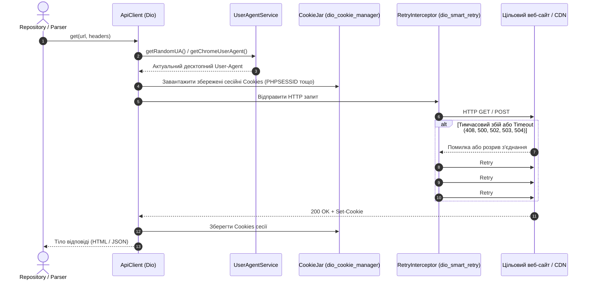
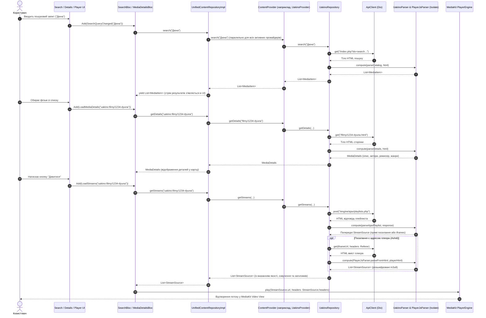

# 02. Джерела даних та механізми парсингу (Data Sources & Parsing)

Цей документ містить вичерпний технічний аналіз шару провайдерів контенту, парсерів та мережевого взаємозв'язку у проєкті **Oxide Film**. Застосунок виконує роль незалежного кросплатформного медіа-агрегатора, що отримує дані безпосередньо з відкритих веб-джерел шляхом динамічного скрапінгу HTML, викликів AJAX-ендпоінтів та розбору конфігурацій медіаплеєрів.

---

## 1. Архітектура шару провайдерів (Data & Providers Architecture)

Архітектура підсистеми побудована з дотриманням принципів **Clean Architecture** та патернів **Repository / Adapter / Registry**:

```mermaid
flowchart TD
    subgraph DomainLayer ["Domain Layer (Контракти та Моделі)"]
        CP[ContentProvider - Interface]
        UCR[UnifiedContentRepository - Interface]
        Entities[MediaItem, MediaDetails, StreamSource, ContentType]
    end

    subgraph DataRegistryLayer ["Реєстрація та Маршрутизація"]
        PR[ProviderRegistry]
        PR -->|Управління списком| CP
        RUM[ResolvedUrlMixin]
        URS[UrlResolverService]
        UAS[UserAgentService]
    end

    subgraph AdaptersLayer ["Provider Adapters (lib/data/providers/)"]
        UaflixP[UaflixProvider] -->|implements| CP
        UakinoP[UakinoProvider] -->|implements| CP
        EneyidaP[EneyidaProvider] -->|implements| CP
        UaserialsP[UaserialsProvider] -->|implements| CP
        YummyP[YummyanimeProvider] -->|implements| CP
        YouTubeP[YouTubeProvider] -->|implements| CP
    end

    subgraph RepositoriesLayer ["Repositories (lib/data/repositories/)"]
        UCRImpl[UnifiedContentRepositoryImpl] -->|делегує виклики| CP
        UaflixR[UaflixRepository]
        UakinoR[UakinoRepository]
        EneyidaR[EneyidaRepository]
        UaserialsR[UaserialsRepository]
        YummyR[YummyAnimeRepository]
        YouTubeR[YouTubeRepository]
    end

    subgraph NetworkAndParsers ["Мережа, Ізоляти та Парсери"]
        AC[ApiClient (Dio + CookieJar + Retry)]
        BS[beautiful_soup_dart]
        PJS[PlayerJsParser]
        Parsers[UaflixParser, UakinoParser, EneyidaParser, UaserialsParser, YummyAnimeParser, YouTubeParser]
    end

    UaflixP --> UaflixR
    UakinoP --> UakinoR
    EneyidaP --> EneyidaR
    UaserialsP --> UaserialsR
    YummyP --> YummyR
    YouTubeP --> YouTubeR

    UaflixR & UakinoR & EneyidaR & UaserialsR & YummyR & YouTubeR --> AC
    UaflixR & UakinoR & EneyidaR & UaserialsR & YummyR & YouTubeR -->|compute() у фоновий Isolate| Parsers
    Parsers --> BS
    Parsers --> PJS
```

### 1.1. Базові інтерфейси та контракти

#### `ContentProvider` ([lib/domain/repositories/content_provider.dart](file:///e:/Github/oxide_film/lib/domain/repositories/content_provider.dart))
Єдиний абстрактний контракт для будь-якого зовнішнього медіа-джерела.
- `id` (`String`): Унікальний машинний ідентифікатор провайдера (`uaflix`, `uakino`, `eneyida`, `uaserials`, `yummyanime`, `youtube`).
- `name` (`String`): Читабельна назва для відображення в інтерфейсі користувача.
- `baseUrl` (`String`): Базовий кореневий URL (fallback/за замовчуванням).
- `effectiveBaseUrl` (`String`): Актуальний робочий домен (динамічно коригується після аналізу редиректів).
- `isEnabled` (`bool`): Прапорець активності в налаштуваннях застосунку.
- `supportedTypes` (`List<ContentType>`): Список підтримуваних типів (`movie`, `series`, `cartoon`, `anime`, `dorama`).
- Методи:
  - `search(String query, {ContentType? type, int page = 1}) -> Future<List<MediaItem>>`
  - `getDetails(String id) -> Future<MediaDetails>`
  - `getStreams(String id, {int? season, int? episode}) -> Future<List<StreamSource>>`
  - `getPopular({ContentType? type, int page = 1}) -> Future<List<MediaItem>>`
  - `getNew({ContentType? type, int page = 1}) -> Future<List<MediaItem>>`
  - `getCategories() -> Future<List<String>>`
  - `getByCategory(String category, {ContentType? type, int page = 1}) -> Future<List<MediaItem>>`
  - `getSimilar(String id, MediaDetails details) -> Future<List<MediaItem>>`

#### `ResolvedUrlMixin` ([lib/data/mixins/resolved_url_mixin.dart](file:///e:/Github/oxide_film/lib/data/mixins/resolved_url_mixin.dart))
Міксин для класів-провайдерів. Через сервіс локатора `GetIt.instance<ProviderRegistry>()` отримує актуальне оновлене доменне ім'я сайту, якщо воно було замінено в процесі роботи або через блокування регуляторами.

#### `ProviderRegistry` ([lib/data/providers/provider_registry.dart](file:///e:/Github/oxide_film/lib/data/providers/provider_registry.dart))
Центральний реєстр активних провайдерів.
- Зберігає мапу `_resolvedUrls: Map<String, String>`.
- Реалізує розподіл провайдерів за типами показів:
  - `separateProviderIds = {'youtube'}` — джерела з окремими сторінками або специфічним плеєром/контентом, які виключаються із загальних стрічок головного екрана (`showOnHome = false`).
  - `hasFixedStreams(provider)` — для джерел, у яких параметри потоку (озвучення, якість) формуються один раз під час запиту сесії й не перемикаються всередині одного файлу.
- `resolveProviderUrls()`: фоновий обхід усіх провайдерів через `UrlResolverService` під час старту застосунку без блокування завантаження інтерфейсу.

#### `UnifiedContentRepositoryImpl` ([lib/data/repositories/unified_content_repository_impl.dart](file:///e:/Github/oxide_film/lib/data/repositories/unified_content_repository_impl.dart))
Реалізація фасадного репозиторію:
- Формує комбіновані глобальні ідентифікатори об'єктів у форматі `"{providerId}:{itemId}"` (наприклад, `uakino:filmy/1234-avatar`).
- Виконує паралельний пошук у всіх активних джерелах через `StreamController`: результати стрімінгово з'являються в UI відразу ж у міру надходження відповідей від провайдерів (`_streamProviders`).
- Здійснює зв'язку з базою даних **Drift** (`FavoritesDao`, `HistoryDao`, `MediaItemsDao`) для кешування карток та збереження прогресу відтворення.

---

## 2. Мережевий стек та захист від блокувань (Network Layer & Anti-Blocking)

Мережева взаємодія реалізована за допомогою **Dio** та спеціалізованих сервісів інфраструктури:



### 2.1. `ApiClient` ([lib/core/network/api_client.dart](file:///e:/Github/oxide_film/lib/core/network/api_client.dart))
- **Таймаути**: `AppConfig.connectTimeout` (10-15 сек), `AppConfig.receiveTimeout`.
- **Сесійні Cookie**: Підключено `CookieJar` через `CookieManager(_cookieJar)`. Завдяки цьому зберігаються сесії PHP (`PHPSESSID`), маркери захисту від XSS, а також стан між переходами від каталогів до внутрішніх сторінок відео.
- **Retry-політика**: `RetryInterceptor` (`dio_smart_retry`) налаштований на 3 повторні спроби із затримками 1, 2 та 3 секунди на випадок перевантаження або тимчасових мережевих втрат пакетів.
- **Accept-Language**: Метод `_buildAcceptLanguage()` автоматично аналізує системну локаль (`Platform.localeName`) та формує повноцінний заголовок якості (наприклад, `uk-UA,uk;q=0.9,en-US;q=0.8,en;q=0.7`), що запобігає примусовому редиректу на російськомовні дзеркала.
- **Діагностика помилок**: Метод `_classifyConnectionError` розпізнає та маркує специфічні помилки сокетів, збої SSL/TLS-handshake (`badCertificate`), відсутність маршрутів та помилки резолвінгу DNS.

### 2.2. Динамічний пул User-Agent (`UserAgentService`)
Клас [lib/data/services/user_agent_service.dart](file:///e:/Github/oxide_film/lib/data/services/user_agent_service.dart):
- Запобігає ідентифікації парсера як "бота" за стандартним User-Agent бібліотек Dart/Dio.
- Автоматично кешує пул сучасних браузерних заголовків у `SharedPreferences`.
- Раз на 24 години у фоні оновлює базу популярних User-Agent із веб-ресурсів `techblog.willshouse.com` або `useragents.me` за допомогою регулярних виразів.
- Має вбудований пул перевірених сучасних десктопних браузерів (Chrome 122+, Firefox 123+, Edge 122+, Safari 17+ для Windows/macOS/Linux).
- Надає методи `getRandomUA()` для випадкового скрапінгу та `getChromeUserAgent()` для AJAX-запитів, чутливих до структури клієнта.

### 2.3. Автоматичне відстеження дзеркал (`UrlResolverService`)
Клас [lib/data/services/url_resolver_service.dart](file:///e:/Github/oxide_film/lib/data/services/url_resolver_service.dart):
- Українські піратські онлайн-кінотеатри постійно змінюють доменні зони (`uaflix.net` -> `uafix.net`, `uaserials.my` -> `uaserials.tv` тощо).
- `resolveUrl(originalUrl)` робить `HEAD` (або легкотривалий `GET` із заголовком `Range: bytes=0-0` у разі HTTP 405 Method Not Allowed) без авто-слідування за редиректами (`followRedirects: false`).
- Фіксує коди `301`, `302`, `307`, `308`, витягує заголовок `Location`, обробляє відносні шляхи та зберігає кінцевий робочий домен (scheme + host).
- Результати кешуються в `SharedPreferences` на 24 години, що усуває зайві затримки при повторних запусках.

### 2.4. Ізоляція обчислень (`compute`)
Парсинг великих HTML-документів розміром 100–500 КБ через DOM дерево [beautiful_soup_dart](file:///e:/Github/oxide_film/pubspec.yaml) вимагає значних ресурсів CPU. Усі репозиторії обертають виклики парсерів у функцію `compute(...)` (або `Isolate.run`), завдяки чому парсинг відбувається у паралельних Dart Isolates і головний UI-потік Flutter не підпадає під jank/фризи кадрів.

---

## 3. Каталог провайдерів та детальний аналіз парсингу

Нижче наведено технічний опис кожного з 6 реалізованих провайдерів:

```
┌───────────────┬───────────────────────────┬──────────────────────────────────────────────────────────────┐
│ Провайдер     │ Базовий домен (Base URL)  │ Головна технологія плеєра / Стріми                           │
├───────────────┼───────────────────────────┼──────────────────────────────────────────────────────────────┤
│ UAFlix        │ https://uafix.net         │ PlayerJS / Ashdi / MP4 / HLS                                 │
│ UAKino        │ https://uakino.best       │ AJAX Playlists (/engine/ajax/playlists.php) / Ashdi / HLS     │
│ Eneyida       │ https://eneyida.tv        │ AJAX Playlists / PlayerJS data-file / HLS / MP4              │
│ UaSerials     │ https://uaserials.my      │ Iframes / PlayerJS / Ashdi / HLS                             │
│ YummyAnime    │ https://yummyanime.tv     │ AJAX Controller / Kodik / Ashdi / Alloha / HLS               │
│ YouTube       │ https://www.youtube.com   │ youtube_explode_dart (Desktop Muxed) / YouTube Embed (Mobile)│
└───────────────┴───────────────────────────┴──────────────────────────────────────────────────────────────┘
```

---

### 3.1. UaFlix (раніше uaflix.net, наразі uafix.net)

- **Файли коду**: [uaflix_provider.dart](file:///e:/Github/oxide_film/lib/data/providers/uaflix_provider.dart), [uaflix_repository.dart](file:///e:/Github/oxide_film/lib/data/repositories/uaflix_repository.dart), [uaflix_parser.dart](file:///e:/Github/oxide_film/lib/data/parsers/uaflix_parser.dart).
- **Підтримувані типи контенту**: `ContentType.movie`, `ContentType.series`, `ContentType.cartoon`, `ContentType.anime`, `ContentType.dorama`.
- **Структура URL-адрес**:
  - Пошук: `/index.php?do=search&subaction=search&story={encodedQuery}&search_start={page}`
  - Каталог/Категорії: `/{category}/page/{page}/` (наприклад, `/films/new_netflix_ua/`, `/serials/new_uaserial/`, `/anime/`, `/dorama/`).
  - Сторінка фільму/серіалу: `/{id}/`
- **Парсинг каталогу та пошуку**:
  - Картки пошуку розміщуються в тегах `<a class="sres-wrap">`.
  - Звичайна пагінація сайту використовує `<div class="video-item">` із посиланням `<a class="vi-img">`.
  - Рік витягується з назви регулярним виразом `\((\d{4})\)`, з атрибута `title` або з закінчення URL-адреси `-(\d{4})/`.
  - Постер: `div.sres-img img` або атрибути `data-src`/`src`.
- **Парсинг метаданих**:
  - Очищення SEO-хвостів назви: видаляються закінчення на кшталт `дивитись онлайн`, `в хорошій якості`, `безкоштовно`.
  - Пріоритет мікророзмітки **Schema.org**: `meta[itemprop="director"]`, `meta[itemprop="genre"]`, `meta[itemprop="dateCreated"]`, `meta[itemprop="actors"]`, `meta[itemprop="alternateName"]`.
  - Очищення опису: видалення тегів `<script>`, `<style>`, а також leaked JS/пагінації за допомогою класів `.rating`, `.vote-num`, `.unit-rating`, `.ppagin`.
- **Отримання відеопотоків (Streams)**:
  1. Метод `extractIframeSrcs` витягує всі `<iframe>`, конвертує протоколи `//` в `https://`, а також шукає скрипти плеєра **Ashdi** (`src="...ashdi..."`).
  2. Завантажується вміст iframes із передачею обов'язкового заголовка `Referer: https://uafix.net/`.
  3. З отриманого HTML через `PlayerJsParser` витягуються посилання на відео або плейлисти m3u8.
  4. Як резервний варіант перевіряється наявність HTML5-тегів `<video><source src="...">`.

---

### 3.2. UAKino (uakino.best)

- **Файли коду**: [uakino_provider.dart](file:///e:/Github/oxide_film/lib/data/providers/uakino_provider.dart), [uakino_repository.dart](file:///e:/Github/oxide_film/lib/data/repositories/uakino_repository.dart), [uakino_parser.dart](file:///e:/Github/oxide_film/lib/data/parsers/uakino_parser.dart).
- **Підтримувані типи**: `movie`, `series`, `cartoon`, `anime`.
- **Структура розділів**:
  - Фільми: `/filmy/`
  - Серіали: `/seriesss/`
  - Мультфільми: `/cartoon/`
  - Аніме: `/animeukr/`
  - Пошук: `/index.php?do=search&subaction=search&story={query}&search_start={page}`
- **Парсинг каталогу та карток**:
  - Шукає `<div class="movie-item">` або `<div class="short-item">`.
  - У разі зміни верстки сайту реалізовано надійний fallback: пошук усіх посилань `<a>`, що відповідають масці `/(filmy|seriesss|cartoon|animeukr)/[^/]+/\d+-` або `/\d+-[^/]+\.html$`.
  - Рейтинг: витягується з атрибутів `data-likes-id` та `data-dislikes-id`, розраховується як `(likes / (likes + dislikes)) * 10`.
- **Отримання стрімів**:
  1. На сторінці витягується `news_id` (з `<input name="news_id">`, `div.playlists-ajax[data-news_id]` або з назви файлу `\d+-`).
  2. Відправляється AJAX-запит:
     ```
     POST /engine/ajax/playlists.php
     Data: news_id={newsId}&xfield=playlist&time={timestamp}
     Headers: X-Requested-With: XMLHttpRequest, Referer: {url}
     ```
  3. Парсер `parseAjaxPlaylist`:
     - Обробляє список `div.playlists-videos li`.
     - Витягує атрибути `data-file`, `data-voice`, `data-id`.
     - `data-id` виду `{seasonIndex}_{episodeIndex}` розбирається для визначення сезону (`seasonNum = index + 1`).
     - Розпізнає назву серій/епізодів регулярними виразами `[Сс]ер[іi][яй]\s*(\d+)`, `[Ee]pisode\s*(\d+)`.
  4. Якщо `data-file` веде на сторінку програвача або iframe (наприклад, Ashdi), репозиторій рекурсивно робить GET-запит до цього програвача та застосовує `PlayerJsParser`.

---

### 3.3. Eneyida (eneyida.tv)

- **Файли коду**: [eneyida_provider.dart](file:///e:/Github/oxide_film/lib/data/providers/eneyida_provider.dart), [eneyida_repository.dart](file:///e:/Github/oxide_film/lib/data/repositories/eneyida_repository.dart), [eneyida_parser.dart](file:///e:/Github/oxide_film/lib/data/parsers/eneyida_parser.dart).
- **Підтримувані типи**: `movie`, `series`, `cartoon`, `anime`.
- **Структура URL-адрес**:
  - Головна/Новинки: `/page/{page}/`
  - Популярне за розділами: `/{section}/page/{page}/` (`films`, `series`, `cartoon`, `anime`).
  - За жанрами: `/genre/{slug}/page/{page}/`.
  - Пошук: `/index.php?do=search&subaction=search&story={encodedQuery}&search_start={page}`.
  - Деталі: `/{id}.html`.
- **Парсинг карток**:
  - `<article class="short">` або `<div class="short-item">`.
  - Назва: `a.short_title` або `div.short_title`.
  - Постер: пошук посилань із каталогами `/uploads/posts/` або `/posters/`.
  - Жанри: парсинг списку з розділювачем крапки/булітів (`•`).
- **Стрімінг та відтворення**:
  1. Пошук `news_id` через `input[name="news_id"]`, `article[id]` або атрибут `data-news_id`.
  2. POST-запит на `/engine/ajax/playlists.php` (`news_id={newsId}&xfield=playlist`).
  3. Обробка списку серій `parseAjaxPlaylist`:
     - Підтримка складного синтаксису якостей у полі `data-file`:
       `[480p]https://...m3u8,[720p]https://...m3u8,[1080p]https://...m3u8`
     - Розбиття на окремі об'єкти `StreamSource` із відповідними `StreamQuality`.
  4. Резервні варіанти: виявлення `iframe` та пошук блоків PlayerJS безпосередньо у вихідному HTML.

---

### 3.4. UaSerials (uaserials.my)

- **Файли коду**: [uaserials_provider.dart](file:///e:/Github/oxide_film/lib/data/providers/uaserials_provider.dart), [uaserials_repository.dart](file:///e:/Github/oxide_film/lib/data/repositories/uaserials_repository.dart), [uaserials_parser.dart](file:///e:/Github/oxide_film/lib/data/parsers/uaserials_parser.dart).
- **Підтримувані типи**: `series`, `movie`, `cartoon`, `anime`.
- **Структура каталогів**:
  - Серіали: `/seriess/`
  - Фільми: `/filmss/`
  - Мультфільми: `/cartoons/`
  - Аніме: `/anime/`
- **Особливості скрапінгу**:
  - Картки базуються на `<div class="short-item">` з посиланням `<a class="short-img">`.
  - Оригінальна назва витягується з `<div class="th-title-oname">`.
  - Постери підтримують lazy loading: парсер перевіряє атрибут `data-src`, а потім `src`.
- **Потоки відео**:
  - Сервіс не має власного AJAX-плейлиста, а вбудовує сторонні плеєри через `<iframe src="...">` або скрипти Ashdi.
  - Репозиторій фільтрує сторонні трейлери (YouTube/Vimeo) через перевірку `iframe.src`.
  - Для кожного знайденого iframe надсилається GET-запит із заголовком `Referer: https://uaserials.my`, після чого тіло програвача обробляється за допомогою `PlayerJsParser`.

---

### 3.5. YummyAnime (yummyanime.tv)

- **Файли коду**: [yummyanime_provider.dart](file:///e:/Github/oxide_film/lib/data/providers/yummyanime_provider.dart), [yummyanime_repository.dart](file:///e:/Github/oxide_film/lib/data/repositories/yummyanime_repository.dart), [yummyanime_parser.dart](file:///e:/Github/oxide_film/lib/data/parsers/yummyanime_parser.dart).
- **Підтримувані типи**: Спеціалізований аніме-провайдер (`ContentType.anime`).
- **Браузерний захист**:
  - Потребує набору заголовків `_browserHeaders`:
    `User-Agent` (Chrome 120), `Accept` (з підтримкою image/avif, image/webp), `DNT: 1`, `Upgrade-Insecure-Requests: 1`.
  - Пошук здійснюється виключно через **POST-запит**:
    `/index.php?do=search` із `FormData({'do': 'search', 'subaction': 'search', 'story': query})`.
- **Отримання сезонів та озвучень**:
  - Парсер аналізує випадаючі списки HTML:
    - `<select id="filterS">` — вибір сезону;
    - `<select id="filterE">` — вибір серії;
    - `<select id="filterV">` — перелік доступних команд дубляжу (Amanogawa, FanVoxUA, Clan Kaizoku тощо).
- **Отримання потоків**:
  1. **AJAX Controller**: елементи `<div class="xfplayer" data-params="...">` містять параметри `mod=kodik-player&url=...`.
     Репозиторій робить GET-запит на `/engine/ajax/controller.php?{playerParams}` із заголовком `X-Requested-With: XMLHttpRequest` та отримує URL iframe.
  2. **Внутрішній API**: запит до `/api/episode/{dataId}` повертає JSON із переліком доступних програвачів (`kodik`, `ashdi`, `aniboom`, `alloha`, `parlorate`).
  3. Метод `parseEmbedContent` за допомогою регулярних виразів парсить вихідний код знайдених плеєрів та витягує прямі посилання на плейлисти `.m3u8`.

---

### 3.6. YouTube (youtube.com)

- **Файли коду**: [youtube_provider.dart](file:///e:/Github/oxide_film/lib/data/providers/youtube_provider.dart), [youtube_repository.dart](file:///e:/Github/oxide_film/lib/data/repositories/youtube_repository.dart), [youtube_parser.dart](file:///e:/Github/oxide_film/lib/data/parsers/youtube_parser.dart).
- **Позиціонування**: `showOnHome = false` (має окремий екран та розділ).
- **Парсинг результатів пошуку**:
  - Запит надсилається до `/results?search_query={query}`.
  - Пошук внутрішнього JSON-об'єкта YouTube у тегах `<script>`:
    `var ytInitialData = {...};` або `window["ytInitialData"] = {...};`.
  - Регулярними виразами з JSON витягуються `videoId` (`[a-zA-Z0-9_-]{11}`) та назви відео `runs.text`.
  - У разі відсутності JSON запускається DOM fallback: пошук посилань `a[href*="/watch?v="]`.
- **Отримання відеопотоків**:
  - **Desktop (Windows / Linux / macOS)**: використовується бібліотека **youtube_explode_dart**.
    Вона витягує повний маніфест відео (`streamsClient.getManifest(videoId)`), знаходить мультиплексовані відео+аудіо потоки (`manifest.muxed`) або адаптивні потоки, мапить якість на внутрішній перелік `StreamQuality` (`360p`, `480p`, `720p`, `1080p`, `1440p`, `4k`) та повертає прямі URL для вбудованого плеєра `media_kit`.
  - **Mobile / Web**: згідно з політикою платформ та ToS повертається тип `StreamType.youtubeEmbed` для відображення у WebView/офіційному плеєрі.

---

## 4. Універсальний парсер програвачів PlayerJS (`PlayerJsParser`)

Більшість українських сайтів та iframe-хостингів (зокрема Ashdi) використовують веб-плеєр [PlayerJS](https://playerjs.com). Клас [lib/data/parsers/playerjs_parser.dart](file:///e:/Github/oxide_film/lib/data/parsers/playerjs_parser.dart) забезпечує повний цикл вилучення відеопотоків:

### 4.1. Підтримувані формати конфігурації
1. **Пряме значення параметра `file`**:
   - `file:"https://site.com/video.mp4"`
   - `file:'https://site.com/playlist.m3u8'`
2. **Список якостей у квадратних дужках**:
   `[720p]https://cdn.com/720.mp4,[1080p]https://cdn.com/1080.mp4`
3. **Розділені коми з конструкцією `or`**:
   `720p or https://cdn.com/720.mp4, 1080p or https://cdn.com/1080.mp4`
4. **Ієрархічні JSON-структури папок (провідник серій та озвучень)**:
   ```json
   [
     {
       "title": "1 Сезон",
       "folder": [
         {
           "title": "DniproFilm",
           "folder": [
             {"title": "1 серія", "file": "https://cdn.com/s1e1.m3u8"},
             {"title": "2 серія", "file": "https://cdn.com/s1e2.m3u8"}
           ]
         }
       ]
     }
   ]
   ```
   Метод `_parseRecursive` рекурсивно проходить вкладені папки `folder`, накопичуючи ланцюжок «хлібних крихт» (`breadcrumbs`), та автоматично визначає сезон, номер серії, озвучення й якість.

### 4.2. Декодування зашифрованих рядків (`_decodePlayerJsString`)
Деякі сайти шифрують вміст конфігурації (`file:"#encoded..."`). Парсер реалізує каскадну деобфускацію:
1. Стандартний `base64.decode()`.
2. URL-Safe Base64 (заміна `-` -> `+`, `_` -> `/`, додавання паддінгу `=`).
3. Зсув символів Цезаря (ROT) зі значеннями зсуву `-13`, `-3`, `+3`, `+13`.
4. Шістнадцяткове декодування (Hex / Byte array).

---

## 5. Скрипти автоматизованого аналізу (Root Python Scripts)

У корені проєкту та в директорії `scripts/provider_analysis/` розташовано набір діагностичних скриптів мовою Python. Вони відіграють критичну роль в інженерії та підтримці парсерів:

| Скрипт | Призначення та роль в архітектурі |
|---|---|
| `scripts/provider_analysis/provider_super_analyzer.py` | Повний комплексний аудит усіх провайдерів: перевірка доступності доменів, відсоток успішного витягування 20+ полів метаданих, розрахунок коефіцієнта надійності селекторів (`parsing_confidence`). |
| `analyze_uakino_structure.py` | Інспекція структури DOM сайту UAKino, виявлення змін у класах карток (`movie-item` vs `short-item`), структури AJAX-плейлистів. |
| `test_uaflix_connection.py`, `test_uaflix_patterns.py`, `test_uaflix_top.py` | Перевірка працездатності UAFlix під час зміни доменів (наприклад, перехід `uaflix.net` -> `uafix.net`), аналіз регулярних виразів для iframes та Ashdi. |

---

## 6. Наскрізний потік даних (End-to-End Data Flow)

Нижче проілюстровано повний цикл: від введення пошукового запиту користувачем до запуску потоку у відеоплеєрі.



---

## 7. Зведена таблиця характеристик провайдерів

| Провайдер | Основний тип медіа | Джерело стрімів | Підтримка озвучень | Авто-дзеркала | Окремий екран |
|---|---|---|---|---|---|
| **UAFlix** | Фільми, Серіали, Аніме, Дорами | PlayerJS / Ashdi iframe | Так (через теги серій) | Так (UrlResolver) | Ні (Головна) |
| **UAKino** | Фільми, Серіали, Аніме, Мультфільми | AJAX playlists.php / Ashdi | Так (по кожній серії) | Так (UrlResolver) | Ні (Головна) |
| **Eneyida** | Фільми, Серіали, Мультфільми | AJAX playlists.php / PlayerJS | Так (вибір у плеєрі) | Так (UrlResolver) | Ні (Головна) |
| **UaSerials**| Серіали, Мультсеріали, Фільми | Зовнішні iframes / Ashdi | Так (у назві серії) | Так (UrlResolver) | Ні (Головна) |
| **YummyAnime**| Аніме (Серіали, Фільми, OVA) | Controller AJAX / Kodik / Ashdi | Так (filterV селект) | Так (UrlResolver) | Ні (Головна) |
| **YouTube** | Трейлери, Відкриті фільми | youtube_explode_dart / Embed | Вбудована доріжка | Ні (Стабільний) | Так (`showOnHome=false`) |