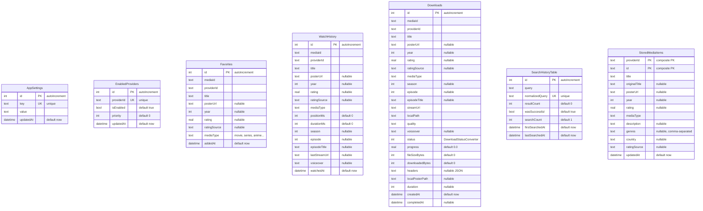
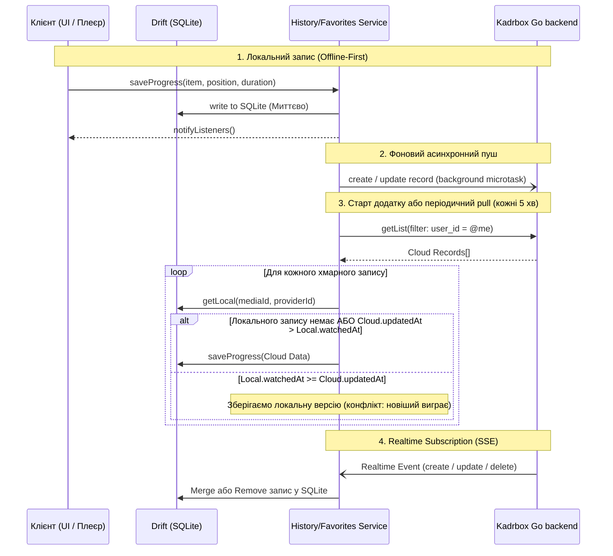
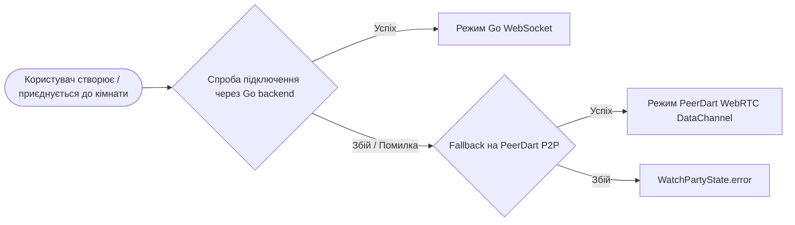

# 03. Локальні дані, синхронізація та мережеві сервіси (Database, Sync & Core Services)

Цей документ містить поглиблений технічний аналіз підсистеми управління даними, збереження стану, синхронізації та мережевих служб клієнтського застосунку **Kadrbox**.

---

## 1. Архітектурний огляд підсистеми даних

У застосунку Kadrbox реалізовано патерн **Offline-First**. Основним джерелом істини (Single Source of Truth) є локальна реляційна база даних **SQLite** під управлінням реактивного фреймворку **Drift**. Бекенд (хмарний сервіс **Go backend**) виступає у ролі вторинного сховища для резервного копіювання, міжпристроєвої синхронізації профілю, обраного й історії перегляду, а також координації кімнат спільного перегляду (**Watch Party**).

```mermaid
flowchart TD
    UI[Презентаційний шар / UI / BLoC / ChangeNotifier] --> Repos[UnifiedContentRepository & Services]
    
    subgraph LocalDataStore ["Локальний шар даних (Primary Source of Truth)"]
        Repos --> FavoritesService[FavoritesService]
        Repos --> HistoryService[HistoryService]
        Repos --> DownloadService[DownloadService]
        Repos --> SettingsService[SettingsService]
        
        FavoritesService --> FavoritesDao[FavoritesDao]
        HistoryService --> HistoryDao[HistoryDao]
        DownloadService --> DownloadsDao[DownloadsDao]
        SettingsService --> SettingsDao[SettingsDao]
        
        FavoritesDao --> AppDatabase[(AppDatabase - Drift / SQLite)]
        HistoryDao --> AppDatabase
        DownloadsDao --> AppDatabase
        SettingsDao --> AppDatabase
    end

    subgraph CloudSyncLayer ["Шар синхронізації та мережі (Cloud & P2P)"]
        FavoritesService -.->|Periodic sync & Realtime| KadrboxServerService[KadrboxServerService]
        HistoryService -.->|Periodic sync & Realtime| KadrboxServerService
        AuthService[AuthService] --> KadrboxServerService
        KadrboxServerService --> PB[(Kadrbox Go backend (user-configured URL))]
        
        WatchPartyService[WatchPartyService] --> PB_Backend[Kadrbox WebSocket backend]
        WatchPartyService -.->|Fallback| PeerDart_Backend[PeerDart WebRTC Backend]
        
        TMDbService[TMDbService] --> TMDbAPI[(The Movie Database API)]
        UpdateService[UpdateService] --> GitHubRelease[(GitHub Releases update.json)]
    end
```

---

## 2. Локальна база даних Drift (SQLite)

Локальна база даних побудована з використанням бібліотек [`drift`](../frontend/pubspec.yaml) та [`drift_flutter`](../frontend/pubspec.yaml). Базовий клас конфігурації знаходиться у файлі [`lib/data/database/app_database.dart`](../frontend/lib/data/database/app_database.dart).

### 2.1. Конфігурація та підключення
- **Назва БД:** `kadrbox.sqlite` (за замовчуванням `kadrbox`).
- **Шлях розміщення:** директорія документів додатку, отримана через `getApplicationDocumentsDirectory()` з пакету `path_provider`.
- **Драйвер:** `driftDatabase` з нативними опціями `DriftNativeOptions(databaseDirectory: getApplicationDocumentsDirectory)`.
- **Поточна версія схеми (`schemaVersion`):** `9`.

### 2.2. ER-діаграма сутностей бази даних



### 2.3. Детальний опис таблиць, колонок та індексів

| Таблиця | Опис призначення | Ключі та обмеження (Unique / PK) | Специфічні конвертери / типи |
| :--- | :--- | :--- | :--- |
| `AppSettings` | Збереження налаштувань у форматі key-value (тема, плеєр, автоперехід) | PK: `id` (autoIncrement), UK: `key` | Звичайні тексти та дати |
| `EnabledProviders` | Статуси активації джерел каталогу та порядок їх пріоритету | PK: `id` (autoIncrement), UK: `providerId` | `priority` (int), `isEnabled` (bool) |
| `Favorites` | Закладки / Обраний контент користувача | PK: `id` (autoIncrement), Composite UK: `{mediaId, providerId}` | `rating` (real), `mediaType` (text) |
| `WatchHistory` | Історія перегляду, відтворення серій/фільмів та точний прогрес у мілісекундах | PK: `id` (autoIncrement), Composite UK: `{mediaId, providerId, season, episode}` | `positionMs` (int), `durationMs` (int) |
| `Downloads` | Завантаження медіа для перегляду офлайн, статус прогресу та файлові шляхи | PK: `id` (autoIncrement), Composite UK: `{mediaId, providerId, season, episode}` | `status` мапиться через `DownloadStatusConverter` (enum `DownloadStatus`: `pending=0`, `downloading=1`, `paused=2`, `completed=3`, `failed=4`), `headers` як JSON string |
| `SearchHistoryTable` | Історія пошукових запитів, аналіз успішності видачі та виправлення одруків | PK: `id` (autoIncrement), UK: `{normalizedQuery}` | `searchCount`, `wasSuccessful` |
| `StoredMediaItems` | Локальний кеш метаданих каталогу медіа для швидкої навігації без мережі | Composite PK: `{providerId, id}` | `genres` (кома-розділений список) |

### 2.4. Еволюція схеми та міграції (`MigrationStrategy`)

У [`AppDatabase.migration`](../frontend/lib/data/database/app_database.dart#L244-L272) реалізовано:
1. **`onCreate`**:
   - Виклик `m.createAll()`.
   - Вставка базових параметрів за замовчуванням у `AppSettings`:
     ```dart
     'theme': 'dark',
     'default_quality': 'auto',
     'player_type': 'internal',
     'auto_play_next': 'true',
     'remember_position': 'true',
     'subtitle_language': 'uk',
     ```
2. **`onUpgrade` (поетапні версії)**:
   - `from < 7`: додавання колонок `rating` та `ratingSource` до таблиць обраного, історії та завантажень.
   - `from < 8`: додавання колонки `headers` (JSON-encoded User-Agent / Referer) до таблиці `Downloads`.
   - `from < 9`: додавання колонок `localPosterPath` та `duration` для повноцінного офлайн-відображення медіафайлів без доступу до Інтернету.

---

## 3. Data Access Objects (DAOs) та Репозиторії

Вся взаємодія з локальною базою даних інкапсульована у відповідних DAO з підтримкою реактивних потоків (`Stream` через `watch()`):

### 3.1. `HistoryDao` ([`lib/data/database/dao/history_dao.dart`](../frontend/lib/data/database/dao/history_dao.dart))
- **`saveProgress(...)`**: Забезпечує збереження та оновлення позиції відтворення. Оскільки SQLite трактує значення `NULL` у складених унікальних ключах як відмінні одне від одного (для фільмів, де `season` та `episode` рівні `NULL`), у коді реалізовано явну перевірку:
  ```dart
  final existing = await (_db.select(_db.watchHistory)..where((t) =>
      t.mediaId.equals(mediaId) &
      t.providerId.equals(providerId) &
      (season != null ? t.season.equals(season) : t.season.isNull()) &
      (episode != null ? t.episode.equals(episode) : t.episode.isNull())
  )).getSingleOrNull();
  ```
  Якщо запис існує — викликається `update`, якщо ні — `insert`.
- **`getContinueWatching({int limit = 20})` / `watchContinueWatching`**:
  - Фільтрує елементи, де `positionMs > 0` та `durationMs > 0`.
  - Відбирає лише ті записи, прогрес перегляду яких знаходиться у діапазоні від 5% до 95% (`progress > 0.05 && progress < 0.95`), що автоматично відсікає тільки-но розпочаті або повністю доглянуті відео.
- **`cleanupDuplicates()`**:
  - Алгоритм дедуплікації: сортує записи за спаданням дати (`watchedAt DESC`) та видаляє старіші дублікати для одного й того ж комбінованого ключа `mediaId_providerId_season_episode`.

### 3.2. `FavoritesDao` ([`lib/data/database/dao/favorites_dao.dart`](../frontend/lib/data/database/dao/favorites_dao.dart))
- **`toggle(...)`**: Атомарне перемикання стану. Перевіряє наявність сутності через `isFavorite()`, видаляє або створює новий запис.
- **`watchAll()` / `watchIsFavorite(mediaId, providerId)`**: Реактивні стріми для оновлення кнопок у плеєрі та на картках каталогу.

### 3.3. `DownloadsDao` ([`lib/data/database/dao/downloads_dao.dart`](../frontend/lib/data/database/dao/downloads_dao.dart))
- **`add(...)`**: Використовує `mode: InsertMode.replace` для перевизначення завантажень із тим самим `mediaId` та епізодом.
- **`updateProgress(id, progress, downloadedBytes, fileSizeBytes)`**: Оновлює статус завантаження файлу на диск.
- **`watchActive()`**: Реактивний фільтр для завантажень у статусах `pending`, `downloading`, `paused`.

### 3.4. `SearchHistoryDao` ([`lib/data/database/dao/search_history_dao.dart`](../frontend/lib/data/database/dao/search_history_dao.dart))
- Реалізований як `@DriftAccessor(tables: [SearchHistoryTable])`.
- Підтримує префіксний пошук (`searchByPrefix`) за `normalizedQuery.like('$normalizedPrefix%')` для автодоповнення.
- Автоматично викликає очищення бази (`_cleanupOldEntries()`), обмежуючи історію 100 останніми записами.
- Надає список запитів без результатів (`getFailedSearches`) для алгоритмів виявлення одруків та пропозиції виправлень.

---

## 4. Бекенд-архітектура та хмарна синхронізація на базі Go backend

Бекенд — це Go-сервіс Kadrbox (Go backend), адресу якого користувач задає у налаштуваннях. Він відповідає лише за авторизацію, синхронізацію та координацію кімнат спільного перегляду.

### 4.1. Авторизація та керування токенами ([`KadrboxServerService`](../frontend/lib/data/services/kadrbox_server_service.dart) & [`AuthService`](../frontend/lib/data/services/auth_service.dart))
- **Збереження сесії:** Використовується `AsyncAuthStore` у парі з `SharedPreferences` під ключем `kadrbox_auth`. При перезапуску додатку сесія відновлюється автоматично.
- **Методи авторизації:**
  1. *Email & Password*: `authWithPassword(email, password)` та `signUp()`.
  2. *OAuth2*: `authWithOAuth2(provider, urlLauncher)` з підтримкою відкриття зовнішнього браузера (Google, Discord).
  3. *Підключення/відключення зовнішніх способів входу*: виклики API Go backend для OAuth-акаунтів.
  4. *Автооновлення токена*: `authRefresh()` при старті чи помилках доступу.

### 4.2. Схема хмарних колекцій Go backend

| Колекція | Поля | Правила доступу (API Rules) | Призначення |
| :--- | :--- | :--- | :--- |
| `users` | `id`, `email`, `name`, `avatar`, `bio` | `id = @request.auth.id` | Профіль користувача |
| `favorites` | `user_id`, `media_id`, `provider_id`, `title`, `poster_url`, `year`, `media_type`, `added_at` | `user_id = @request.auth.id` | Хмарне обране |
| `watch_history` | `user_id`, `media_id`, `provider_id`, `title`, `poster_url`, `year`, `media_type`, `position_ms`, `duration_ms`, `season`, `episode`, `episode_title`, `last_stream_url`, `voiceover`, `watched_at` | `user_id = @request.auth.id` | Хмарний прогрес та історія перегляду |
| `watch_party_rooms` | `room_code`, `host_id`, `host_name`, `participants` (JSON), `current_position`, `is_playing`, `playback_speed` | Публічний доступ / по коду кімнати | Координація Watch Party |
| `watch_party_messages` | `room_code`, `sender_id`, `sender_name`, `action`, `payload` (JSON) | Фільтр за `room_code` | Обмін подіями у кімнаті |

### 4.3. Алгоритм синхронізації та вирішення конфліктів
Сервіси [`FavoritesService`](../frontend/lib/data/services/favorites_service.dart) та [`HistoryService`](../frontend/lib/data/services/history_service.dart) реалізують трирівневу модель синхронізації:



1. **Миттєвий запис на диск:** Будь-яка зміна спочатку зберігається в SQLite, забезпечуючи нульову затримку інтерфейсу та працездатність без Інтернету.
2. **Фоновий запис:** Метод `Future.microtask()` ініціює збереження на сервер.
3. **Періодичний Pull / Push:** Кожні 5 хвилин спрацьовує `Timer.periodic`, який виконує синхронізацію у фоні без блокування UI.
4. **Go backend:** клієнт читає та пише записи через REST-ендпоинти синхронізації Go-бекенду, захищені JWT токеном поточного користувача.
5. **Стратегія злиття (Conflict Resolution):** **Newer Timestamp Wins** (виграє запис із пізнішою міткою часу `watchedAt` або `updated`).

---

## 5. Watch Party та P2P/WebRTC інтеграція

Спільний перегляд реалізовано у [`WatchPartyService`](../frontend/lib/data/services/watch_party_service.dart) з підтримкою гібридної системи зв'язку: Go backend (за замовчуванням) та fallback на P2P через бібліотеку **PeerDart** (WebRTC).

### 5.1. Архітектура бекендів та Fallback



- **Кімната (Room Code):** 6-значний літерно-цифровий код (наприклад, `K7X9B2`).
- **Хост-ідентифікатор у PeerDart:** `kadrbox-${roomCode}` (фіксований для спрощення знаходження піра клієнтами).

### 5.2. Протокол команд та синхронізації
Повідомлення інкапсулюються у клас `WatchPartyMessage`:
```json
{
  "action": "sync | play | pause | seek | speed | chat | userJoined | userLeft | requestSync",
  "senderId": "1719582910123",
  "senderName": "Олександр",
  "payload": { ... },
  "timestamp": "2026-09-28T12:00:00.000Z"
}
```

### 5.3. Багаторівневий алгоритм компенсації розсинхронізації (Drift Correction)
Хост кімнати кожні 2 секунди надсилає повідомлення `sync` із поточною позицією та міткою часу UTC. Клієнт обраховує мережеву затримку:
$$\text{CappedDelay} = \text{clamp}(T_{\text{client\_now\_utc}} - T_{\text{host\_timestamp}}, 0, 5000\text{ ms})$$
$$\text{AdjustedHostPosition} = \text{HostPosition} + \text{CappedDelay}$$
$$\text{Drift} = \text{ClientPosition} - \text{AdjustedHostPosition}$$

Залежно від величини модуля розсинхронізації ($\text{absDrift}$), застосовується один із 4 режимів:

| Діапазон Drift | Режим (`SyncCorrectionMode`) | Дія алгоритму |
| :--- | :--- | :--- |
| **0 – 5 секунд** | `SyncCorrectionMode.none` | Розбіжність ігнорується, швидкість залишається базовою (`1.0x`) |
| **5 – 10 секунд** | `SyncCorrectionMode.slowDown` / `speedUp` | **Smooth correction:** плавне коригування швидкості відтворення на $\pm 10\%$ (`0.9x` якщо клієнт попереду, `1.1x` якщо позаду) |
| **10 – 15 секунд** | `SyncCorrectionMode.slowDown` / `speedUp` | **Fast correction:** прискорене коригування швидкості на $\pm 20\%$ (`0.8x` або `1.2x`) |
| **> 15 секунд** | `SyncCorrectionMode.hardSeek` | **Hard seek:** примусове позиціювання (`onSeek`) на точну позицію хоста, відновлення нормальної швидкості |

---

## 6. Інтеграція з TMDB API (The Movie Database)

Сервіс [`TMDbService`](../frontend/lib/data/services/tmdb_service.dart) використовується для збагачення метаданих контенту каталогового сервера (описи, рейтинги IMDb/TMDb, акторський склад, постери високої роздільної здатності та трейлери з YouTube).

### 6.1. Клієнт та параметри
- **Base URL:** `https://api.themoviedb.org/3`
- **Image CDN:** `https://image.tmdb.org/t/p/{size}` (підтримуються розміри `w500` для постерів та `w1280` для бекдропів).
- **Локалізація запитів:** за замовчуванням `language: 'uk-UA'`.
- **API Key:** Зчитується з `SettingsService.state.tmdbApiKey`, якщо користувач ввів власний ключ, або використовується внутрішній системний ключ.

### 6.2. Методи та зіставлення сутностей (Matching)
1. **`searchMovies(query)` / `searchTV(query)`**: Пошук фільмів чи серіалів.
2. **`getMovieDetails(id)` / `getTVDetails(id)`**: Детальна картка із параметром `append_to_response: 'videos,credits'`. Автоматично парсить трейлери з YouTube (шукає об'єкти з `site == 'YouTube'` та `type == 'Trailer' || 'Teaser'`).
3. **`findMatch({title, originalTitle, year, isMovie})`**:
   - Спочатку здійснює пошук за `originalTitle` (найвища точність зіставлення для перекладених назв).
   - Якщо збігів немає — здійснює пошук за локалізованим українським `title`.
   - Серед знайдених результатів пріоритет віддається фільмам з точним співпадінням року випуску (`item.year == year`).

---

## 7. Сервіс автоматичного оновлення (OTA Update)

Сервіс [`UpdateService`](../frontend/lib/data/services/update_service.dart) забезпечує перевірку наявності свіжих релізів, фонове завантаження інсталяційних пакетів та їх верифікацію без посередництва Google Play або сторонніх маркетів.

### 7.1. Механізм перевірки версій
1. Поточна версія додатку зчитується з файлу `assets/version.json` через [`VersionService`](../frontend/lib/core/services/version_service.dart) (`versionCode` та `versionName`).
2. Додаток робить запит до конфігураційного маніфесту на GitHub:
   `https://raw.githubusercontent.com/edhases/kadrbox/master/update.json?t={timestamp}`
   *(Мітка часу запобігає кешуванню HTTP-проксі).*

### 7.2. Структура `update.json`
Файл підтримує мультиплатформність (`android` та `windows`):
```json
{
  "platforms": {
    "android": {
      "versionCode": 20260205,
      "versionName": "20260205.0.0",
      "releaseNotes": "Оновлення плеєра та виправлення відтворення",
      "url": "https://github.com/edhases/kadrbox/releases/download/.../kadrbox.apk",
      "sha256": "74543BB2B5D066BE64ADDBF76986C5546D1D657ADEA146F05C605E03A0EF1053",
      "minVersionCode": 20260200
    },
    "windows": {
      "versionCode": 20260205,
      "versionName": "20260205.0.0",
      "releaseNotes": "Покращення продуктивності Direct3D",
      "url": "https://github.com/edhases/kadrbox/releases/download/.../kadrbox.exe",
      "sha256": "EE5D73874B58731B7D36CCDC38E29195CCC94E589578B8C1223E3581AFF1C3A6",
      "minVersionCode": 20260200
    }
  }
}
```

### 7.3. Логіка оновлення та перевірки безпеки
- **Forced Update (Примусове оновлення):** Якщо `currentVersionCode < minVersionCode`, застосунок вимагає обов'язкового оновлення через критичні зміни в API.
- **Верифікація цілісності (Checksum):**
  - Завантаження файлу здійснюється через `Dio.download` у тимчасову директорію (`getTemporaryDirectory()`).
  - Після завершення завантаження або при повторному знаходженні завантаженого файлу обчислюється хеш `sha256.convert(bytes)`.
  - У разі невідповідності хешу завантажений файл видаляється як пошкоджений.
- **Встановлення (OTA Install):**
  - На Android запитується дозвіл `Permission.requestInstallPackages`.
  - Запуск файлу пакета (`.apk` або `.exe`) виконується через плагін `open_filex` з MIME-типом `application/vnd.android.package-archive` для Android.
- **Очищення:** Метод `cleanupOldUpdates()` видаляє застарілі файли оновлень з попередніми кодами версій, запобігаючи переповненню накопичувача пристрою.

---

## 8. Зведена таблиця ін'єкцій залежностей (Dependency Injection)

Реєстрація компонентів виконується у [`lib/core/di/injection.dart`](../frontend/lib/core/di/injection.dart) за допомогою контейнера `GetIt`:

| Компонент / Сервіс | Тип реєстрації | Залежності | Призначення |
| :--- | :--- | :--- | :--- |
| `AppDatabase` | Singleton | — | Екземпляр бази даних Drift |
| `KadrboxServerService` | Singleton | `SharedPreferences` | Клієнт Go backend із збереженням токенів |
| `AuthService` | LazySingleton | `KadrboxServerService` | Управління профілем та авторизацією |
| `FavoritesService` | LazySingleton | `AppDatabase`, `KadrboxServerService`, `AuthService` | Управління обраним з синхронізацією |
| `HistoryService` | LazySingleton | `AppDatabase`, `KadrboxServerService`, `AuthService` | Управління історією та відновленням перегляду |
| `SyncService` | LazySingleton | `AppDatabase` | Експорт/імпорт бази даних у JSON та QR-код |
| `DownloadService` | LazySingleton | `AppDatabase`, `ApiClient`, `SettingsService` | Фонове завантаження потоків на диск |
| `WatchPartyService` | LazySingleton | `KadrboxServerService`, `SettingsService` | Синхронізація спільного перегляду |
| `TMDbService` | LazySingleton | `ApiClient`, `SettingsService` | Метадані фільмів/серіалів та трейлери |
| `UpdateService` | LazySingleton | `SettingsService` | Перевірка оновлень та встановлення APK/EXE |
| `UnifiedContentRepository` | LazySingleton | Каталоговий сервер, `HistoryDao`, `FavoritesDao`, `MediaItemsDao` | Єдина точка доступу до каталогу та користувацьких даних |
