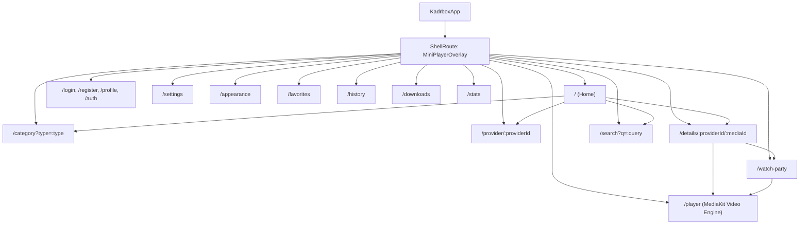

# 04. UI/UX, Навігація та Медіаплеєр (UI/UX & Media Experience)

Цей документ містить вичерпний технічний аналіз презентаційного шару, системи маршрутизації, дизайн-системи, адаптивності та архітектури мультимедійного плеєра кросплатформного застосунку **Kadrbox**.

---

## Зміст
1. [Архітектура презентаційного рівня (Presentation Layer)](#1-архітектура-презентаційного-рівня)
2. [Карта екранів (Sitemap) та маршрутизація GoRouter](#2-карта-екранів-sitemap-та-маршрутизація-gorouter)
3. [Дизайн-система, теми та токени інтерфейсу](#3-дизайн-система-теми-та-токени-інтерфейсу)
4. [Детальний розбір ключових компонентів інтерфейсу](#4-детальний-розбір-ключових-компонентів-інтерфейсу)
5. [Архітектура відеоплеєра на базі MediaKit](#5-архітектура-відеоплеєра-на-базі-mediakit)
6. [Відтворення вбудованих джерел](#6-відтворення-вбудованих-джерел)
7. [Адаптивність (Responsive & Adaptive Design)](#7-адаптивність-responsive--adaptive-design)
8. [Управління фокусом, D-Pad та гарячі клавіші (Hotkeys)](#8-управління-фокусом-d-pad-та-гарячі-клавіші)

---

## 1. Архітектура презентаційного рівня

Презентаційний шар Kadrbox реалізований за канонами **Clean Architecture** та принципами реактивного зв'язування даних. Він відокремлений від шару доменних сутностей і бізнес-логіки:

```
lib/presentation/
├── app.dart                   # Головний віджет KadrboxApp, конфігурація MaterialApp
├── router/
│   └── app_router.dart        # Декларативна маршрутизація GoRouter + ShellRoute
├── theme/
│   ├── app_theme.dart         # Світла, темна та AMOLED теми, кольорові схеми
│   └── app_spacing.dart       # Токени відступів, 4-point grid, брейкпоінти
├── pages/
│   ├── home/                  # Головний екран каталогу, фільтри, категорії
│   ├── details/               # Екран деталей медіа, вибір озвучки/якості/серій
│   ├── player/                # Повноекранний відеоплеєр MediaKit
│   ├── search/                # Пошук із debounce, історією та фільтрами
│   ├── category/              # Каталог контенту за категоріями з пагінацією
│   ├── provider/              # Джерело каталогу
│   ├── favorites/             # Обрані та збережені медіафайли
│   ├── history/               # Історія переглядів із прогресом
│   ├── downloads/             # Завантажений офлайн-контент
│   ├── stats/                 # Статистика та аналітика переглядів
│   ├── watch_party/           # Спільний перегляд через P2P (WebRTC)
│   ├── auth/                  # Авторизація, реєстрація, профіль користувача
│   └── settings/              # Налаштування застосунку та зовнішнього вигляду
└── widgets/
    ├── custom_titlebar.dart   # Кастомний безрамковий заголовок вікна (Desktop)
    ├── media_card.dart        # Універсальна картка постера (hover, focus, glow)
    ├── filter_sheet.dart      # Модальний відбір фільтрів та сортування
    ├── appearance_widgets.dart# Віджети кастомізації (палітра кольорів, сітка)
    ├── player/
    │   ├── mini_player_overlay.dart # Плаваючий міні-плеєр поверх екранів
    │   └── pip_controls.dart        # Оверлей керування для режиму PiP
    └── tv/
        └── focusable_card.dart      # Обгортка навігації для телевізорів/D-Pad
```

### Ключові архітектурні рішення:
- **Dependency Injection**: Доступ до сервісів (`SettingsService`, `VideoPlayerService`, `HistoryService`, `WatchPartyService`) здійснюється через [GetIt](../frontend/lib/core/di/injection.dart).
- **Реактивність**: Використовуються `ListenableBuilder`, `ValueListenableBuilder`, а також підписка на `ChangeNotifier` у `StatefulWidget` з обов'язковим очищенням ресурсів у `dispose()`.
- **Ізоляція важких задач**: Обчислення та парсинг даних делегуються у фонові ізоляти через функцію `compute()`.

---

## 2. Карта екранів (Sitemap) та маршрутизація GoRouter

Маршрутизація в застосунку побудована на базі бібліотеки [`GoRouter`](../frontend/lib/presentation/router/app_router.dart). Головною особливістю є використання `ShellRoute`, яка огортає всі маршрути у віджет `MiniPlayerOverlay`. Це дозволяє продовжувати відтворення відео у плаваючому вікні при переходах між екранами.

### Діаграма карти переходів (Sitemap)



### Таблиця маршрутів застосунку

| Шлях (Path) | Назва (Name) | Параметри (Path/Query/Extra) | Опис призначення |
| :--- | :--- | :--- | :--- |
| `/` | `home` | - | Головний каталог: популярне, категорії, секції "Продовжити перегляд", рекомендації |
| `/login` | `login` | - | Авторизація через Go-бекенд (email/пароль + OAuth2) |
| `/register` | `register` | - | Реєстрація нового облікового запису |
| `/profile` | `profile` | - | Профіль користувача, аватар, біографія, прив'язані OAuth-акаунти |
| `/auth` | `oauth_callback` | - | Deep Link перехоплювач для OAuth2 redirect |
| `/category` | `category` | `type` (Query, опціонально: movie, series тощо) | Перегляд каталогу за категоріями з табами та фільтрами |
| `/provider/:providerId`| `provider` | `providerId` (Path) | Окремий інтерфейс джерела каталогу |
| `/details/:providerId/:mediaId` | `details` | `providerId`, `mediaId` (URL-encoded Path) | Сторінка деталей, актори, серії, вибір озвучки/якості. Плавний `FadeTransition` |
| `/player` | `player` | `url`, `title`, `streams`, `mediaId`, `posterUrl`, `season`, `episode` тощо (Query/Extra) | Відеоплеєр MediaKit з повноекранним інтерфейсом, субтитрами, Watch Party |
| `/search` | `search` | `q` (Query, опціонально) | Розумний пошук, автокомпліт, історія запитів, фільтрація |
| `/settings` | `settings` | - | Налаштування кешу, автооновлення, субтитрів, якості за замовчуванням |
| `/appearance` | `appearance` | - | Вибір теми (Світла/Темна/AMOLED), акцентного кольору, стилю сітки та постерів |
| `/favorites` | `favorites` | - | Збережені закладки медіа за вкладками категорій |
| `/history` | `history` | - | Історія переглядів із прогрес-баром та можливістю відновлення |
| `/downloads` | `downloads` | - | Менеджер офлайн-завантажень HLS та відеофайлів |
| `/stats` | `stats` | - | Аналітика переглядів: графіки, загальний час, улюблені жанри |
| `/watch-party` | `watch-party` | `mediaUrl`, `mediaTitle` (Extra) | Кімната спільного перегляду P2P через WebRTC |

---

## 3. Дизайн-система, теми та токени інтерфейсу

Дизайн-система Kadrbox побудована на принципах Material 3 із глибокою адаптацією під темні мультимедійні інтерфейси кінотеатрів.

### Колірна палітра (`AppTheme`)

Клас [`AppTheme`](../frontend/lib/presentation/theme/app_theme.dart) визначає базові константи та фабричні методи побудови тем:

```dart
// Базові системні кольори
static const Color primaryColor   = Color(0xFF6366F1); // Indigo
static const Color secondaryColor = Color(0xFF8B5CF6); // Purple
static const Color accentColor    = Color(0xFF06B6D4); // Cyan
static const Color errorColor     = Color(0xFFEF4444); // Red
static const Color successColor   = Color(0xFF22C55E); // Green

// Темна тема (Default Dark)
static const Color darkBackground = Color(0xFF0F0F0F); // Глибокий сіро-чорний
static const Color darkSurface    = Color(0xFF1A1A1A); // Панелі та AppBar
static const Color darkCard       = Color(0xFF242424); // Картки та діалоги
static const Color darkBorder     = Color(0xFF333333); // Тонкі контури
```

### Підтримка тем:
1. **Dark Theme** (`buildDarkTheme`): Оптимальна для перегляду у темний час доби. Забезпечує контрастність без перевтоми очей.
2. **AMOLED Theme** (`buildAmoledTheme`): Справжній глибокий чорний колір (`#000000`) для фону, AppBar, меню та карток (`#121212`), що заощаджує енергію на OLED-екранах смартфонів та телевізорів.
3. **Light Theme** (`lightTheme`): Класична світла тема з нейтральним сірим фоном (`#F5F5F5`) та білими поверхнями.

### Система динамічних акцентних кольорів (`AccentColor`)
Користувач може обрати персональний акцентний колір у розділі `AppearancePage`:
- **Indigo** (`#6366F1`)
- **Purple** (`#8B5CF6`)
- **Cyan** (`#06B6D4`)
- **Emerald** (`#10B981`)
- **Amber** (`#F59E0B`)
- **Rose** (`#F43F5E`)

### Токени відступів та сітки (`AppSpacing`)
Клас [`AppSpacing`](../frontend/lib/presentation/theme/app_spacing.dart) впроваджує 4-точковий масштаб:

| Токен | Значення | Призначення |
| :--- | :--- | :--- |
| `none` | 0.0 | Скидання відступів |
| `xxs` | 2.0 | Мікро-відступи між бейджами |
| `xs` | 4.0 | Відступи в кнопках та дрібних чіпах |
| `sm` | 8.0 | Стандартний проміжок між елементами списків |
| `md` | 16.0 | Базовий padding сторінок і карток |
| `lg` | 24.0 | Проміжки між великими блоками контенту |
| `xl` | 32.0 | Відступи для заголовків секцій |
| `xxl` | 48.0 | Десктопні горизонтальні відступи |
| `xxxl` | 64.0 | Великі банери |

---

## 4. Детальний розбір ключових компонентів інтерфейсу

### 4.1. Картка фільму (`MediaCard`)
Віджет [`MediaCard`](../frontend/lib/presentation/widgets/media_card.dart) — центральний візуальний компонент каталогу:
- **Стани фокусу та наведення**: При фокусуванні (клавіатура, D-Pad пульта) або ховері миші картка збільшується за допомогою матричної трансформації `Matrix4.identity()..scale(1.05)` з додаванням неонового свічення `boxShadow` у колір вибраного акценту.
- **Підтримка постерів**: Використовує `DownloadService` для перевірки наявності локально збереженого постера для офлайн-режиму; якщо його немає — завантажує через `CachedNetworkImage` із пласихолдером `Skeleton`.
- **Бейджі інформації**:
  - Джерело каталогу у верхньому лвому кутку;
  - Тип контенту (Фільм, Серіал, Аніме) з відповідним кольоровим індикатором;
  - Рейтинг (`RatingBadge`) у правому верхньому кутку з кодуванням кольору (зелений `>= 7.0`, жовтий `5.0-6.9`, червоний `< 5.0`);
  - Рік випуску та градієнтне накладення назви знизу.

### 4.2. Головний екран (`HomePage`)
Компонент [`HomePage`](../frontend/lib/presentation/pages/home/home_page.dart) використовує `CustomScrollView` зі `Sliver`-компонентами:
1. **SliverAppBar**: Заголовок із кнопками відкриття швидких фільтрів, сортування, повідомлень про нові серії, пошуку та меню (обране, історія, локальні файли, спільний перегляд).
2. **ContinueWatchingSection**: Горизонтальний список медіа з відновленням точки зупинки та смужкою відносного прогресу (зі збереженням в Drift DB).
3. **RecommendationsSection**: Блок персоналізованих рекомендацій від `RecommendationService`.
4. **Categories & Providers**: Горизонтальні каруселі швидкого переходу до категорій (Фільми, Серіали, Мультфільми, Аніме, Дорами) та окремих джерел каталогу.
5. **Адаптивна медіа-сітка**: Динамічний розрахунок `SliverGridDelegateWithMaxCrossAxisExtent` залежно від налаштованого розміру постерів (`PosterSize.small`: 130px, `medium`: 180px, `large`: 250px) або режиму компактного списку (`ListStyle.compact` / `ListStyle.list`).

### 4.3. Екран деталей медіа (`DetailsPage`)
Розширений екран [`DetailsPage`](../frontend/lib/presentation/pages/details/details_page.dart) агрегує всю інформацію про тайтл:
- **Адаптивна розкладка**: На мобільних — вертикальна колонка з великим банером/постером, на планшетах та десктопі — розділення на 2 колонки (ліворуч постер фіксованої ширини з кнопками дій, праворуч — детальна метаінформація).
- **Селектор сезонів та серій**: Горизонтальні чіпи сезонів і сітка нумерованих серій для серіалів з автовибором першого доступного епізоду.
- **Діалог вибору озвучки та якості**: Групування доступних потоків (`StreamSource`) за студією дубляжу/перекладу (Ukr/Eng/Original) та роздільною здатністю (360p, 480p, 720p, 1080p, 1440p, 4K).
- **Дії над контентом**:
  - Кнопка "Дивитися" (перехід у `PlayerPage`);
  - Кнопка "Спільний перегляд" (створення сесії `WatchParty`);
  - Кнопка "В обране" (синхронізація через `FavoritesService`);
  - Кнопка "Завантажити" (запуск фонового завантаження через `DownloadService`);
  - Секція "Схожий контент" (`SimilarContentSection`).

### 4.4. Екран пошуку (`SearchPage`)
Віджет [`SearchPage`](../frontend/lib/presentation/pages/search/search_page.dart) поєднує:
- Пошукове поле з debounce таймером (500 мс) для запобігання спаму мережевими запитами;
- Підказки та історію останніх запитів (`SmartSearchService`);
- Фільтр по конкретному джерелу каталогу або пошук по всьому каталогу;
- Опцію дедуплікації результатів на основі fuzzy-порівняння рядків.

### 4.5. Безрамковий заголовок вікна (`CustomTitleBar`)
Для Windows, Linux та macOS застосовується кастомний віджет [`CustomTitleBar`](../frontend/lib/presentation/widgets/custom_titlebar.dart) на базі `window_manager`:
- Інтеграція зони перетягування вікна (`GestureDetector` + `windowManager.startDragging()`);
- Подвійний клік для максимізації / відновлення розміру вікна;
- Кнопки керування вікном (Згорнути, Розгорнути, Закрити) у нативному стилі з підтримкою ефектів наведення.

---

## 5. Архітектура відеоплеєра на базі MediaKit

Відтворення відео — одна з найскладніших і найважливіших підсистем застосунку Kadrbox. Вона повністю побудована на пакеті **MediaKit** (кросплатформна обгортка над **mpv / libmpv**).

### Архітектура контролера та сервісу

```
┌─────────────────────────────────────────────────────────────┐
│                    VideoPlayerService                       │
│  (Керування життєвим циклом, PiP, зміна розмірів вікна)     │
└──────────────────────────────┬──────────────────────────────┘
                               │ володіє / управляє
┌──────────────────────────────▼──────────────────────────────┐
│                     PlayerController                        │
│  - Стан плеєра (PlayerState)                                │
│  - MPV engine: Player + VideoController                     │
│  - Підписки на потоки позиції, тривалості, буферизації       │
│  - Перемикання HLS доріжок та прямих потоків                 │
│  - Збереження позиції в HistoryService (кожні 10 сек)       │
│  - Синхронізація WatchPartyService (Play/Pause/Seek/Rate)   │
└──────────────┬───────────────────────────────┬──────────────┘
               │                               │
┌──────────────▼──────────────┐ ┌──────────────▼──────────────┐
│      PlayerGestureLayer     │ │        PlayerControls       │
│   (Жести гучності/яскравості│ │ (плеєр-стиль, TopBar,        │
│    подвійний тап Fullscreen)│ │  BottomControls, Seeker)    │
└─────────────────────────────┘ └─────────────────────────────┘
```

### 5.1. Налаштування апаратного прискорення та декодерів
В методі `initialize()` контролера [`PlayerController`](../frontend/lib/presentation/pages/player/player_controller.dart#L493-L580):
- Створюється екземпляр `Player` із конфігурацією логування `MPVLogLevel.info`.
- Для нативних десктопних платформ (`NativePlayer`) через внутрішній протокол mpv виставляється параметр:
  ```dart
  await (player.platform as NativePlayer).setProperty('hwdec', 'auto-copy');
  ```
  > [!IMPORTANT]
  > Вибір стратегії декодування `auto-copy` (замість прямого `auto` / `d3d11va`) критично важливий для десктопних платформ Windows і Linux. Він розв'язує декодування кадрів та рендеринг у текстуру Flutter, усуваючи збої, зависання та чорні екрани під час динамічної зміни розмірів вікна та переходу у повноекранний режим.

### 5.2. Безшовний перехід у повноекранний режим (Event-Driven Fullscreen)
Для запобігання гонки рендерингу (race conditions) на Windows реалізовано протокол синхронізації з подіями віконного менеджера (`WindowListener`):
1. Контролер виставляє прапорець `isTransitioning: true`.
2. UI відключає важку текстуру `Video` від дерева віджетів і рендерить чорну заглушку (`SizedBox.expand(child: ColoredBox(color: Colors.black))`).
3. Викликається `windowManager.setFullScreen(newFullscreenState)`.
4. Контролер очікує реальної події від ОС (`onWindowEnterFullScreen` або `onWindowLeaveFullScreen`) через `Completer`.
5. Після отримання сигналу та захисної мікро-затримки (100 мс для завершення інтерполяції ОС) текстура підключається назад із оновленим `textureKey`, змушуючи рушій перевиділити графічний буфер без збоїв.

### 5.3. Перемикання якостей та аудіодоріжок
Підтримується два сценарії вибору якості:
1. **Мульти-бітрейтні потоки HLS / DASH**:
   - Відстежуються через потік `player.stream.tracks`.
   - Зміна здійснюється викликом `player.setVideoTrack(track)` або вибором `VideoTrack.auto()` для адаптивного бітрейту без перезапуску медіа.
2. **Окремі файлові джерела (Direct MP4 / CDN)**:
   - Контролер зберігає поточний час перегляду `position = state.position`.
   - Відкриває новий URL: `_player.open(Media(stream.url, httpHeaders: stream.headers))`.
   - Виконує відновлення таймінгу: `_player.seek(currentPosition)`.

### 5.4. Система автозниження якості (Auto-downgrade при буферизації)
Якщо мережеве з'єднання нестабільне або під час сеансу Watch Party клієнт не встигає за кімнатою, метод `tryReduceQuality()` автоматично знаходить наступну нижчу роздільну здатність у списку доріжок чи потоків і безшовно перемикає якість, сповіщаючи користувача через `SnackBar`.

### 5.5. Жестове керування (`PlayerGestureLayer`)
Компонент [`PlayerGestureLayer`](../frontend/lib/presentation/pages/player/player_gesture_layer.dart) реалізує сенсорні та мишачі взаємодії:
- **Одинарний тап / клік**: Перемикання видимості елементів керування (`showControls`) з автоматичним таймером приховування через 5 секунд.
- **Подвійний тап / клік**: Перемикання повноекранного режиму.
- **Вертикальний драг**: Зміна рівня гучності плеєра від 0 до 100% із відображенням напівпрозорого HUD по центру екрана.

### 5.6. Режими "Картинка в картинці" (Picture-in-Picture)
Сервіс [`VideoPlayerService`](../frontend/lib/data/services/video_player_service.dart) реалізує два типи PiP:
1. **Desktop PiP (Windows/Linux/macOS)**:
   - Зберігає поточні координати та розміри вікна (`_windowBoundsBeforePiP`).
   - Зменшує вікно до 400x225 (16:9), встановлює атрибут `setAlwaysOnTop(true)` і переміщує його в правий нижній кут робочого столу.
   - Вмикає віджет [`PiPControls`](../frontend/lib/presentation/widgets/player/pip_controls.dart) із можливістю перетягування вікна за будь-яку точку.
2. **Внутрішній плаваючий віджет (`MiniPlayerOverlay`)**:
   - Якщо користувач згортає плеєр кнопкою назад або переходить по маршрутах додатку, плеєр згортається у плаваюче вікно розміром 300x169.
   - Вікно можна вільно перетягувати по екрану з автоматичним магнітним прилипанням (snap to edges) до лівого або правого краю екрана.
3. **Нативний Android/iOS PiP**:
   - Інтеграція через `MethodChannel('com.kadrbox.kadrbox/pip')`.

---

## 6. Відтворення вбудованих джерел

Каталоговий сервер повертає для кожного елемента один або кілька потоків. Тип потоку
(`direct` / `hls` / `embed`) визначається самим сервером, а застосунок лише відтворює те,
що отримав.

### Механізми відтворення
1. **Прямі та HLS-потоки**:
   - Потік передається у `media_kit` як `Media(url, httpHeaders: stream.headers)`.
   - Заголовки з відповіді сервера (`Referer`, `User-Agent`) обов'язкові для частини
     джерел і передаються без змін.
   - Це забезпечує єдиний UX перегляду, роботу гарячих клавіш, налаштування гучності та
     синхронізацію Watch Party.
2. **Вбудовані джерела**:
   - Для потоків типу `embed` застосунок використовує вбудований програвач на основі
     `flutter_inappwebview`.

> **Історична примітка.** До розділення відповідальності застосунок містив власні
> видобувачі потоків для окремих платформ. Після міграції видобуванням потоків займається
> каталоговий сервер, а застосунок лише відтворює готовий URL.

---

## 7. Адаптивність (Responsive & Adaptive Design)

Kadrbox підтримує широкий спектр пристроїв: від ультракомпактних смартфонів до 4K десктопних моніторів та Android TV.

### Класифікація пристроїв та брейкпоінти (`ResponsiveUtils`)

Клас [`ResponsiveUtils`](../frontend/lib/core/utils/responsive_utils.dart) класифікує поточний контекст за шириною вікна:

```
0px                 360px               600px               900px               1200px
├─────────────────────┼───────────────────┼───────────────────┼───────────────────┼──────────►
   ScreenSize.compact   ScreenSize.small    ScreenSize.medium   ScreenSize.large    ScreenSize.extraLarge
      (Small Phones)      (Standard Phone)      (Phablet/Fold)       (Tablet/Laptop)       (Desktop / TV)
```

Також визначається тип пристрою `DeviceType`:
- `DeviceType.phone`: Мобільна навігація через нижній `BottomNavigationBar`, сенсорні жести, компактні картки.
- `DeviceType.tablet`: Двоколонкові списки, комбіновані панелі керування.
- `DeviceType.desktop`: Безрамковий заголовок вікна `CustomTitleBar`, повзунок гучності на панелі плеєра, ховери курсору, drag-scroll мишею.
- `DeviceType.tv`: D-Pad фокусування, збільшені розміри шрифтів та відступів під перегляд з відстані 2-3 метрів.

### Адаптивні стилі інтерфейсу плеєра (`PlayerControls`):
- **Десктопний / Планшетний інтерфейс**:
  - Панель керування: прогрес-бар на всю ширину розташований безпосередньо над кнопками відтворення.
  - Постійно доступний горизонтальний слайдер гучності `_VolumeSlider`.
  - Текстовий індикатор часу у форматі `Поточний час / Загальний час`.
  - Швидкі кнопки перемикання пропорцій відео (Fit / Cover / Fill), швидкості та завантаження.
- **Мобільний інтерфейс**:
  - Компактне розташування з центральними великими кнопками Play/Pause та Skip (+/- 10 сек).
  - Слайдер гучності приховано (використовуються фізичні клавіші гучності смартфону або вертикальні свайпи).
  - Випадаючі списки замінено на виклик зручних нижніх шторок (`ModalBottomSheet`).

---

## 8. Управління фокусом, D-Pad та гарячі клавіші

Для десктопних систем та телевізійних приставок у проекті реалізована повноцінна підтримка навігації без використання тачскріну:

### 8.1. Віджет фокусування `FocusableCard`
Компонент [`FocusableCard`](../frontend/lib/presentation/widgets/tv/focusable_card.dart) огортає елементи списків:
- Прослуховує `FocusNode`.
- Перехоплює натискання клавіш вибору: `LogicalKeyboardKey.select` та `LogicalKeyboardKey.enter`.
- Забезпечує плавне збільшення розміру та яскравий контур навколо вибраного об'єкта під час навігації стрілками клавіатури або хрестовиною пульта D-Pad.

### 8.2. Drag-to-Scroll для миші (`_AppScrollBehavior`)
У класі [`KadrboxApp`](../frontend/lib/presentation/app.dart) налаштовано спеціальну поведінку прокручування:
```dart
class _AppScrollBehavior extends MaterialScrollBehavior {
  @override
  Set<PointerDeviceKind> get dragDevices => {
    PointerDeviceKind.touch,
    PointerDeviceKind.mouse,
    PointerDeviceKind.trackpad,
  };
}
```
Це дозволяє комфортно перетягувати горизонтальні каруселі постерів та категорій затиснутою лівою кнопкою миші на ПК.

### 8.3. Таблиця гарячих клавіш у плеєрі (`PlayerPage`)

Обробник [`_handleKeyEvent`](../frontend/lib/presentation/pages/player/player_page.dart#L267-L315) підтримує глобальні гарячі клавіші (якщо фокус не знаходиться у текстовому полі чату):

| Клавіша | Дія у плеєрі |
| :--- | :--- |
| **Space** / **Enter** | Відтворення / Пауза (Play / Pause) |
| **K** | Відтворення / Пауза |
| **Стрілка вправо (→)** | Перемотування вперед на 10 секунд |
| **L** | Перемотування вперед на 10 секунд |
| **Стрілка вліво (←)** | Перемотування назад на 10 секунд |
| **J** | Перемотування назад на 10 секунд |
| **F** | Увімкнення / вимкнення повноекранного режиму |
| **Escape** | Вихід із повноекранного режиму (або закриття плеєра, якщо не у повноекранному) |
