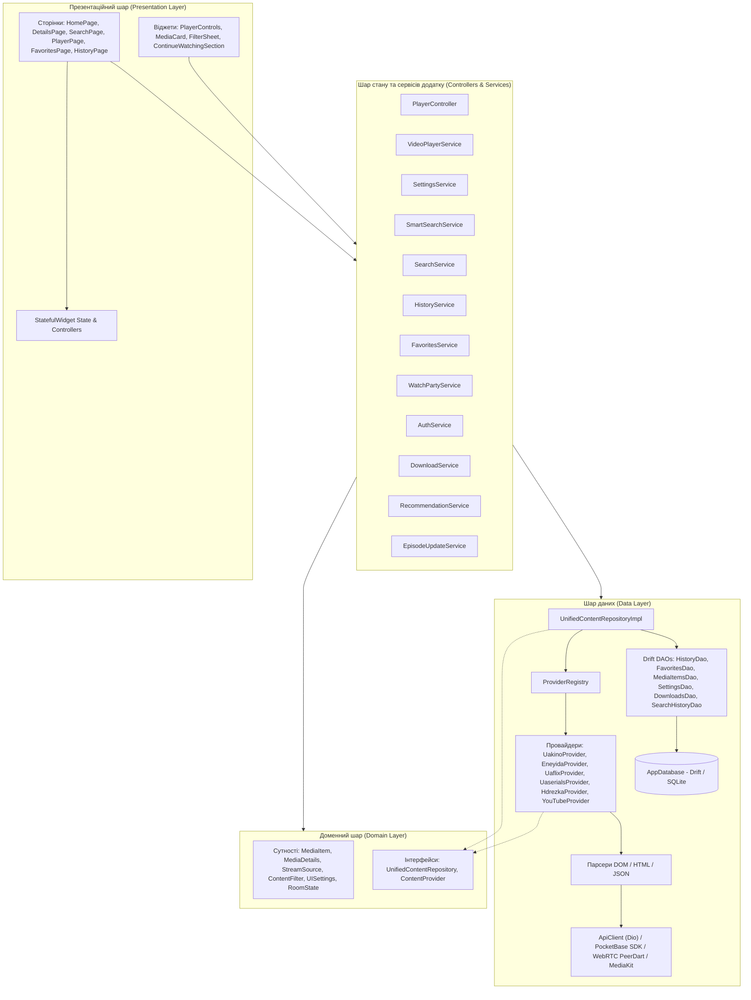
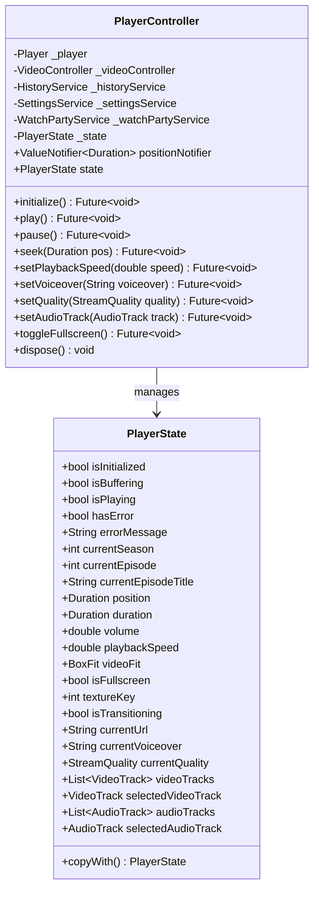
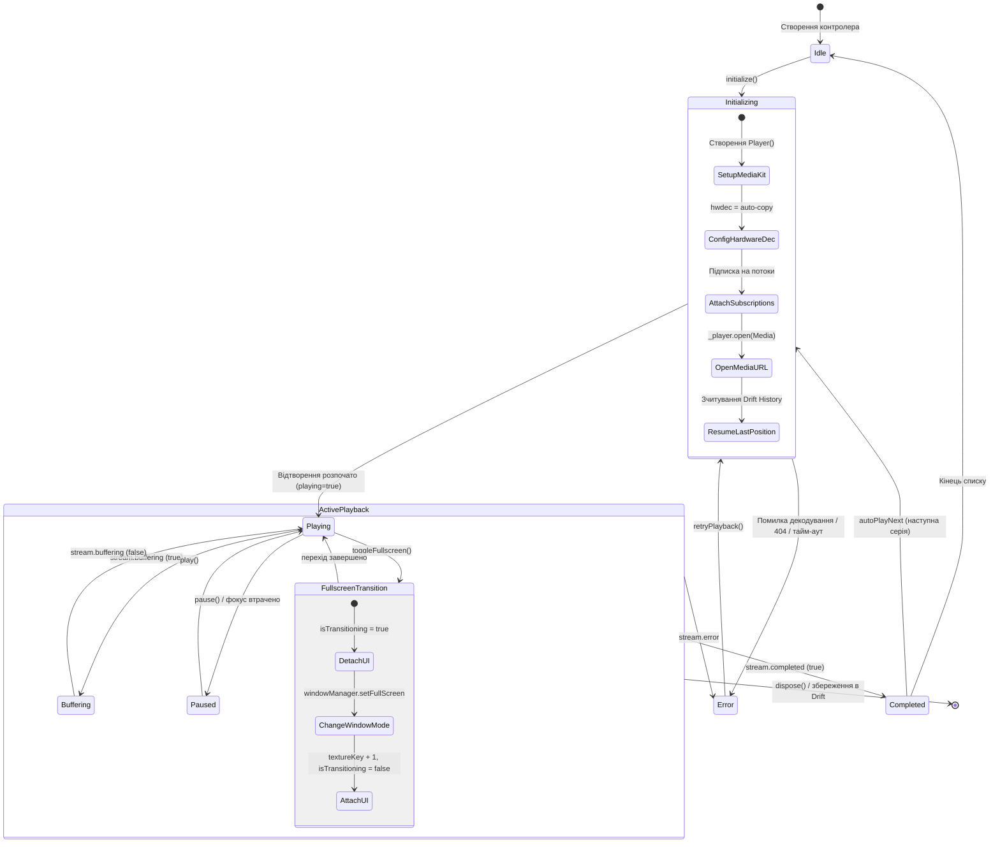
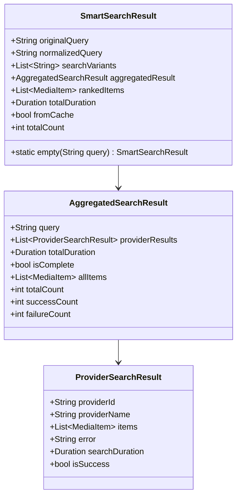
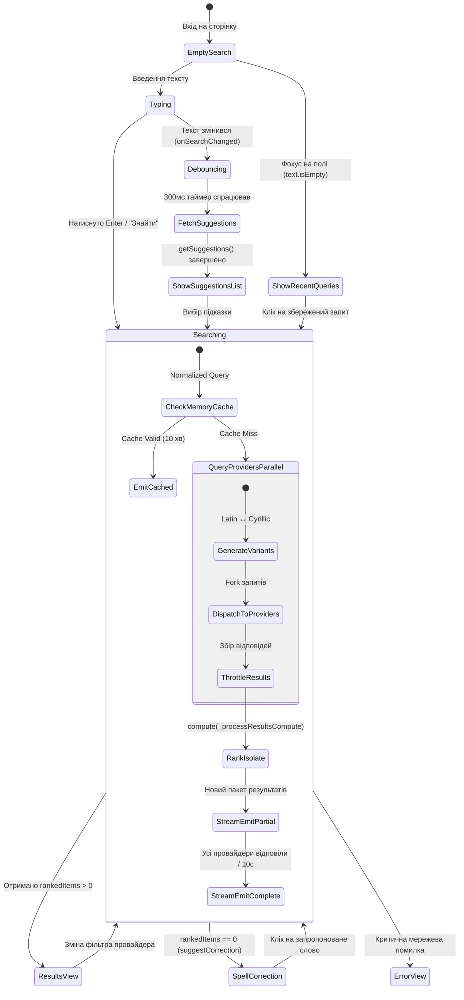
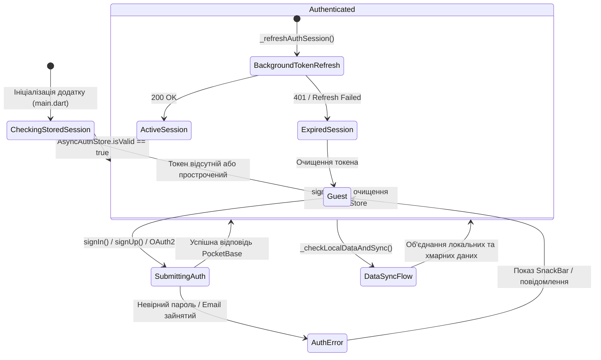
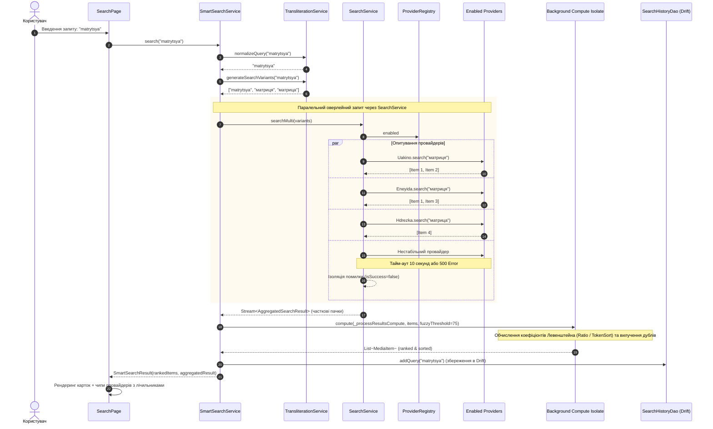
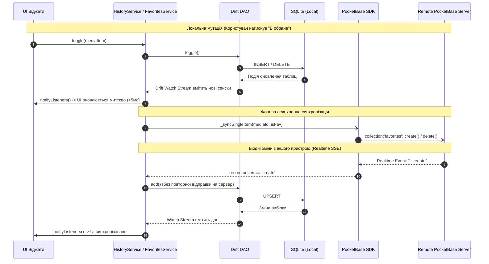
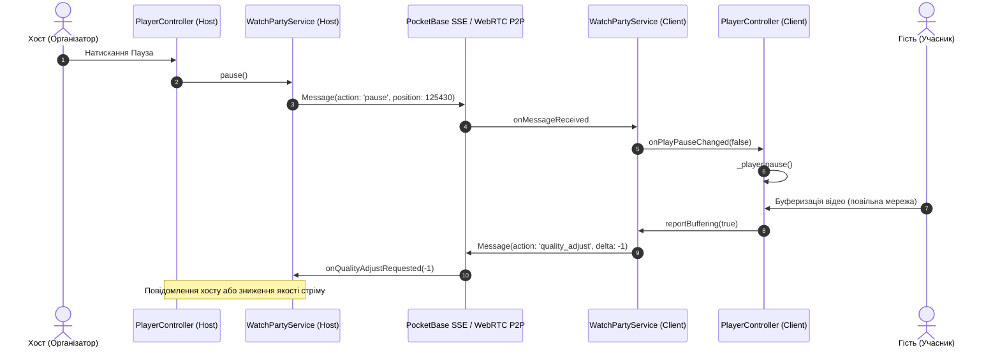

# 05. Управління станом та системні потоки взаємодії (State Management & System Workflows)

Цей документ містить вичерпний технічний аналіз архітектури управління станом, життєвого циклу даних, реактивних потоків та наскрізних призначених для користувача сценаріїв (End-to-End User Journeys) застосунку **Oxide Film**.

---

## 1. Архітектурний огляд управління станом

Хоча у залежностях проекту [`pubspec.yaml`](file:///e:/Github/oxide_film/pubspec.yaml) присутня бібліотека `flutter_bloc` та `equatable`, кодова база Oxide Film використовує прагматичну гібридну реактивну архітектуру. Замість класичних формальних BLoC з подіями та селекторами, ядро стейт-менеджменту реалізовано через:
1. **Domain/Application State Controllers (`ChangeNotifier` / Observable State Pattern)**:
   - Автономні контролери та сервіси (`PlayerController`, `VideoPlayerService`, `SettingsService`, `HistoryService`, `FavoritesService`, `WatchPartyService`, `AuthService`, `SyncService`, `DownloadService`, `EpisodeUpdateService`, `RecommendationService`).
   - Інкапсуляція бізнес-правил, зовнішніх API, локального кешу та бази даних.
   - Експозиція незмінних моделей стану (`PlayerState`, `SettingsState`, `WatchPartyState`, `SmartSearchResult`) через геттери або `ValueNotifier`.
2. **Stream-Driven Reactive Data Layer (Drift DAOs + Dart Streams)**:
   - Локальна база даних Drift підтримує реактивні потоки (`watchAll()`, `watchContinueWatching()`, `watchByStatus()`).
   - Сервіси підписуються на Drift Streams та транслюють оновлення до UI через `notifyListeners()`.
3. **Reactive Provider Multi-Search Pipelines**:
   - `SmartSearchService` та `SearchService` оперують прогресивними асинхронними генераторами та стрімами (`Stream<SmartSearchResult>`), здатними видавати часткові результати в міру відповіді парсерів провайдерів.
4. **Local UI State**:
   - `StatefulWidget` з контролерами скролу, анімацій, табів і текстових полів (`ScrollController`, `TabController`, `TextEditingController`, `FocusNode`).

---

## 2. Специфікація зв'язків між шарами (Clean Architecture Cross-Layer Map)

Взаємодія між шарами проекту підпорядковується правилу залежностей (Dependency Rule) з інверсією контролю через IoC-контейнер GetIt:



### Таблиця матриці відповідальності шарів

| Шар | Компоненти | Вхідні дані | Вихідні дані | Відповідальність |
| :--- | :--- | :--- | :--- | :--- |
| **Presentation** | `HomePage`, `SearchPage`, `DetailsPage`, `PlayerPage`, `FavoritesPage` | Дії користувача (тапи, жести, введення) | Рендеринг віджетів, навігація GoRouter | Відображення інтерфейсу, перехоплення клавіатурних/D-Pad подій, Skeleton-завантаження |
| **Controllers / Services** | `PlayerController`, `SmartSearchService`, `HistoryService`, `FavoritesService` | Виклики методів, параметри пошуку, позиція медіа | `ChangeNotifier` сповіщення, `Stream<T>`, оновлені моделі стану | Управління життєвим циклом фічі, синхронізація з сервером, дедуплікація, кешування |
| **Domain** | `MediaItem`, `StreamSource`, `MediaDetails`, `UnifiedContentRepository` | Чисті доменні структури | Бізнес-моделі | Опис контрактів взаємодії, абстракція від джерел отримання даних |
| **Data (Repository)** | `UnifiedContentRepositoryImpl`, `ProviderRegistry` | Запити до кількох джерел | Агреговані колекції `MediaItem` | Маршрутизація запитів між конкретними провайдерами, уніфікація ID |
| **Data (Providers/Parsers)**| `UakinoProvider`, `EneyidaProvider`, `HdrezkaParser` тощо | URL сторінки, HTML/JSON | Парсинг стрімів, метаданих | Скрапінг, отримання прямих HLS/MP4 посилань |
| **Data (Persistence & Net)** | `AppDatabase` (Drift), `PocketBaseService`, `ApiClient` (Dio) | SQL транзакції, HTTP запити, WebSocket | Реактивні `Stream` з БД, мережеві DTO | Збереження на диск, обхід блокувань, фонова синхронізація |

---

## 3. Реєстр контролерів стану (Controllers & Services Registry)

Нижче наведено повний перелік керуючих станом компонентів системи із зазначенням типу спостереження, життєвого циклу та зони відповідальності.

| Клас / Контролер | Файл | Тип реєстрації (DI) | Патерн стану | Зона відповідальності |
| :--- | :--- | :--- | :--- | :--- |
| [`PlayerController`](file:///e:/Github/oxide_film/lib/presentation/pages/player/player_controller.dart) | `lib/presentation/pages/player/player_controller.dart` | Factory / Instantiated on play | `ChangeNotifier` + `PlayerState` + `ValueNotifier<Duration>` | Відтворення медіа, перемикання аудіодоріжок/якості, повноекранний режим Desktop/Mobile, таймер автозбереження прогресу, синхронізація Watch Party, WakeLock |
| [`VideoPlayerService`](file:///e:/Github/oxide_film/lib/data/services/video_player_service.dart) | `lib/data/services/video_player_service.dart` | LazySingleton (`getIt`) | `ChangeNotifier` + `MiniPlayerState` | Глобальне утримання інстансу `PlayerController`, керування плаваючим вікном PiP (Android Picture-in-Picture та кастомний Desktop PiP), згортання/розгортання плеєра |
| [`SettingsService`](file:///e:/Github/oxide_film/lib/data/services/settings_service.dart) | `lib/data/services/settings_service.dart` | LazySingleton (`getIt`) | `ChangeNotifier` + `SettingsState` + `UISettings` | Налаштування теми (Dark/Light/Amoled), мови інтерфейсу, розміру сітки та карток, автооновлення, параметрів плеєра за замовчуванням |
| [`HistoryService`](file:///e:/Github/oxide_film/lib/data/services/history_service.dart) | `lib/data/services/history_service.dart` | LazySingleton (`getIt`) | `ChangeNotifier` + Drift Stream Subscriptions | Збереження та зчитування історії перегляду, фільтрація секції "Продовжити перегляд", дедуплікація, фонова двостороння синхронізація з PocketBase |
| [`FavoritesService`](file:///e:/Github/oxide_film/lib/data/services/favorites_service.dart) | `lib/data/services/favorites_service.dart` | LazySingleton (`getIt`) | `ChangeNotifier` + Drift Stream Subscriptions | Додавання/видалення з обраного (offline-first), реактивний моніторинг змін у Drift, синхронізація з PocketBase Realtime |
| [`SmartSearchService`](file:///e:/Github/oxide_film/lib/data/services/smart_search/smart_search_service.dart) | `lib/data/services/smart_search/smart_search_service.dart` | LazySingleton (`getIt`) | `Stream<SmartSearchResult>` + In-Memory Cache | Розумний пошук: авто-транслітерація Cyrillic ↔ Latin, fuzzy-пошук (Levenshtein), ранжування у Isolate (`compute`), збереження історії запитів |
| [`SearchService`](file:///e:/Github/oxide_film/lib/data/services/search_service.dart) | `lib/data/services/search_service.dart` | LazySingleton (`getIt`) | Async Stream Aggregator (`AggregatedSearchResult`) | Паралельний оверлей-пошук по всіх увімкнених провайдерах з тайм-аутами (10с на джерело), дедуплікація та ізоляція помилок |
| [`WatchPartyService`](file:///e:/Github/oxide_film/lib/data/services/watch_party_service.dart) | `lib/data/services/watch_party_service.dart` | LazySingleton (`getIt`) | `ChangeNotifier` + WebSockets / WebRTC P2P | Синхронний перегляд фільмів: створення кімнати, передача команд (play/pause/seek/speed), розрахунок часового дрифту (clock drift) та автокорекція затримки, груповий чат |
| [`AuthService`](file:///e:/Github/oxide_film/lib/data/services/auth_service.dart) | `lib/data/services/auth_service.dart` | LazySingleton (`getIt`) | `ChangeNotifier` + `AsyncAuthStore` | Автентифікація користувачів у PocketBase (Email/Password, OAuth2), сесії, отримання профілю та аватарів |
| [`DownloadService`](file:///e:/Github/oxide_film/lib/data/services/download_service.dart) | `lib/data/services/download_service.dart` | LazySingleton (`getIt`) | `ChangeNotifier` + Drift Stream Subscriptions | Завантаження HLS/MP4 стрімів для офлайн-перегляду, керування чергою, пауза/відновлення, збереження у `DownloadsDao` |
| [`EpisodeUpdateService`](file:///e:/Github/oxide_film/lib/data/services/episode_update_service.dart) | `lib/data/services/episode_update_service.dart` | LazySingleton (`getIt`) | `ChangeNotifier` | Фонова перевірка нових серій для збережених улюблених серіалів |
| [`RecommendationService`](file:///e:/Github/oxide_film/lib/data/services/recommendation_service.dart) | `lib/data/services/recommendation_service.dart` | LazySingleton (`getIt`) | `ChangeNotifier` | Генерація персональних рекомендацій на основі переглянутих жанрів та історії |
| [`SyncService`](file:///e:/Github/oxide_film/lib/data/services/sync_service.dart) | `lib/data/services/sync_service.dart` | LazySingleton (`getIt`) | `ChangeNotifier` | Ручний експорт та імпорт даних користувача (обране, історія, налаштування) у форматі JSON без обов'язкового бекенду |

---

## 4. Детальний аналіз подій та станів ключових фіч

### 4.1. Медіаплеєр: `PlayerController` та `PlayerState`

Центральний компонент відтворення працює на базі пакета `media_kit`. Стан `PlayerState` є немутабельним об'єктом, оновлюваним за допомогою методу `copyWith`:



#### Діаграма станів відеоплеєра



> [!NOTE]
> **Оптимізація частоти кадрів (60 FPS):** Оновлення поточної позиції `_player.stream.position` **не викликає** `notifyListeners()`, щоб уникнути важкого ребілду всього дерева віджетів. Замість цього використовується виокремлений `ValueNotifier<Duration> positionNotifier`, на який точково підписаний лише повзунок таймлайну (`Slider` / `ProgressBar`).

---

### 4.2. Пошук та розумне ранжування: `SmartSearchService`

Стан пошуку передається як реактивний стрім `Stream<SmartSearchResult>`:



#### Діаграма станів процесу пошуку на сторінці `SearchPage`



---

### 4.3. Авторизація та синхронізація профілю: `AuthService`



---

## 5. Повні наскрізні сценарії взаємодії (End-to-End User Journeys)

### Сценарій 1: Від запуску додатку до вибору та перегляду фільму

Цей сценарій охоплює холодний старт, перевірку мережі, паралельне завантаження контенту від увімкнених провайдерів, клієнтську фільтрацію та перехід до сторінки деталей.

```mermaid
sequenceDiagram
    autonumber
    actor User as Користувач
    participant Main as main.dart / DI (GetIt)
    participant UI as HomePage
    participant Net as Connectivity
    participant Registry as ProviderRegistry
    participant Providers as Ukrainian Providers (Uakino, Eneyida, Uaflix, Uaserials)
    participant EUS as EpisodeUpdateService
    participant Router as GoRouter
    participant Details as DetailsPage

    User->>Main: Запуск застосунку
    Main->>Main: MediaKit.ensureInitialized(), configureDependencies()
    Main->>Registry: resolveProviderUrls() (перевірка дзеркал у фоні)
    Main->>UI: runApp(OxideFilmApp) -> HomePage
    
    UI->>Net: checkConnectivity() & listen()
    UI->>EUS: checkForUpdates() (перевірка нових серій)
    
    rect rgb(240, 248, 255)
    note right of UI: Паралельний збір популярного контенту
    UI->>Registry: homeProviders (uakino, eneyida, uaflix, uaserials)
    par Запит до Uakino
        UI->>Providers: Uakino.getPopular(page: 1)
        Providers-->>UI: List~MediaItem~
    and Запит до Eneyida
        UI->>Providers: Eneyida.getPopular(page: 1)
        Providers-->>UI: List~MediaItem~
    and Запит до Uaflix
        UI->>Providers: Uaflix.getPopular(page: 1)
        Providers-->>UI: List~MediaItem~
    and Запит до Uaserials
        UI->>Providers: Uaserials.getPopular(page: 1)
        Providers-->>UI: List~MediaItem~
    end
    UI->>UI: Дедуплікація за uniqueId, збереження в _allItems
    UI->>UI: _applyFilter() -> рендеринг сітки або списку
    end

    User->>UI: Натискання на MediaCard фільму
    UI->>Router: context.push('/details/:providerId/:mediaId')
    Router->>Details: Ініціалізація DetailsPage
    Details->>Details: _loadDetails() & _checkFavorite()
```

---

### Сценарій 2: Пошук (fuzzy matching) та агрегація результатів з різних провайдерів

Сценарій демонструє роботу конвеєра розумного пошуку з транслітерацією, захистом від друкарських помилок та поглинанням відмов окремих провайдерів.



---

### Сценарій 3: Завантаження джерела, вибір якості/озвучки, запуск плеєра та запис прогресу в Drift

Повний життєвий цикл вибору стріму та його програвання зі збереженням стану при закритті або у фоновому таймері.

```mermaid
sequenceDiagram
    autonumber
    actor User as Користувач
    participant Details as DetailsPage
    participant Provider as ContentProvider (e.g. Hdrezka / Uakino)
    participant FavSvc as FavoritesService
    participant Router as GoRouter
    participant VPS as VideoPlayerService
    participant PC as PlayerController
    participant MK as MediaKit Player
    participant HistSvc as HistoryService
    participant DAO as HistoryDao (Drift)
    participant PB as PocketBaseService (Cloud)

    User->>Details: Перегляд сторінки фільму/серіалу
    Details->>Provider: getDetails(mediaId) & getStreams(mediaId)
    Provider-->>Details: MediaDetails + List~StreamSource~ (якості, озвучки, сезони)
    
    Details->>Details: Групування за озвучками та якостями
    User->>Details: Вибір озвучки "НеЗупиняйПродакшн" та серії 3
    Details->>Details: setState: _selectedStream = stream
    
    User->>Details: Натискання кнопки "Дивитися"
    Details->>Router: context.push('/player', extra: {url, streams, mediaId...})
    Router->>VPS: open(url, streams, mediaId, providerId...)
    VPS->>PC: Створення PlayerController
    VPS->>PC: initialize()
    
    PC->>MK: _player.open(Media(url, headers))
    PC->>HistSvc: Зчитування останньої позиції з БД
    HistSvc->>DAO: getProgress(mediaId, providerId)
    DAO-->>PC: positionMs = 1420000 (23:40)
    PC->>MK: _player.seek(Duration(milliseconds: 1420000))
    
    rect rgb(240, 255, 240)
    note over PC,PB: Цикл відтворення та фонового збереження прогресу
    MK-->>PC: stream.position оновлюється
    PC->>PC: positionNotifier.value = pos (60fps плавний повзунок)
    
    loop Кожні 10 секунд (_startProgressSaving)
        PC->>HistSvc: saveProgress(mediaId, pos, duration, voiceover...)
        HistSvc->>DAO: saveProgress(...) -> Drift SQLite INSERT/UPDATE
        HistSvc-->>PB: _syncSingleItemToCloud (Fire-and-forget хмарний бекап)
    end
    end

    User->>PC: Вихід із плеєра / Клік кнопки Назад
    PC->>HistSvc: Фінальний saveProgress()
    PC->>MK: _player.dispose()
    PC->>VPS: minimize() або очищення контролера
    DAO-->>HistSvc: Drift Stream оновлює _continueWatching
    HistSvc-->>UI: notifyListeners() (секція "Продовжити перегляд" на головній миттєво оновлена)
```

---

## 6. Аналіз життєвого циклу даних та реактивності (Stream-Oriented Patterns)

### 6.1. Реактивний ланцюг Drift -> DAO -> Service -> UI

У системі застосовано реактивний патерн **Database as Single Source of Truth**:
1. База даних Drift генерує реактивні стріми за допомогою `SelectStatement.watch()`.
2. `HistoryDao` та `FavoritesDao` транслюють їх назовні:
   ```dart
   // lib/data/database/dao/history_dao.dart
   Stream<List<WatchHistoryData>> watchContinueWatching({int limit = 20}) {
     final query = select(watchHistory)
       ..where((t) => t.positionMs.isBiggerThanValue(0) & 
                      (t.positionMs.cast<double>() / t.durationMs.cast<double>()).isSmallerThanValue(0.95))
       ..orderBy([(t) => OrderingTerm.desc(t.lastWatchedAt)])
       ..limit(limit);
     return query.watch();
   }
   ```
3. `HistoryService` відкриває довготривалу підписку `_continueSubscription` у методі `_init()`:
   ```dart
   _continueSubscription = _dao.watchContinueWatching(limit: 20).listen((items) {
     _continueWatching = items;
     notifyListeners(); // Сповіщає UI про зміни без повторних SQL-запитів
   });
   ```
4. Віджет [`ContinueWatchingSection`](file:///e:/Github/oxide_film/lib/presentation/widgets/home/continue_watching_section.dart) слухає `HistoryService` і автоматично оновлює слайдер карток при поверненні користувача з перегляду.

### 6.2. Синхронізація PocketBase: Offline-First + Realtime Event Loop



---

## 7. Спільний перегляд (Watch Party Workflow)

`WatchPartyService` підтримує як серверний транспорт (PocketBase Realtime / Server-Sent Events), так і прямий одноранговий P2P WebRTC зв'язок через `PeerDart`.

### 7.1. Протокол команд та синхронізація часу

Пакет синхронізації `WatchPartyMessage` передає:
- `action`: `sync`, `play`, `pause`, `seek`, `speed`, `chat`.
- `payload`: поточна позиція (`positionMs`), стан відтворення, затримка мережі.
- `timestamp`: UTC-мітка відправлення для компенсації мережевого лагу:

$$\text{Latency} = \frac{\text{Now} - \text{Timestamp}}{2}$$
$$\text{ExpectedPosition} = \text{HostPosition} + (\text{HostIsPlaying} ? \text{Latency} : 0)$$
$$\text{Drift} = |\text{LocalPosition} - \text{ExpectedPosition}|$$

- Якщо $\text{Drift} > 2000\,\text{мс}$, `PlayerController` примусово викликає `_player.seek()`.
- Якщо $\text{Drift} \le 2000\,\text{мс}$, швидкість відтворення тимчасово коригується на $\pm 5\%$, запобігаючи стрибкам аудіодоріжки.



---

## 8. Висновки

1. **Архітектурна однорідність**: Незважаючи на відсутність формальних класів `Bloc`/`Cubit`, кодова база має чітке розділення відповідальності завдяки зв'язці `StatefulWidget` $\rightarrow$ `ChangeNotifier Services / Controllers` $\rightarrow$ `Domain Entities` $\rightarrow$ `Drift DAOs / Provider Registry`.
2. **Продуктивність UI**: Використання ізольованих нотифікаторів (наприклад, `positionNotifier` у плеєрі та ізолятів `compute()` у розумному пошуку) гарантує відсутність блокування UI-потоку навіть під час інтенсивних операцій.
3. **Надійність (Resilience)**:
   - Відмова окремих провайдерів ізолюється у `SearchService` і не призводить до краху пошукового запиту.
   - Offline-First підхід гарантує повну працездатність додатку без доступу до інтернету (для локальних та завантажених медіафайлів).
   - Двостороння синхронізація з PocketBase реалізована за принципом фонової черги з захистом від зациклення через локальні перевірки.
