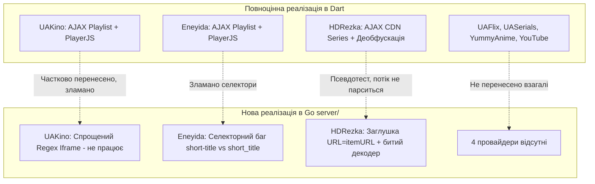
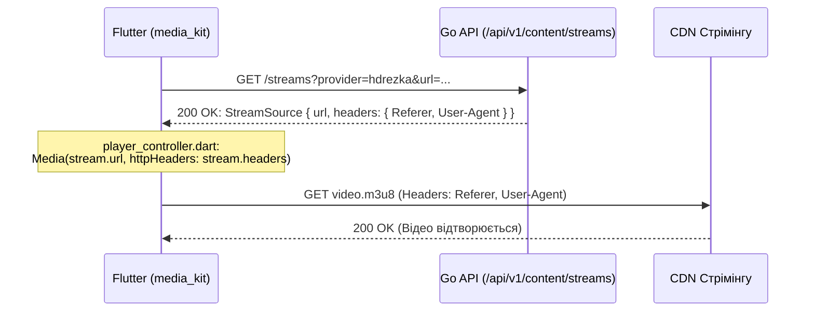

# Звіт аудиту №2: Валідація парсерів та джерел контенту (Go Parsers vs Dart Scrapers)

**Дата аудиту:** 28 вересня 2026 року  
**Роль:** Незалежний технічний аудитор (Валідатор парсерів та джерел контенту)  
**Об'єкт аудиту:**
- Dart-скрейпери: `lib/data/parsers/*`, `lib/data/providers/*`, `lib/data/repositories/*`, `lib/domain/entities/stream_source.dart`
- Go-серверні парсери: `server/internal/provider/*` (`uakino.go`, `eneyida.go`, `hdrezka.go`, `client.go`, `registry.go`), `server/internal/domain/content.go`, `server/internal/domain/provider.go`
- Програвач та заголовки: `lib/presentation/pages/player/player_controller.dart`

---

## 1. Загальний висновок (Executive Summary)

Перенесення парсерів з Flutter/Dart на Go-бекенд перебуває на початковому та частково непрацездатному етапі. Жоден із трьох перенесених провайдерів у Go-сервері (`UAKino`, `Eneyida`, `HDRezka`) **наразі не здатен видати реальний робочий потік відео для `media_kit`**, а два з трьох взагалі повертають **порожні результати пошуку** при реальних запитах через критичні помилки селекторів та блокування редиректів.

### Ключові показники відповідності:
| Критерій | Статус | Коментар |
| :--- | :---: | :--- |
| **Кількість провайдерів** | ❌ **3 з 7 (43%)** | У Dart є 7 провайдерів (UAKino, Eneyida, HDRezka, UAFlix, UASerials, YummyAnime, YouTube). У Go реалізовано лише 3. |
| **Працездатність пошуку** | ❌ **0 з 3 (0%)** | Усі 3 Go-провайдери повертають 0 результатів у реальних мережевих умовах. |
| **Парсинг деталей (Metadata)** | ⚠️ **Частково (20%)** | У Go вилучаються лише Title, Poster, Desc. Не вилучаються: Year, Rating, Genres, Actors, Director, Seasons/Episodes. |
| **Деобфускація HDRezka** | ❌ **Критичний баг** | Алгоритм у Go перевіряє вигадані токени у відкритому тексті замість реальних Base64-токенів HDRezka. |
| **Резолвінг потоків (Streams)** | ❌ **Не реалізовано** | Go повертає HTML-сторінки iframe або URL самої сторінки фільму замість прямого `.m3u8`/`.mp4`. |
| **Заголовки для `media_kit`** | ⚠️ **Невідповідність** | Схема JSON сумісна, але значення Referer/Origin некоректні для сторонніх CDN (викликають HTTP 403 Forbidden). |
| **Обхід блокувань (TLS Client)** | ⚠️ **Помилка конфігурації** | JA3 Chrome-120 працює, але прапорець `WithNotFollowRedirects()` повністю ламає запити на оновлені дзеркала. |

---

## 2. Порівняльний аналіз провайдерів (Dart vs Go)



---

## 3. Детальний аудит HTML-селекторів та контрактів

### 3.1. UAKino (`uakino.go` vs `uakino_parser.dart`)

1. **Домен та редиректи:**
   - **Go:** `baseURL = "https://uakino.me"`.
   - **Фактичний стан мережі:** `https://uakino.me` повертає `HTTP/1.1 301 Moved Permanently` з `Location: https://uakino.best/`.
   - Оскільки в `client.go` встановлено `tls_client.WithNotFollowRedirects()`, клієнт зупиняється на порожньому тілі 301-відповіді. Результат: **0 знайдених фільмів**.
   - **Dart:** Використовує актуальний `https://uakino.best`.
2. **Селектори пошуку:**
   - **Go:** `.movie-item, .short-story` -> `.movie-title a, a.movie-title, h2.title a` -> `.movie-poster img, .poster img`.
   - **Проблема атрибутів:** Go читає лише `img.Attr("src")`. На UAKino діє lazy loading: постери часто зберігаються в `data-src`. У Dart передбачено: `img?.attributes['src'] ?? img?.attributes['data-src']`.
3. **Метадані в `GetDetails`:**
   - Go повністю ігнорує рік, рейтинг, країну, режисера, акторів та структуру сезонів/серій:
     ```go
     // server/internal/provider/uakino.go:116
     details := &domain.MediaDetails{
         MediaItem: domain.MediaItem{
             ID: itemURL, ProviderID: p.ID(), Title: title, PosterURL: poster, URL: itemURL, Type: "movie",
         },
         Description: desc,
         Genres: genres, // Seasons, Year, Rating залишаються порожніми!
     }
     ```
   - Dart витягує Schema.org розмітку (`meta[itemprop="director"]`, `meta[itemprop="actors"]`, `dateCreated`), таблицю `.film-info`, рейтинг IMDb та лайки сайту.

---

### 3.2. Eneyida (`eneyida.go` vs `eneyida_parser.dart`)

1. **Критична помилка селекторів пошуку (Дефіс замість підкреслення):**
   - У Go (`server/internal/provider/eneyida.go:52`):
     ```go
     linkElem := s.Find("h2.short-title a, .short-title a, a.short-btn")
     imgElem := s.Find(".short-img img")
     ```
   - **Фактичний DOM сайту Eneyida.tv:**
     - Клас картки: `article.short` (знайдено 6 карток).
     - Елемент посилання: `a.short_title` (**з підкресленням**, знайдено 6). Елементів `.short-title` — **0**!
     - Елемент картинки: `a.short_img img` (**з підкресленням**, знайдено 6). Елементів `.short-img` — **0**!
     - Кнопки `a.short-btn` на сайті взагалі немає.
   - **Наслідок:** В Go `linkElem.Text()` завжди порожній, `href` не знаходиться, цикл завершується на `if !exists || title == "" { return }`. Пошук Eneyida в Go **завжди повертає 0 елементів**.
2. **Селектори сторінки деталей (`GetDetails`):**
   - Go шукає `doc.Find("h1.full-title")` та `doc.Find(".full-poster img")`.
   - На Eneyida.tv заголовок знаходиться в простому тегу `<h1>` (без класів), а постер завантажується за шляхом `/uploads/posts/...`.
   - Результат у Go: `Title = ""` та `PosterURL = ""`! Dart має захисний фолбек: `titleEl ??= soup.find('h1')` та пошук картинки по масці URL.

---

### 3.3. HDRezka (`hdrezka.go` vs `hdrezka_parser.dart`)

1. **Неробочий базовий домен:**
   - Go використовує `https://hdrezka.me`. При зверненні цей домен повертає `HTTP/1.1 403 Forbidden` (заблоковано/вимкнено).
   - Dart використовує динамічний пул дзеркал (`https://hdrezka-home.tv`, `https://rezka.ag`, `https://hdrezka.ag`, тощо) із можливістю автоматичного або ручного перемикання дзеркала.
2. **Селектори пошуку та деталей:**
   - Селектор `.b-content__inline_item` у Go правильний, але тип контенту жорстко захардкоджений як `"movie"`:
     ```go
     Type: "movie", // Навіть якщо це аніме або серіал
     ```
   - Немає парсингу сезонів та серій (`ul#simple-seasons-tabs`, `ul.b-simple_episodes__list`).

---

## 4. Глибокий аналіз деобфускації HDRezka (`DecodeStreamURL`)

У HDRezka потоки шифруються для захисту від прямого грабінгу. Порівняння реалізацій виявило фіктивність поточної Go-імплементації.

### 4.1. Що зроблено в Go (`server/internal/provider/hdrezka.go`):
```go
func DecodeStreamURL(encoded string) (string, error) {
	if !strings.HasPrefix(encoded, "#h") {
		return encoded, nil
	}

	raw := encoded[2:] // Зрізаємо префікс #h
	trashList := []string{
		"$$#!!@#!@##", "_@#@_#@_###", "@@@@@!#!@#",
	}

	for _, trash := range trashList {
		raw = strings.ReplaceAll(raw, trash, "")
	}

	decodedBytes, err := base64.StdEncoding.DecodeString(raw)
	if err != nil {
		return "", err
	}

	return string(decodedBytes), nil
}
```

### 4.2. Чому це не працює з реальними даними HDRezka:
1. **Сміттєві токени (Trash strings):** HDRezka вставляє сміттєві послідовності **безпосередньо у Base64-рядок** перед декодуванням. Вони самі виглядають як Base64-фрагменти (наприклад, `//_//JCQhIUAkXiY=`, `//_//QEBAQEAhIyM=`, `//_//Xl5eIyo=`), або регулярний вираз `//[A-Za-z0-9+/]{1,25}=`, а також роздільники `//` та `_`.
2. Рядки `"$$#!!@#!@##"`, `"_@#@_#@_###"`, `"@@@@@!#!@#"` у Go — це символи, які з'являються **після** розкодування сміття, а не всередині Base64-стрінга. Жоден реальний Base64-рядок HDRezka не містить `$$` чи `@#@`.
3. **Префікси версій:** HDRezka використовує маркери `#h`, `#0`, `#1`, `#2`, або просто `#`. Go ігнорує все, що не починається з `#h`.
4. **Вирівнювання Base64 (Padding):** Go використовує суворий `base64.StdEncoding`, який падає з помилкою `illegal base64 data at input byte`, якщо довжина рядка не кратна 4 (`raw.length % 4 != 0`). У Dart є цикл додавання `=`.
5. **Фіктивний Unit-тест (`hdrezka_test.go`):**
   ```go
   // Тест проходить лише тому, що автор сам склеїв рядок зі своїми псевдо-токенами:
   garbageEncoded := "#h" + encodedBase64[:10] + "$$#!!@#!@##" + encodedBase64[10:20] + "_@#@_#@_###" + encodedBase64[20:]
   ```
   Цей тест перевіряє власну штучну конструкцію, а не алгоритм обфускації HDRezka.

### 4.3. Повна відсутність виклику декодера у `GetStreams`:
У файлі `server/internal/provider/hdrezka.go:103-122`:
```go
func (p *HdrezkaProvider) GetStreams(ctx context.Context, itemURL string, season, episode int, voiceID string) (*domain.ContentStreamsResponse, error) {
	headers := map[string]string{
		"Referer":    p.baseURL + "/",
		"User-Agent": "Mozilla/5.0 ... Chrome/120.0.0.0 Safari/537.36",
	}

	return &domain.ContentStreamsResponse{
		ProviderID: p.ID(),
		Streams: []domain.StreamSource{
			{
				Quality:       "Auto / 1080p",
				URL:           itemURL,       // <--- ПОВЕРТАЄТЬСЯ САМИЙ URL СТОРІНКИ ФІЛЬМУ!
				DirectURL:     itemURL,
				RequiresProxy: false,
				Headers:       headers,
			},
		},
	}, nil
}
```
Функція `DecodeStreamURL` **навіть не викликається**! Провайдер віддає веб-сторінку замість відеопотоку.

---

## 5. Обхід захисту через `bogdanfinn/tls-client`

### 5.1. Позитивні аспекти:
- Використання `github.com/bogdanfinn/tls-client` із профілем `profiles.Chrome_120` та `fhttp` є правильною архітектурною концепцією. Воно симулює реальний JA3/JA4 TLS handshake, TLS extensions, ciphersuites та порядок заголовків Google Chrome 120.
- Це успішно усуває Cloudflare TLS Fingerprint блокування, яке виникало при прямих запитах із Dart `Dio`/`HttpClient`.

### 5.2. Виявлені архітектурні дефекти:
1. **`tls_client.WithNotFollowRedirects()`:**
   - Налаштування у `client.go:24` блокує обробку HTTP 301/302/307.
   - Оскільки українські онлайн-кінотеатри постійно змінюють домени та дзеркала (або DLE перенаправляє при точній назві), клієнт отримує статус 301 і повертає порожню відповідь замість переходу за заголовком `Location`.
2. **Відсутність перевірки кодів стану (Status Code):**
   - У `Get()` та `PostForm()` відсутня валідація `resp.StatusCode`:
     ```go
     resp, err := c.client.Do(req)
     // ...
     bodyBytes, err := io.ReadAll(resp.Body)
     return string(bodyBytes), nil // 403 Forbidden або 503 Challenge повертаються як валідний HTML!
     ```
   - Парсер намагається розібрати HTML сторінки помилки Cloudflare / Nginx, не отримує елементів і віддає порожній результат клієнту без жодного повідомлення про помилку мережі.

---

## 6. Інтеграція потоків та заголовків із `media_kit`

### 6.1. Ланцюг передачі даних:



### 6.2. Невідповідності контрактів та поведінки:
1. **Формат StreamSource:**
   - Поля `Headers: map[string]string` у Go серіалізуються в JSON як `{"Referer": "...", "User-Agent": "..."}`.
   - У Flutter `player_controller.dart:562`:
     ```dart
     await _player.open(Media(_state.currentUrl, httpHeaders: currentStream?.headers));
     ```
     Контракт типів між Go JSON та Dart Entity збігається.
2. **Фатальна проблема з URL потоку:**
   - Для **UAKino** та **Eneyida** Go повертає посилання на iframe (наприклад `https://hdvbua.pro/vid/74574` або `https://ashdi.vip/...`).
   - `media_kit` (який використовує `libmpv`) **не є браузером**: він не вміє рендерити HTML сторінку плеєра, виконувати JS та витягувати звідти відеопотік. Передача iframe URL у `Media()` завершується помилкою плеєра: `Demuxer error / Unrecognized file format`.
3. **Проблема з Referer/Origin:**
   - У CDN Rezka та Ashdi потік `.m3u8` вимагає специфічного реферера:
     - Для Rezka: обов'язковий `Origin: https://hdrezka-home.tv` та `Referer: https://hdrezka-home.tv/`. У Go поле `Origin` відсутнє.
     - Для UAKino / Eneyida: відеофрагменти `.ts` часто вимагають `Referer: https://ashdi.vip/` (хост самого плеєра), а Go передає `Referer: https://uakino.me/`, що викликає помилку CDN `HTTP 403 Forbidden`.

---

## 7. Відсутні провайдери в Go-сервері

У Flutter-клієнті присутні 4 додаткові робочі джерела контенту, які взагалі не реалізовані на бекенді:

| Провайдер | Dart-джерело | Наявність у Go | Складність переносу |
| :--- | :--- | :---: | :--- |
| **UASerials** | `uaserials_provider.dart`, `uaserials_parser.dart` | ❌ Відсутній | Середня (AJAX + PlayerJS) |
| **UAFlix** | `uaflix_provider.dart`, `uaflix_parser.dart` | ❌ Відсутній | Середня (DLE структура) |
| **YummyAnime** | `yummyanime_provider.dart`, `yummyanime_parser.dart` | ❌ Відсутній | Висока (POST ajax-фільтри, списки плеєрів) |
| **YouTube** | `youtube_provider.dart`, `youtube_parser.dart` | ❌ Відсутній | Низька (Iframe Embed / Invidious) |

---

## 8. Покроковий план виправлення (Remediation Plan)

### Крок 1. Виправлення `TLSClient` (`server/internal/provider/client.go`)
- Зняти опцію `tls_client.WithNotFollowRedirects()`, увімкнувши стандартне слідування за 301/302 редиректами (до 10 кроків).
- Додати перевірку статус-кодів у `Get` та `PostForm`: якщо `resp.StatusCode >= 400`, повертати структуровану помилку `fmt.Errorf("http error: status %d", resp.StatusCode)`.

### Крок 2. Виправлення селекторів та доменів
- **UAKino:** змінити `baseURL` на `https://uakino.best` (або брати з конфігу/env). У пошуку та деталях додати `data-src` для картинок.
- **Eneyida:** замінити у пошуку `h2.short-title a` на `a.short_title`, а `.short-img img` на `a.short_img img`. У деталях брати `h1` без класу та постер через перевірку `/uploads/posts/`.

### Крок 3. Реалізація реального резолвера потоків для UAKino та Eneyida
- Додати в Go виклик ендпоінта AJAX плейлиста: `POST /engine/ajax/playlists.php` з параметрами `news_id` та `xfield=playlist`.
- Реалізувати порт `PlayerJsParser` на Go:
  - Регулярні вирази для пошуку `file: "..."`, `[720p]url,[1080p]url`.
  - Декодування рядків PlayerJS (Base64, ROT13/Caesar shift).

### Крок 4. Повна реалізація HDRezka парсера потоків
- Переписати функцію `DecodeStreamURL`:
  - Забезпечити очищення реальних Base64 сміттєвих масок: `//_//JCQhIUAkXiY=`, `//_//QEBAQEAhIyM=`, `//_//Xl5eIyo=`, regex `//[A-Za-z0-9+/]{1,25}=`, `//`, `_`.
  - Додати вирівнювання довжини паддінгом `=`.
- У методі `GetStreams`:
  - Парсити зі сторінки `data-id`, `translator_id` та `csrf-token`.
  - Виконувати POST-запит на `$_mirror/ajax/get_cdn_series/`.
  - Отримувати зашифрований рядок, викликати `DecodeStreamURL` і парсити список якостей `[1080p]...`.
  - Передавати в заголовках `Referer` та `Origin`.

### Крок 5. Перенесення відсутніх провайдерів
- Почергово реалізувати в `server/internal/provider/`: `uaserials.go`, `uaflix.go`, `yummyanime.go`.
