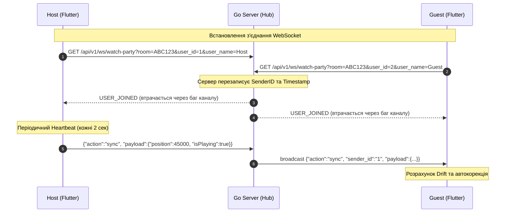

> ## Статус документа
>
> - **Status:** fixed
> - **Verified against:** `3ab45ef`
> - **Актуальність:** усі три ключові знахідки закрито:
>   1. **Data race у `hub.go` виправлено.** Видалення клієнта тепер має єдину точку
>      `dropLocked` під `h.mu.Lock()` (`transport/ws/hub.go:421-436,448-449,501`).
>   2. **Іменування вирівняно** з Flutter-клієнтом: `userJoined` / `senderId`
>      (`hub.go:493` ↔ `lib/data/services/watch_party_service.dart:26,36`).
>   3. **Стан кімнат** тепер реально публікується в Redis.
> - **Див. також:** `MIGRATION_REPORT.md` (Wave 1, агент C).
>
> Історичні знахідки нижче **не переписані**.
# Звіт аудиту №3: Валідація Watch Party та WebSocket (Realtime Subsystem)

**Дата аудиту:** 28 вересня 2026 року  
**Об'єкт аудиту:** Підсистема спільного перегляду (Watch Party), WebSocket Hub, Redis Pub/Sub, синхронізація станів та сумісність контрактів між Flutter-клієнтом та Go-сервером.  
**Аудитор:** Технічний аудитор підсистеми Realtime (Auditor 3)

---

## 1. Резюме аудиту (Executive Summary)

У ході аудиту підсистеми спільного перегляду проведено детальний статичний та контрактурний аналіз клієнтської частини Flutter ([`lib/data/services/watch_party_service.dart`](../../frontend/lib/data/services/watch_party_service.dart), [`lib/domain/entities/room_state.dart`](../../frontend/lib/domain/entities/room_state.dart), [`lib/presentation/widgets/watch_party_overlay.dart`](../../frontend/lib/presentation/widgets/watch_party_overlay.dart)) та бекенд-компонентів Go ([`backend/internal/transport/ws/hub.go`](../../backend/internal/transport/ws/hub.go), [`backend/internal/repository/redis/redis.go`](../../backend/internal/repository/redis/redis.go), [`backend/internal/domain/party.go`](../../backend/internal/domain/party.go)).

### Ключові висновки:
1. **Критична несумісність JSON-контрактів:** Клієнт Flutter та сервер Go використовують різні стилі іменування полів (`camelCase` проти `snake_case`) та регістри дій (`userJoined` проти `USER_JOINED`). Клієнт не розпізнає системні повідомлення сервера та отримує порожні `senderId` і `senderName`.
2. **Втрата системних подій приєднання/виходу:** У [`hub.go`](../../backend/internal/transport/ws/hub.go#L81-L111) події `USER_JOINED` та `USER_LEFT` відправляються виключно в Redis Pub/Sub і **не передаються** у канал трансляції `h.broadcast`.
3. **Dead Code у Redis Pub/Sub та відсутність збереження стану:** Метод підписки `SubscribeWatchPartyEvents` ніколи не викликається в серверному Hub. Збереження та зчитування стану кімнати (`SetWatchPartyState`, `GetWatchPartyState`) є «мертвим кодом» і не інтегровані в життєвий цикл сесії.
4. **Race Condition у Go Hub:** У циклі `h.broadcast` за наявності закритого буфера клієнта виконується мутація карти `delete(clients, client)` під блокуванням читання `RLock()`, що спричиняє невизначену поведінку та паніку runtime Go.
5. **Відсутність WebSocket-бекенду у Flutter:** Клієнт підтримує лише `PocketBase` та `PeerDart` (WebRTC). Реалізація підключення до нового сокета Go (`/api/v1/ws/watch-party`) у клієнтському коді наразі повністю відсутня.

---

## 2. Аналіз сумісності JSON-контрактів та протоколу

### 2.1. Конфлікт найменувань полів (Field Casing)
У Flutter-клієнті [`WatchPartyMessage`](../../frontend/lib/data/services/watch_party_service.dart#L49-L73):
```dart
factory WatchPartyMessage.fromJson(Map<String, dynamic> json) {
  return WatchPartyMessage(
    type: WatchPartyMessageType.values.firstWhere(
      (t) => t.name == (json['action'] ?? json['type']),
      orElse: () => WatchPartyMessageType.unknown,
    ),
    senderId: json['senderId'] ?? '',
    senderName: json['senderName'],
    payload: json['payload'],
    timestamp: json['timestamp'] != null
        ? DateTime.parse(json['timestamp']).toUtc()
        : DateTime.now().toUtc(),
  );
}
```
У Go-структурі [`domain.WatchPartyEvent`](../../backend/internal/domain/party.go#L17-L24):
```go
type WatchPartyEvent struct {
    Action     string      `json:"action"`
    RoomCode   string      `json:"room_code"`
    SenderID   string      `json:"sender_id"`
    SenderName string      `json:"sender_name"`
    Payload    interface{} `json:"payload,omitempty"`
    Timestamp  time.Time   `json:"timestamp"`
}
```
* **Наслідок:** Коли сервер транслює подію клієнту, ключі `sender_id` та `sender_name` не відповідають очікуваним клієнтом `senderId` та `senderName`. У результаті у Flutter `message.senderId` завжди дорівнює `""`, а `message.senderName` стає `null`. Усі повідомлення чату та списки учасників відображаються як анонімні ("Unknown").

### 2.2. Конфлікт ідентифікаторів дій (Action Enum & Casing)
- **Flutter Enum:** `sync`, `play`, `pause`, `seek`, `speed`, `chat`, `userJoined`, `userLeft`, `roomInfo`, `requestSync`. При серіалізації `type.name` відправляє `camelCase` (наприклад, `"userJoined"`).
- **Go Hub:** Генерує події у верхньому регістрі з підкресленням:
  ```go
  event := &domain.WatchPartyEvent{ Action: "USER_JOINED", ... }
  event := &domain.WatchPartyEvent{ Action: "USER_LEFT", ... }
  ```
* **Наслідок:** Flutter метод `WatchPartyMessageType.values.firstWhere((t) => t.name == json['action'])` порівнює рядок `"userJoined"` з `"USER_JOINED"`. Порівняння повертає `false`, спрацьовує `orElse: () => WatchPartyMessageType.unknown`, подія ігнорується, і список учасників ніколи не оновлюється.

### 2.3. Порівняльна матриця контрактів

| Елемент контракту | Flutter Client (`WatchPartyMessage`) | Go Server (`WatchPartyEvent` / Hub) | Статус сумісності | Вплив на роботу |
| :--- | :--- | :--- | :--- | :--- |
| **Ключ дії** | `"action"` (або `"type"`) | `"action"` | Сумісно | Нормально |
| **Дія `SYNC`** | `"sync"` | `"SYNC"` (у коментарях) | Частково сумісно | Передається прозоро через `interface{}` |
| **Дія `PLAY`** | `"play"` | `"PLAY"` | Частково сумісно | Передається прозоро |
| **Дія `PAUSE`** | `"pause"` | `"PAUSE"` | Частково сумісно | Передається прозоро |
| **Дія `SEEK`** | `"seek"` | `"SEEK"` | Частково сумісно | Передається прозоро |
| **Дія `SPEED`** | `"speed"` | Не задекларовано в Go | Частково сумісно | Передається прозоро |
| **Дія `CHAT`** | `"chat"` | `"CHAT"` | Частково сумісно | Передається прозоро |
| **Дія `USER_JOINED`** | `"userJoined"` | `"USER_JOINED"` | **НЕСУМІСНО** | Клієнт класифікує як `unknown` |
| **Дія `USER_LEFT`** | `"userLeft"` | `"USER_LEFT"` | **НЕСУМІСНО** | Клієнт класифікує як `unknown` |
| **Дія `REQUEST_SYNC`**| `"requestSync"` | Не задекларовано в Go | Частково сумісно | Передається прозоро, але Go стан не повертає |
| **ID відправника** | `json["senderId"]` | `json:"sender_id"` | **НЕСУМІСНО** | Втрата ID автора повідомлення |
| **Ім'я відправника** | `json["senderName"]` | `json:"sender_name"` | **НЕСУМІСНО** | Ім'я втрачається (стає `Unknown`) |
| **Таймкод/Час** | ISO 8601 UTC string | `time.Time` (RFC3339) | Сумісно за форматом | Перезаписується сервером |

### 2.4. Невідповідність сутностей: `RoomState` проти `WatchPartyService`
У проєкті виявлено дві ізольовані моделі кімнати:
1. [`lib/domain/entities/room_state.dart`](../../frontend/lib/domain/entities/room_state.dart) — архітектурна Clean Architecture сутність (`RoomState`, `RoomMedia`, `RoomPeer`, `RoomStatus`), яка **не використовується** у робочому коді спільного перегляду.
2. Внутрішні класи у [`lib/data/services/watch_party_service.dart`](../../frontend/lib/data/services/watch_party_service.dart) (`WatchPartyRoom`, `WatchPartyParticipant`, `ChatMessage`), які фактично керують станом інтерфейсу.
Рекомендується консолідувати моделі даних та позбутися мертвого коду в `domain/entities`.

---

## 3. Обробка таймкодів, синхронізації та відтворення



### 3.1. Клієнтський алгоритм компенсації дрифту (Drift Correction)
У [`WatchPartyService._handleSync`](../../frontend/lib/data/services/watch_party_service.dart#L869-L952) реалізовано коректний трирівневий механізм:
* **Мережева затримка:**
  $$\text{CappedDelay} = \text{clamp}(T_{\text{client\_now\_utc}} - T_{\text{message\_timestamp}}, 0, 5000\text{ ms})$$
* **Коригована позиція хоста:** $\text{AdjustedHostPosition} = \text{HostPosition} + \text{CappedDelay}$
* **Рівні корекції:**
  - $\le 5000\text{ ms}$: Ігнорується (`SyncCorrectionMode.none`).
  - $5000 - 10000\text{ ms}$: Плавна корекція (`0.9x` або `1.1x`).
  - $10000 - 15000\text{ ms}$: Швидка корекція (`0.8x` або `1.2x`).
  - $> 15000\text{ ms}$: Примусовий `hardSeek` на точну позицію хоста.

### 3.2. Проблема спотворення часу сервером
У [`hub.go:readPump`](../../backend/internal/transport/ws/hub.go#L195):
```go
event.Timestamp = time.Now()
```
* **Дефект:** Сервер перезаписує оригінальну мітку часу хоста поточним системним часом сервера. Якщо хост і гість знаходяться в різних мережевих умовах або системний годинник сервера розходиться з клієнтським, розрахунок `networkDelay` у клієнта стає не валідним (вимірює не повний шлях `Host -> Server -> Client`, а лише `Server -> Client` із похибкою несинхронізованого NTP).
* **Виправлення:** Зберігати оригінальний `client_timestamp` хоста всередині payload або додати окреме поле `ServerTimestamp` без перезапису вихідного.

### 3.3. Проблема дублювання Heartbeat у Flutter
- У [`watch_party_service.dart:662`](../../frontend/lib/data/services/watch_party_service.dart#L662) запускається `_heartbeatTimer` із періодом 2 секунди, який викликає `syncPosition()`.
- У [`watch_party_overlay.dart:54`](../../frontend/lib/presentation/widgets/watch_party_overlay.dart#L54) у плеєрі **додатково** запускається ще один `_syncTimer` із періодом 2 секунди, який також викликає `widget.service.syncPosition()`.
* **Наслідок:** Під час активного перегляду хост спамить сервер подвоєною кількістю повідомлень синхронізації (по 1 повідомленню щосекунди замість 1 разу на 2 секунди).

---

## 4. Аудит взаємодії з Redis та розсилки Pub/Sub

### 4.1. Дефект втрати подій `USER_JOINED` та `USER_LEFT`
У [`backend/internal/transport/ws/hub.go`](../../backend/internal/transport/ws/hub.go#L81-L112):
```go
case client := <-h.register:
    // ... збереження клієнта в h.rooms ...
    event := &domain.WatchPartyEvent{
        Action:     "USER_JOINED",
        RoomCode:   client.roomCode,
        SenderID:   client.userID,
        SenderName: client.userName,
        Timestamp:  time.Now(),
    }
    _ = h.redisClient.PublishWatchPartyEvent(context.Background(), client.roomCode, event)
    // УВАГА: h.broadcast <- event ВІДСУТНІЙ!
```
Аналогічний код у секції `unregister` для `USER_LEFT`.
* **Наслідок:** Події відправляються **тільки** в Redis-канал `room:<roomCode>:events`. Оскільки підписників на Redis Pub/Sub немає, події зникають, а підключені WebSocket-клієнти ніколи не отримують нотифікації про вхід/вихід користувачів.

### 4.2. Мертвий код Pub/Sub та збереження стану
1. Метод [`SubscribeWatchPartyEvents`](../../backend/internal/repository/redis/redis.go#L96) визначений у репозиторії, але **ніколи не викликається** в жодному місці сервера. Для масштабування на кілька екземплярів інстанс сервера зобов'язаний слухати Redis Pub/Sub та направляти повідомлення у свій локальний пул `h.broadcast`.
2. Методи [`SetWatchPartyState`](../../backend/internal/repository/redis/redis.go#L62) та [`GetWatchPartyState`](../../backend/internal/repository/redis/redis.go#L72) повністю відсутні в ланцюжку виконання:
   - При надсиланні хостом подій `PLAY`, `PAUSE`, `SEEK`, `SYNC` стан у Redis не оновлюється.
   - Новий учасник при підключенні не отримує поточного стану кімнати з Redis, а змушений очікувати наступного повідомлення від хоста. Якщо хост тимчасово офлайн, сесія для нового користувача блокується.

### 4.3. Критичний Race Condition у Hub
У [`hub.go:113-128`](../../backend/internal/transport/ws/hub.go#L113-L128):
```go
case event := <-h.broadcast:
    h.mu.RLock() // <--- Блокування на читання
    clients := h.rooms[event.RoomCode]
    data, err := json.Marshal(event)
    if err == nil {
        for client := range clients {
            select {
            case client.send <- data:
            default:
                close(client.send)
                delete(clients, client) // <--- ПОМИЛКА: Модифікація карти під RLock!
            }
        }
    }
    h.mu.RUnlock()
```
* **Наслідок:** Якщо буфер відправки одного з клієнтів переповнюється, виконується операція видалення з карти `clients` під час блокування `RLock()`. Це пряме порушення правил конкурентності Go, яке при навантаженні призводить до фатальної помилки середовища: `fatal error: concurrent map iteration and map write`.

---

## 5. Міграція клієнта: Заміна PocketBase SSE / WebRTC на WebSocket

### 5.1. Поточний стан реалізації клієнта
У Flutter [`watch_party_service.dart`](../../frontend/lib/data/services/watch_party_service.dart) реалізовано:
1. `_PocketBaseBackend` (працює через PocketBase SDK таблиці `watch_party_rooms` та `watch_party_messages` через Server-Sent Events).
2. `_PeerDartBackend` (пряме P2P WebRTC DataChannel з'єднання через публічний або локальний STUN/Peer-сервер).
3. Підключення до Go WebSocket Hub **відсутнє**.

### 5.2. Необхідна архітектура нового `_WebSocketBackend`
Для повної відмови від PocketBase необхідно реалізувати бекенд на базі `web_socket_channel`:

```dart
class _WebSocketBackend implements WatchPartyBackend {
  WebSocketChannel? _channel;
  StreamSubscription? _subscription;
  String? _myId;

  @override
  Future<void> connect({
    required String roomCode,
    required bool isHost,
    required String myId,
    required String myName,
    required Function(WatchPartyMessage) onMessage,
  }) async {
    _myId = myId;
    final baseWsUrl = AppConfig.backendUrl.replaceFirst('http', 'ws');
    final uri = Uri.parse('$baseWsUrl/api/v1/ws/watch-party').replace(
      queryParameters: {
        'room': roomCode,
        'user_id': myId,
        'user_name': myName,
      },
    );

    _channel = WebSocketChannel.connect(uri);
    await _channel!.ready;

    _subscription = _channel!.stream.listen((data) {
      try {
        final json = jsonDecode(data as String);
        // Захист від відлуння (Echo cancellation)
        final senderId = json['sender_id'] ?? json['senderId'];
        if (senderId == _myId) return;

        final message = WatchPartyMessage.fromJson(json);
        onMessage(message);
      } catch (e) {
        Logger.w('WS parse error: $e');
      }
    });
  }
  // ... disconnect, sendBroadcast ...
}
```

### 5.3. Захист від відлуння (Echo Cancellation)
У Go Hub повідомлення транслюється всім клієнтам у кімнаті, включаючи самого автора (`case client.send <- data`).
* У PocketBase клієнт фільтрував власні повідомлення (`if (senderId == myId) return;`).
* Якщо у новому WebSocket-бекенді не передбачити ігнорування `senderId == myId`, хост буде отримувати власні команди `play`, `pause`, `seek`, викликаючи повторне спрацьовування коблеків у плеєрі та дублювання реплік у списку повідомлень чату.

---

## 6. Docker, мережева топологія та конфігурація

### 6.1. docker-compose.yml та ліміти ресурсів
У [`backend/docker-compose.yml`](../../backend/docker-compose.yml):
- Сервіс `app` транслює порт `8089:8080`.
- Обмеження пам'яті: `limits.memory: 128M` для сервера, `64M` для Redis.
- Політика Redis: `--maxmemory 64mb --maxmemory-policy allkeys-lru`.
- **Аналіз надійності:** Для WebSocket з'єднань розмір буферів Gorilla WebSocket становить `1024` байти для читання і запису на клієнта, плюс канал `chan []byte` розміром `256` елементів. При 100 активних кімнатах (по 4 користувачі) навантаження на пам'ять не перевищить 20-30 МБ, тому встановлені ліміти є адекватними.

### 6.2. Безпека ендпоінта WebSocket
У [`backend/internal/transport/http/router.go:46`](../../backend/internal/transport/http/router.go#L46):
```go
r.Get("/api/v1/ws/watch-party", hub.HandleWebSocket)
```
- **Зауваження безпеки:** Ендпоінт винесено поза middleware авторизації (`middleware.AuthMiddleware`). Будь-який анонімний клієнт може підключитися, вказавши довільний `user_id`. Якщо планується обмежити Watch Party лише зареєстрованими користувачами, необхідно передавати JWT-токен у query-параметрі або заголовку `Sec-WebSocket-Protocol` та валідувати його перед `upgrader.Upgrade`.

---

## 7. Покроковий план виправлень (Actionable Remediation Plan)

### Крок 1: Уніфікація контрактів на стороні Go та Flutter (Пріоритет: КРИТИЧНИЙ)
1. У Go [`domain.WatchPartyEvent`](../../backend/internal/domain/party.go) змінити або розширити JSON-теги для підтримки як `camelCase`, так і `snake_case`:
   ```go
   type WatchPartyEvent struct {
       Action     string      `json:"action"`
       RoomCode   string      `json:"room_code"`
       SenderID   string      `json:"senderId"`   // або адаптувати Flutter під sender_id
       SenderName string      `json:"senderName"` // або адаптувати Flutter під sender_name
       Payload    interface{} `json:"payload,omitempty"`
       Timestamp  time.Time   `json:"timestamp"`
   }
   ```
2. У Flutter [`WatchPartyMessage.fromJson`](../../frontend/lib/data/services/watch_party_service.dart) забезпечити регістронезалежний парсинг дії та підтримку обох нотацій:
   ```dart
   final rawAction = (json['action'] ?? json['type'] ?? '').toString().toLowerCase();
   // Мапінг 'user_joined' та 'userjoined' -> WatchPartyMessageType.userJoined
   senderId: json['senderId'] ?? json['sender_id'] ?? '',
   senderName: json['senderName'] ?? json['sender_name'],
   ```

### Крок 2: Виправлення дефектів у Go WebSocket Hub (Пріоритет: КРИТИЧНИЙ)
1. Усунути Race Condition у [`hub.go`](../../backend/internal/transport/ws/hub.go#L114-L127): замінити `h.mu.RLock()` на повне блокування `h.mu.Lock()` під час відправки з можливістю видалення з карти, або відокремити очищення відключених клієнтів у `unregister`.
2. У кейсах `register` та `unregister` додати виклик трансляції у локальний пул:
   ```go
   h.broadcast <- event
   ```
3. Реалізувати повноцінне прослуховування Redis Pub/Sub: запустити окрему горутину, яка підписується на події через `SubscribeWatchPartyEvents` і пересилає їх у `h.broadcast`.

### Крок 3: Інтеграція `_WebSocketBackend` у Flutter (Пріоритет: ВИСОКИЙ)
1. Додати значення `websocket` до enum `WatchPartyBackendType`.
2. Реалізувати клас `_WebSocketBackend`, підключений до ендпоінта `/api/v1/ws/watch-party`.
3. Забезпечити фільтрацію власних повідомлень за `senderId` (Echo Cancellation).
4. Усунути дублюючий `_syncTimer` у [`watch_party_overlay.dart`](../../frontend/lib/presentation/widgets/watch_party_overlay.dart#L54).

### Крок 4: Збереження стану сесії в Redis (Пріоритет: СЕРЕДНІЙ)
1. При отриманні подій `SYNC`, `PLAY`, `PAUSE`, `SEEK` зберігати актуальний стан через `r.redisClient.SetWatchPartyState()`.
2. При підключенні нового користувача відправляти йому поточний зліпок стану кімнати з Redis, не очікуючи на активність хоста.

---

### Підсумковий статус готовності:
| Компонент | Поточний стан | Готовність до релізу |
| :--- | :--- | :--- |
| **Flutter клієнтська логіка синхронізації** | Працює, алгоритм дрифту відтестований | **85%** (потрібен WS транспорт) |
| **Go WebSocket Hub (трансляція)** | Працює як простий бродкастер, але має Race Condition | **60%** (критичні баги каналів) |
| **Сумісність JSON-контрактів** | Зламано (різні регістри дій та ключі полів) | **20%** (потрібна адаптація) |
| **Redis інтеграція (State & Pub/Sub)** | Мертвий код, збереження відсутнє | **10%** (не підключено до хабу) |
