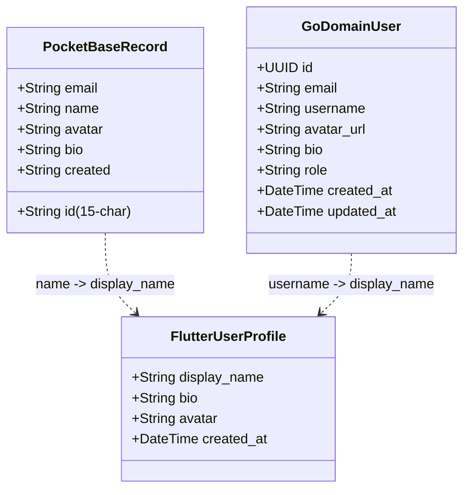
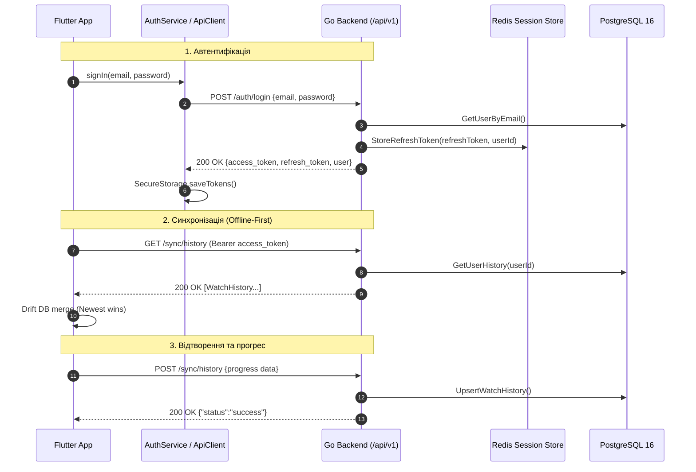

# Технічний аудит API контрактів та клієнт-серверної сумісності (Go Backend vs Flutter Client)

**Дата аудиту:** 28 вересня 2026 року  
**Роль:** Аудитор 4 — Валідатор API контрактів та клієнт-серверної інтеграції  
**Об'єкти аудиту:**
- **Go-бекенд (Серверна частина):**
  - Маршрутизатор та Middleware: [`server/internal/transport/http/router.go`](file:///e:/Github/oxide_film/server/internal/transport/http/router.go), [`server/internal/transport/http/middleware/auth.go`](file:///e:/Github/oxide_film/server/internal/transport/http/middleware/auth.go)
  - Хендлери: [`server/internal/transport/http/auth_handler.go`](file:///e:/Github/oxide_film/server/internal/transport/http/auth_handler.go), [`server/internal/transport/http/content_handler.go`](file:///e:/Github/oxide_film/server/internal/transport/http/content_handler.go), [`server/internal/transport/http/sync_handler.go`](file:///e:/Github/oxide_film/server/internal/transport/http/sync_handler.go)
  - Моделі домену: [`server/internal/domain/user.go`](file:///e:/Github/oxide_film/server/internal/domain/user.go), [`server/internal/domain/content.go`](file:///e:/Github/oxide_film/server/internal/domain/content.go), [`server/internal/domain/party.go`](file:///e:/Github/oxide_film/server/internal/domain/party.go)
  - WebSocket Hub: [`server/internal/transport/ws/hub.go`](file:///e:/Github/oxide_film/server/internal/transport/ws/hub.go)
- **Flutter-клієнт:**
  - Мережевий транспорт: [`lib/core/network/api_client.dart`](file:///e:/Github/oxide_film/lib/core/network/api_client.dart)
  - Сервіси автентифікації та синхронізації: [`lib/data/services/auth_service.dart`](file:///e:/Github/oxide_film/lib/data/services/auth_service.dart), [`lib/data/services/pocketbase_service.dart`](file:///e:/Github/oxide_film/lib/data/services/pocketbase_service.dart), [`lib/data/services/history_service.dart`](file:///e:/Github/oxide_film/lib/data/services/history_service.dart), [`lib/data/services/favorites_service.dart`](file:///e:/Github/oxide_film/lib/data/services/favorites_service.dart), [`lib/data/services/watch_party_service.dart`](file:///e:/Github/oxide_film/lib/data/services/watch_party_service.dart)
  - Репозиторії та моделі: [`lib/data/repositories/unified_content_repository_impl.dart`](file:///e:/Github/oxide_film/lib/data/repositories/unified_content_repository_impl.dart), [`lib/domain/entities/media_item.dart`](file:///e:/Github/oxide_film/lib/domain/entities/media_item.dart), [`lib/domain/entities/media_details.dart`](file:///e:/Github/oxide_film/lib/domain/entities/media_details.dart), [`lib/domain/entities/stream_source.dart`](file:///e:/Github/oxide_film/lib/domain/entities/stream_source.dart)

---

## 1. Виконавче резюме (Executive Summary)

В ході аудиту проведено поглиблене порівняння реалізованих HTTP/WebSocket ендпоінтів Go-сервера з потребами, контрактами та реальними викликами клієнта Flutter.

### Ключові висновки аудиту:
1. **Функціональне покриття ендпоінтів:**
   - Go-сервер реалізує **11 REST-ендпоінтів** та **1 WebSocket-шлюз**.
   - Повністю покриває базові сценарії: Реєстрація, Логін, Рефреш токена, Отримання поточного юзера, Пошук контенту, Деталі медіа, Отримання відеопотоків, Читання/запис історії перегляду, "Продовжити перегляд", Список обраного та перемикання обраного.
2. **Критичні архітектурні невідповідності (Blockers):**
   - **CORS Misconfiguration:** У [`router.go`](file:///e:/Github/oxide_film/server/internal/transport/http/router.go#L29-L36) виставлено `AllowedOrigins: ["*"]` одночасно з `AllowCredentials: true`. Згідно з W3C/WHATWG CORS специфікацією, браузери блокують будь-які запити з `credentials: include` при wildcard origin `*`. Це зламає роботу Flutter Web та клієнтів за межами Desktop.
   - **Типізація у `ApiClient.dart`:** Метод `ApiClient.getJson()` жорстко кастує відповідь у `Map<String, dynamic>`. Ендпоінти Go `/api/v1/content/search`, `/api/v1/sync/history`, `/api/v1/sync/continue-watching`, `/api/v1/sync/favorites` повертають **JSON Array (`List<dynamic>`)**, що викличе миттєвий `TypeError` у Dart.
   - **Конфлікт `null` у JSON при збереженні історії:** У Go struct [`WatchHistory`](file:///e:/Github/oxide_film/server/internal/domain/user.go#L45-L46) поля `Season` та `Episode` оголошені як `int` (а не `*int`). Якщо клієнт Flutter передає `{"season": null, "episode": null}` для фільмів, парсер Go поверне `400 Bad Request` (`cannot unmarshal null into Go struct field WatchHistory.season of type int`).
   - **Неузгодженість ключів користувача:** У клієнтському коді PocketBase ім'я користувача передається/зчитується як `name`, тоді як Go очікує і повертає `username`.
   - **Content-Type помилок:** Використання `http.Error(w, ...)` у Go встановлює заголовок `Content-Type: text/plain; charset=utf-8`, незважаючи на передачу JSON-рядка `{"error":"..."}`. Крім того, хендлер [`SaveProgress`](file:///e:/Github/oxide_film/server/internal/transport/http/sync_handler.go#L69-L71) взагалі не встановлює `Content-Type: application/json`.
3. **Статус клієнтської міграції:**
   - Клієнт Flutter наразі **на 100% прив'язаний до PocketBase SDK** (`pocketbase: ^0.19.0`). Жоден виклик у `AuthService`, `HistoryService`, `FavoritesService`, `WatchPartyService` ще не переведений на Go API.

---

## 2. Матриця відповідності ендпоінтів та контрактів

| Метод & Ендпоінт Go | Призначення | Відповідний сервіс / метод Flutter | Статус сумісності | Виявлені колізії та зауваження |
| :--- | :--- | :--- | :--- | :--- |
| `POST /api/v1/auth/register` | Реєстрація нового користувача | `AuthService.signUp()` | ⚠️ Потребує адаптації | Клієнт шле `name`, сервер очікує `username`. PB повертав authStore, Go повертає `{access_token, refresh_token, user}`. |
| `POST /api/v1/auth/login` | Вхід за email/password | `AuthService.signIn()` | ⚠️ Потребує адаптації | PB повертав `pb.authStore`, Go повертає пару JWT. Потрібен інтерцептор збереження пари токенів. |
| `POST /api/v1/auth/refresh` | Оновлення пари токенів | `AuthService.refreshAuth()` | ⚠️ Потребує адаптації | Ротація токенів у Redis. У клієнта відсутній механізм відправки `refresh_token` при 401. |
| `GET /api/v1/auth/me` | Отримання власного профілю | `AuthService.profile` | ⚠️ Потребує адаптації | Вимагає `Authorization: Bearer <access_token>`. Розбіжність полів `username` vs `name`. |
| `GET /api/v1/content/search` | Агрегований SingleFlight пошук | `UnifiedContentRepository.search()` | ⚠️ Потребує адаптації | Go повертає `List<MediaItem>`, а `ApiClient.getJson` очікує `Map`. Потрібен мапінг `ContentType` enum. |
| `GET /api/v1/content/details` | Деталі медіа та сезони | `UnifiedContentRepository.getDetails()` | ⚠️ Потребує адаптації | Go очікує `?provider=...&url=...`, а клієнт передає єдиний `id` (`provider:itemId`). |
| `GET /api/v1/content/streams` | Стріми та субтитри для плеєра | `UnifiedContentRepository.getStreams()` | ⚠️ Потребує адаптації | Go повертає `ContentStreamsResponse`, `quality` як рядок ("1080p"), заголовки для `media_kit`. |
| `GET /api/v1/sync/history` | Отримання історії переглядів | `HistoryService._pullFromCloud()` | ⚠️ Потребує адаптації | Go віддає `List<WatchHistory>` безпосередньо, а PB віддавав обгортку `{items: [...]}`. |
| `POST /api/v1/sync/history` | Збереження прогресу (Upsert) | `HistoryService.saveProgress()` | ⚠️ Потребує адаптації | Конфлікт при відправці `season: null` (має бути 0). Відсутній заголовок `Content-Type: application/json` у відповіді. |
| `GET /api/v1/sync/continue-watching` | Відео в процесі (5%..95%) | `HistoryService.continueWatching` | ⚠️ Потребує адаптації | Повертає список `List<WatchHistory>`. Можна використовувати для крос-девайсного бекапу. |
| `GET /api/v1/sync/favorites` | Список обраного | `FavoritesService._pullFromCloud()` | ⚠️ Потребує адаптації | Go віддає `List<Favorite>`, без поля `rating`/`rating_source` (втрата даних). |
| `POST /api/v1/sync/favorites/toggle` | Додати/видалити з обраного | `FavoritesService.toggle()` | ⚠️ Потребує адаптації | Відповідь `{"is_favorite": bool}` ідеально відповідає логіці `FavoritesDao.toggle()`. |
| `GET /api/v1/ws/watch-party` | WebSocket синхронізація кімнат | `WatchPartyService._PocketBaseBackend` | ⚠️ Потребує адаптації | Заміна polling/SSE на бідирекціональний WebSocket (`gorilla/websocket` + Redis PubSub). |

---

## 3. Детальний аналіз контрактів та структур даних

### 3.1. Модуль авторизації (`/api/v1/auth/*`)

#### Go Request / Response DTO:
```go
// Реєстрація
type RegisterRequest struct {
    Email    string `json:"email"`
    Password string `json:"password"`
    Username string `json:"username"`
}

// Відповідь авторизації
type AuthResponse struct {
    AccessToken  string       `json:"access_token"`
    RefreshToken string       `json:"refresh_token"`
    User         *domain.User `json:"user"`
}
```

#### Порівняння схем користувача:



#### Виявлені колізії:
1. **Ключ `username` vs `name`:** У Flutter [`auth_service.dart`](file:///e:/Github/oxide_film/lib/data/services/auth_service.dart#L46) очікується `record.data['name']`. Go API віддає `{"user": {"username": "..."}}`.
2. **Формат аватара:** У PocketBase аватар зберігався як назва файлу і генерувався URL виду `${pb.baseUrl}/api/files/users/${id}/${avatar}`. У Go це повноцінний `avatar_url` (TEXT).
3. **Відсутні функції в Go бекенді:**
   У клієнті [`AuthService`](file:///e:/Github/oxide_film/lib/data/services/auth_service.dart) реалізовано:
   - `resetPassword(email)` -> в Go відсутній endpoint
   - `requestVerification(email)` -> в Go відсутній endpoint
   - `updateProfile({displayName, bio})` -> в Go відсутній `PUT /api/v1/auth/me`
   - `changePassword(old, new)` -> в Go відсутній `PUT /api/v1/auth/password`
   - `updateAvatar(filePath)` -> в Go відсутній multipart `POST /api/v1/auth/avatar`
   - `deleteAccount()` -> в Go відсутній `DELETE /api/v1/auth/me`
   - `socialSignIn(provider)` (Google, Discord OAuth2) -> в Go відсутній OAuth2 стек.

---

### 3.2. Модуль каталогу та контенту (`/api/v1/content/*`)

#### 1. Пошук (`GET /api/v1/content/search?q={query}`)
- **Запит:** Query-параметр `q` (обов'язковий). При відсутності повертає `400 Bad Request`.
- **Відповідь Go:** `200 OK` із тілом `[]domain.MediaItem`.
```json
[
  {
    "id": "https://uakino.me/filmy/12345-movie.html",
    "provider_id": "uakino",
    "title": "Назва фільму",
    "original_title": "Original Movie",
    "poster_url": "https://uakino.me/posters/12345.jpg",
    "year": 2024,
    "type": "movie",
    "rating": 8.4,
    "url": "https://uakino.me/filmy/12345-movie.html"
  }
]
```
- **Колізія з клієнтом:**
  - В Flutter `MediaItem.type` є enum `ContentType { movie, series, cartoon, anime, dorama, unknown }`. Go передає string (`"movie"`, `"series"`). Необхідна фабрика `ContentType.values.firstWhere((e) => e.name == json['type'])`.

#### 2. Деталі (`GET /api/v1/content/details?provider={id}&url={url}`)
- **Запит:** Очікує два обов'язкових параметри: `provider` (наприклад, `uakino`) та `url` (повний або відносний URL сторінки).
- **Колізія з клієнтом:**
  - Клієнтський інтерфейс [`UnifiedContentRepository.getDetails(String id)`](file:///e:/Github/oxide_film/lib/data/repositories/unified_content_repository_impl.dart#L60) приймає єдиний рядок виду `"uakino:filmy/12345-movie"`.
  - Клієнтський репозиторій розбиває його на `providerId` та `itemId`. Для виклику Go API клієнт повинен передавати `itemId` або зібраний повний URL у параметрі `url`.

#### 3. Стріми (`GET /api/v1/content/streams?provider={id}&url={url}&season={s}&episode={e}&voice={v}`)
- **Відповідь Go:** `200 OK` із структурою [`ContentStreamsResponse`](file:///e:/Github/oxide_film/server/internal/domain/content.go#L62-L66):
```json
{
  "provider_id": "uakino",
  "streams": [
    {
      "quality": "1080p",
      "url": "https://stream-cdn.example/hls/master.m3u8",
      "direct_url": "https://direct-cdn.example/video.mp4",
      "requires_proxy": false,
      "headers": {
        "User-Agent": "Mozilla/5.0 ...",
        "Referer": "https://uakino.me/"
      }
    }
  ],
  "subtitles": [
    {
      "language": "uk",
      "label": "Українські",
      "url": "https://subtitles.example/uk.vtt"
    }
  ]
}
```
- **Сумісність із відеоплеєром Flutter (`media_kit`):**
  - **Ідеально:** Поле `headers` у Go struct [`StreamSource`](file:///e:/Github/oxide_film/server/internal/domain/content.go#L9) містить `Referer` та `User-Agent`. Це критично необхідно для `media_kit`, який підтримує передачу HTTP-заголовків через `Media(stream.url, httpHeaders: stream.headers)`.
  - **Розбіжність субтитрів:** У Go `subtitles` винесені в корінь об'єкта `ContentStreamsResponse`. У Dart моделі [`StreamSource`](file:///e:/Github/oxide_film/lib/domain/entities/stream_source.dart#L67) субтитри вкладені в кожен окремий потік. При десеріалізації на клієнті потрібно змапити кореневі субтитри до кожного потоку.

---

### 3.3. Модуль синхронізації (`/api/v1/sync/*`)

#### 1. Збереження прогресу (`POST /api/v1/sync/history`)
- **Go Handler:** Приймає JSON [`domain.WatchHistory`](file:///e:/Github/oxide_film/server/internal/domain/user.go#L36-L53).
```json
{
  "media_id": "12345",
  "provider_id": "uakino",
  "title": "Дюна: Частина друга",
  "poster_url": "https://...",
  "year": 2024,
  "media_type": "movie",
  "season": 0,
  "episode": 0,
  "position_ms": 5420000,
  "duration_ms": 9960000,
  "last_stream_url": "https://...",
  "voiceover": "Озвучення"
}
```

> [!CAUTION]
> **Критична помилка серіалізації `null` у Go:**
> У Go структурі `domain.WatchHistory` поля оголошені як:
> ```go
> Season  int `json:"season"`
> Episode int `json:"episode"`
> ```
> У Flutter [`HistoryDao`](file:///e:/Github/oxide_film/lib/data/database/dao/history_dao.dart) для фільмів `season` та `episode` мають значення `null`.
> Якщо Flutter-клієнт відправить JSON:
> ```json
> {"season": null, "episode": null}
> ```
> Стандартний `json.NewDecoder(r.Body).Decode(&item)` у Go впаде з помилкою:
> `json: cannot unmarshal null into Go struct field WatchHistory.season of type int`.
> Клієнт Flutter **зобов'язаний** відправляти `season: season ?? 0` та `episode: episode ?? 0`, або Go-структура має підтримувати `*int` чи кастомний unmarshaler!

#### 2. Отримання історії (`GET /api/v1/sync/history?limit=50&offset=0`)
- **Відповідь Go:** `200 OK` із масивом `[]domain.WatchHistory`.
- **Сумісність:** Назви полів (`position_ms`, `duration_ms`, `watched_at`) на 100% співпадають з полями таблиці Drift [`WatchHistory`](file:///e:/Github/oxide_film/lib/data/database/app_database.dart#L96-L108).

#### 3. Обране (`GET /api/v1/sync/favorites` та `POST /api/v1/sync/favorites/toggle`)
- **Відповідь Go на Toggle:** `200 OK`, `{"is_favorite": true}` або `{"is_favorite": false}`.
- **Сумісність:** Повністю відповідає очікуванням UI у [`FavoritesService.toggle()`](file:///e:/Github/oxide_film/lib/data/services/favorites_service.dart#L68-L87), який повертає булеве значення стану.

---

### 3.4. Модуль Watch Party (WebSocket)

- **Шлях:** `GET /api/v1/ws/watch-party?room={roomCode}&user_id={userId}&user_name={userName}`
- **Go Hub:** Реалізований на базі `gorilla/websocket` з підтримкою Redis Pub/Sub для горизонтального масштабування.
- **Контракт події (`domain.WatchPartyEvent`):**
```json
{
  "action": "SYNC",
  "room_code": "ABC123",
  "sender_id": "user-uuid",
  "sender_name": "Олександр",
  "payload": {
    "position_ms": 125000,
    "is_playing": true,
    "playback_speed": 1.0
  },
  "timestamp": "2026-09-28T16:35:00Z"
}
```
- **Порівняння з Flutter [`WatchPartyMessage`](file:///e:/Github/oxide_film/lib/data/services/watch_party_service.dart#L34-L73):**
  - У клієнті поле дії сериалізується як `'action'` (з підтримкою `'type'` для сумісності).
  - Імена екшенів: `sync`, `play`, `pause`, `seek`, `speed`, `chat`, `userJoined`, `userLeft`.
  - У Go: `Action: "USER_JOINED"`, `Action: "USER_LEFT"`, `SYNC`, `PLAY`, `PAUSE`.
  - **Увага:** У Go події системних екшенів відправляються у **UPPERCASE** (`USER_JOINED`, `USER_LEFT`), тоді як Flutter-клієнт в enum очікує **camelCase** (`userJoined`, `userLeft`). Необхідно додати case-insensitive парсинг у Dart.

---

## 4. Аналіз транспортного рівня, CORS та кодів помилок

### 4.1. Аналіз CORS конфігурації
У [`server/internal/transport/http/router.go`](file:///e:/Github/oxide_film/server/internal/transport/http/router.go#L29-L36):
```go
r.Use(cors.Handler(cors.Options{
    AllowedOrigins:   []string{"*"},
    AllowedMethods:   []string{"GET", "POST", "PUT", "DELETE", "OPTIONS"},
    AllowedHeaders:   []string{"Accept", "Authorization", "Content-Type", "X-CSRF-Token", "X-Refresh-Token"},
    ExposedHeaders:   []string{"Link"},
    AllowCredentials: true,
    MaxAge:           300,
}))
```

> [!WARNING]
> **Несумісність CORS з веб-специфікацією:**
> Комбінація `AllowedOrigins: []string{"*"}` та `AllowCredentials: true` є **неприпустимою** за стандартами CORS. Якщо клієнт запускається у веб-середовищі (Flutter Web або PWA), браузер відхилить відповідь з помилкою:
> *"The value of the 'Access-Control-Allow-Origin' header in the response must not be the wildcard '*' when the request's credentials mode is 'include'."*
> **Рішення:** Замінити на динамічну валідацію `AllowOriginFunc` або вказати конкретні домени клієнта.

### 4.2. Аналіз кодів відповідей HTTP та заголовків помилок

| Код HTTP | Сценарій використання в Go | Коректність використання | Формат тіла помилки | Проблема Content-Type |
| :--- | :--- | :--- | :--- | :--- |
| **200 OK** | Успішний запит (GET, POST auth, POST toggle) | ✅ Вірно | JSON об'єкт або масив | У `sync_handler.go` (SaveProgress) забуто `Content-Type: application/json`. |
| **400 Bad Request** | Некоректний JSON, відсутні поля `q`, `provider`, `url` | ✅ Вірно | `{"error":"..."}` | Віддається через `http.Error` -> `Content-Type: text/plain`. |
| **401 Unauthorized** | Відсутній/недійсний JWT токен, невірний пароль | ✅ Вірно | `{"error":"..."}` | Віддається через `http.Error` -> `Content-Type: text/plain`. |
| **404 Not Found** | Невідомий провайдер, користувача не знайдено | ✅ Вірно | `{"error":"..."}` | Віддається через `http.Error` -> `Content-Type: text/plain`. |
| **409 Conflict** | Email вже зареєстровано | ✅ Вірно | `{"error":"email already registered"}` | Віддається через `http.Error` -> `Content-Type: text/plain`. |
| **500 Internal Error** | Помилка БД, збій скрапера, генерація JWT | ✅ Вірно | `{"error":"..."}` | Віддається через `http.Error` -> `Content-Type: text/plain`. |

#### Рекомендований фікс для Go `respondError`:
Замість `http.Error(w, msg, code)` слід створити уніфікований хелпер:
```go
func respondError(w http.ResponseWriter, code int, message string) {
    w.Header().Set("Content-Type", "application/json")
    w.WriteHeader(code)
    _ = json.NewEncoder(w).Encode(map[string]string{"error": message})
}
```

---

## 5. Аудит клієнтського мережевого стеку Flutter

### 5.1. Обмеження [`ApiClient.dart`](file:///e:/Github/oxide_film/lib/core/network/api_client.dart)
Файл `lib/core/network/api_client.dart` містить методи:
```dart
Future<Map<String, dynamic>> getJson(String url, {...}) async {
    final response = await _dio.get<Map<String, dynamic>>(url, ...);
    return response.data ?? {};
}
```
- Якщо ендпоінт повертає список (наприклад, `/api/v1/content/search` або `/api/v1/sync/favorites`), Dio викине виняток через спробу зведення `List<dynamic>` до `Map<String, dynamic>`.
- **Рішення:** Додати універсальні дженерик методи:
```dart
Future<List<dynamic>> getList(String url, {Map<String, dynamic>? queryParameters}) async {
    final response = await _dio.get<List<dynamic>>(url, queryParameters: queryParameters);
    return response.data ?? [];
}
```

### 5.2. Відсутність Auth Interceptor для Bearer токенів
Наразі `ApiClient` містить лише `CookieManager` та `RetryInterceptor`.
Для роботи з новим Go API необхідно додати `AuthInterceptor`:
1. Додавання заголовка `Authorization: Bearer <access_token>` до всіх захищених запитів.
2. Перехоплення `401 Unauthorized` помилки.
3. Автоматичний запит на `POST /api/v1/auth/refresh` з `refresh_token`.
4. Повторення неуспішного запиту з новим `access_token`.

---

## 6. Покроковий план підключення клієнта Flutter до нового Go-бекенду



### Фаза 1: Оновлення транспортного клієнта (`ApiClient`)
1. Створити `TokenStorage` на базі `flutter_secure_storage` для безпечного зберігання `accessToken` та `refreshToken`.
2. Додати `AuthInterceptor` до `Dio` у `ApiClient`.
3. Додати підтримку запитів, що повертають `List<dynamic>`.
4. Оновити `AppConfig.backendUrl` на адресу нового Go-сервера (наприклад, `http://localhost:8080` для розробки або `https://api.oxide.skystreamua.space`).

### Фаза 2: Підміна сервісу автентифікації (`AuthService`)
Замінити прямі виклики PocketBase на виклики Go API через `ApiClient`:
- `signUp(email, password, displayName)` -> `POST /api/v1/auth/register` із `{email, password, username: displayName}`.
- `signIn(email, password)` -> `POST /api/v1/auth/login` із `{email, password}`.
- `refreshAuth()` -> `POST /api/v1/auth/refresh` із `{refresh_token}`.
- `currentUser` / `profile` -> читання з розпарсеного `domain.User` (`GET /api/v1/auth/me`).

### Фаза 3: Підміна хмарної синхронізації в `HistoryService`
У файлі [`lib/data/services/history_service.dart`](file:///e:/Github/oxide_film/lib/data/services/history_service.dart):
1. **Метод `_pullFromCloud()`:**
   - Замість `_pocketBase.pb.collection('watch_history').getList(...)` викликати `GET /api/v1/sync/history?limit=500`.
   - Розпарсити `List<domain.WatchHistory>` та зберегти у локальну Drift БД через `_dao.saveProgress()`.
2. **Метод `_syncSingleItemToCloud()`:**
   - Замість PocketBase `create/update` викликати `POST /api/v1/sync/history`.
   - Забезпечити передачу `season: item.season ?? 0` та `episode: item.episode ?? 0` (захист від `null`).

### Фаза 4: Підміна хмарної синхронізації в `FavoritesService`
У файлі [`lib/data/services/favorites_service.dart`](file:///e:/Github/oxide_film/lib/data/services/favorites_service.dart):
1. **Метод `_pullFromCloud()`:**
   - Замість PocketBase `collection('favorites').getFullList(...)` викликати `GET /api/v1/sync/favorites`.
   - Злити записи з локальною Drift БД через `_dao.add()`.
2. **Метод `toggle()` / `_syncSingleItem()`:**
   - Викликати `POST /api/v1/sync/favorites/toggle` з JSON об'єктом тайтлу.

### Фаза 5: Інтеграція Watch Party через WebSocket
У файлі [`lib/data/services/watch_party_service.dart`](file:///e:/Github/oxide_film/lib/data/services/watch_party_service.dart):
1. Створити `_GoWsBackend implements WatchPartyBackend`.
2. Використовувати `web_socket_channel` для підключення до `ws://<backend>/api/v1/ws/watch-party?room={code}&user_id={id}&user_name={name}`.
3. Мапити події між Dart `WatchPartyMessage` та Go `domain.WatchPartyEvent` (враховуючи регістр `action`).

---

## 7. Реєстр виявлених дефектів та невідповідностей (Defect Registry)

| ID | Компонент | Рівень критичності | Опис дефекту | Необхідна дія (Action Item) |
| :--- | :--- | :--- | :--- | :--- |
| **SEC-01** | `router.go` | **CRITICAL** | `AllowedOrigins: ["*"]` разом з `AllowCredentials: true`. Браузери блокують CORS відповіді з обліковими даними при wildcard. | Замінити на динамічну перевірку origin у `go-chi/cors`. |
| **API-01** | `sync_handler.go` | **HIGH** | Go struct `WatchHistory` очікує `int` для `Season`/`Episode`. Передача `null` викликає 400 Bad Request. | Клієнту передавати `0` замість `null`, на сервері дозволити `*int`. |
| **API-02** | `api_client.dart` | **HIGH** | `getJson` кастує все у `Map<String, dynamic>`. Ендпоінти списків викликають `TypeError`. | Реалізувати `getListJson()` / дженерик метод у `ApiClient`. |
| **API-03** | `auth_handler.go` | **MEDIUM** | Розбіжність полів імені користувача: Go очікує `username`, клієнт передає `name`. | Синхронізувати моделі DTO на клієнті або додати fallback у Go. |
| **API-04** | `sync_handler.go` | **MEDIUM** | Відсутній заголовок `Content-Type: application/json` у відповіді `SaveProgress`. | Додати `w.Header().Set("Content-Type", "application/json")` перед `WriteHeader`. |
| **API-05** | `middleware/auth.go`| **MEDIUM** | `http.Error` встановлює `Content-Type: text/plain` замість `application/json` для помилок. | Створити централізований хелпер JSON-відповідей на помилки. |
| **DAT-01** | `favorites_repo.go`| **MEDIUM** | Втрата полів `rating` та `rating_source` при збереженні та читанні обраного. | Додати стовпці `rating` та `rating_source` до PostgreSQL таблиці `favorites`. |
| **RTM-01** | `hub.go` | **LOW** | Невідповідність регістру системних дій Watch Party (`USER_JOINED` у Go vs `userJoined` у Dart). | Додати нормалізацію рядків до нижнього регістру перед парсингом enum. |
| **FEAT-01**| `auth_handler.go` | **LOW** | Відсутні ендпоінти скидання/зміни пароля, редагування профілю, аватара та видалення акаунта. | Розширити роутер Go відповідними хендлерами. |

---

## 8. Загальний вердикт аудиту

API-контракти нового Go-бекенду спроектовані якісно, покривають усі ключові сутності (користувачі, каталог, історія, закладки, кімнати сумісного перегляду) та забезпечують високу швидкість завдяки `pgxpool`, Redis і SingleFlight.

Однак, **пряме підключення клієнта Flutter на поточному етапі неможливе** через 3 блокуючі фактори:
1. Конфлікт CORS для Web/PWA.
2. Несумісність типів списків у `ApiClient.getJson`.
3. Парсинг `null` у полях `season`/`episode`.

Після виконання рекомендацій з розділу 6 та усунення дефектів із розділу 7, система буде повністю готова до безпечного відключення PocketBase та переходу на автономний Go-стек.
