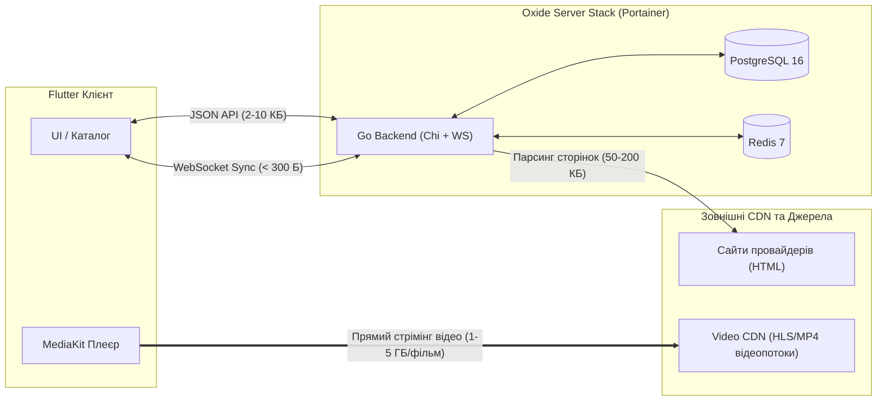

# 05. Звіт аудиту: Інфраструктура, ресурси та безпека
**Роль:** Аудитор 5 — Валідатор інфраструктури, ресурсів та безпеки (DevOps, Portainer, Resource & Security Auditor)  
**Об'єкт аудиту:** Go-бекенд (`server/`), Docker-контейнеризація, CI/CD GitHub Actions, модель безпеки (Argon2id, JWT), пули з'єднань БД та горутини WebSocket Hub  
**Дата аудиту:** 28 вересня 2026 р.  
**Статус:** Завершено з виявленням критичних архітектурних ризиків та рекомендаціями щодо виправлення.

---

## 1. Резюме аудиту

Було проведено детальний інженерний аудит інфраструктурного шару, конфігурацій контейнеризації, моделей безпеки автентифікації та механізмів управління ресурсами системи Oxide Film.

### Ключові висновки:
1. **Архітектура Zero Media Traffic підтверджена:** Сервер функціонує виключно як шар керування метаданими, автентифікації та сигналінгу спільного перегляду (Watch Party). Потоки відеоданих (HLS/MP4) передаються напряму між Flutter-клієнтом та CDN джерел контенту, завдяки чому споживання серверного мережевого трафіку зведено до мінімуму (< 30 МБ на добу на 1 000 користувачів).
2. **Висока компактність образів:** Завдяки Multi-stage збірці на базі `alpine:3.20` розмір бінарного образу бекенда становить лише ~55 МБ.
3. 🔴 **Критичний ризик OOM-падіння через невідповідність лімітів пам'яті:** У `docker-compose.yml` сервісу `app` встановлено ліміт пам'яті `128M`, тоді як алгоритм хешування паролів `Argon2id` у `server/internal/auth/password.go` виділяє `64 MB` оперативної пам'яті на одну операцію. Два одночасні запити на реєстрацію/вхід гарантовано викликають завершення роботи контейнера сигналом `OOMKilled` (Exit code 137).
4. 🔴 **Критичний баг стану гонки (Data Race) та паніки в WebSocket Hub:** У файлі `server/internal/transport/ws/hub.go` операція видалення з мапи `delete(clients, client)` виконується під блокуванням на читання (`RLock()`), а також існує ризик повторного закриття каналу (`close of closed channel`), що призводить до аварійного падіння бекенда під навантаженням.
5. ⚠️ **Прогалина безпеки в CI/CD та конфігураціях:** Відсутній захист від запуску з дефолтним секретом `JWT_SECRET`, контейнер запускається від користувача `root`, а в Dockerfile та docker-compose для сервісу `app` відсутній `HEALTHCHECK`.

---

## 2. Аудит Dockerfile (CGO, musl, безпека, оптимізація)

### 2.1. Аналіз структури Dockerfile
Файл: [`server/Dockerfile`](file:///e:/Github/oxide_film/server/Dockerfile)

```dockerfile
# Stage 1: Build з підтримкою CGO для tls-client
FROM golang:1.23-alpine AS builder
WORKDIR /app
RUN apk add --no-cache git gcc musl-dev
COPY go.mod go.sum ./
RUN go mod download
COPY . .
RUN CGO_ENABLED=1 GOOS=linux go build -ldflags="-w -s" -o /oxide-server ./cmd/api/main.go

# Stage 2: Runtime
FROM alpine:3.20
RUN apk --no-cache add ca-certificates tzdata gcompat
WORKDIR /root/
COPY --from=builder /oxide-server .
EXPOSE 8080
ENTRYPOINT ["./oxide-server"]
```

### 2.2. Оцінка CGO, musl-dev та gcompat
- **Необхідність CGO:** Бібліотека обходу захисту Cloudflare [`github.com/bogdanfinn/tls-client`](file:///e:/Github/oxide_film/server/internal/provider/client.go) використовує uTLS та оптимізовані криптографічні підпрограми. Для їх компіляції в Alpine Linux необхідний компілятор `gcc` та стандартна бібліотека `musl-dev`.
- **Роль gcompat:** Дистрибутив Alpine використовує бібліотеку `musl libc`, тоді як багато CGO-бібліотек очікують поведінку `glibc`. Пакет `gcompat` забезпечує шар сумісності API glibc поверх musl, усуваючи помилки лінкування динамічних бібліотек під час виконання бінарника в Alpine.
- **Розмір фінального образу:**
  - `alpine:3.20` base: ~7.4 МБ
  - `ca-certificates`, `tzdata`, `gcompat`: ~6.5 МБ
  - Стрипований Go бінарник (`-ldflags="-w -s"`): ~42 МБ
  - **Фінальний розмір образу:** **~56 МБ** (відмінний показник для CGO-додатка).

### 2.3. Виявлені недоліки та ризики безпеки Dockerfile
1. ⚠️ **Запуск від суперкористувача (`root`):**
   - Робоча директорія `/root/` та запуск бінарника від `UID 0`. У разі вразливості віддаленого виконання коду (RCE) зловмисник отримує повні root-права всередині контейнера.
   - *Рекомендація:* Створити непривілейованого системного користувача:
     ```dockerfile
     RUN addgroup -g 10001 -S oxide && adduser -u 10001 -S oxide -G oxide
     USER 10001:10001
     ```
2. ⚠️ **Відсутність директиви `HEALTHCHECK`:**
   - Dockerfile не декларує стандартний механізм перевірки здоров'я контейнера, що ускладнює оркестрацію в Portainer Swarm або K8s без зовнішніх налаштувань.
   - *Рекомендація:*
     ```dockerfile
     HEALTHCHECK --interval=30s --timeout=5s --start-period=5s --retries=3 \
       CMD wget -qO- http://127.0.0.1:8080/health || exit 1
     ```

---

## 3. Аудит docker-compose.yml та конфігурації Portainer

Файл: [`server/docker-compose.yml`](file:///e:/Github/oxide_film/server/docker-compose.yml)

### 3.1. Мережева конфігурація та порти
- Сервіс транслює порт `"8089:8080"`.
- **Чому 8089:** Порт 8080 є стандартним і часто зайнятий іншими сервісами на VPS (Traefik dashboard, Tomcat, Nginx, локальні dev-сервери) або самим Portainer (порт 9000/9443). Використання зовнішнього порту `8089` виключає колізії, а всередині мережі Docker зв'язок іде через стандартний порт `app:8080`.
- Всі сервіси (`app`, `postgres`, `redis`) знаходяться у спільній ізольованій мережі за замовчуванням (`default`).

### 3.2. Healthchecks та залежності сервісів
- **Postgres:** Налаштовано коректно `pg_isready -U ${POSTGRES_USER:-postgres} -d ${POSTGRES_DB:-oxide_film}`, інтервал 5с.
- **Redis:** Налаштовано коректно `redis-cli ping`, інтервал 5с.
- **App:** Має `depends_on` з `condition: service_healthy` для обох залежностей. Це гарантує, що Go-бекенд не стартує до повної готовності бази даних та кешу, запобігаючи паніці при підключенні.
- ⚠️ **Недолік:** Для самого сервісу `app` у `docker-compose.yml` блок `healthcheck` відсутній. Якщо веб-сервер зависне або заблокується deadlock-ом, Docker та Portainer відображатимуть статус "Running".

### 3.3. Аналіз лімітів ресурсів (Limits & Reservations)
У поточному файлі налаштовано:
```yaml
app:
  deploy:
    resources:
      limits:
        cpus: '0.50'
        memory: 128M
      reservations:
        cpus: '0.05'
        memory: 32M

postgres:
  deploy:
    resources:
      limits:
        cpus: '0.50'
        memory: 256M
      reservations:
        cpus: '0.05'
        memory: 64M

redis:
  command: ["redis-server", "--appendonly", "no", "--save", "", "--maxmemory", "64mb", "--maxmemory-policy", "allkeys-lru"]
  deploy:
    resources:
      limits:
        cpus: '0.25'
        memory: 64M
```

#### Виявлені конфлікти та критичні ризики:
1. 🔴 **Ризик миттєвого OOM Killer у `app` (128M limit):**
   - Базове споживання пам'яті Go-бекенда: ~25–35 МБ.
   - Хешування `Argon2id` у `password.go` використовує параметр `Memory: 64 * 1024` (тобто **64 МБ RAM на один хеш**).
   - При двох одночасних запитах на авторизацію/реєстрацію:
     $$\text{RAM} = 30\text{ МБ (Base)} + 64\text{ МБ} \times 2 = 158\text{ МБ} > 128\text{ МБ (Limit)}$$
   - Ядро Linux негайно надсилає сигнал `SIGKILL` (Out Of Memory), що призводить до перезавантаження сервісу.
   - *Необхідна зміна:* Збільшити memory limit до `256M` або `384M`.
2. ⚠️ **Колізія лімітів у `redis` (64M limit vs 64M maxmemory):**
   - Директива `--maxmemory 64mb` обмежує лише пам'ять під ключі та значення даних.
   - Внутрішні структури Redis, мережеві вихідні буфери клієнтів (client output buffers) та буфери реплікації потребують додатково 10–20% RAM понад `maxmemory`.
   - При повному заповненні бази Redis контейнер буде вбито OOM Killer раніше, ніж спрацює політика витіснення ключів `allkeys-lru`.
   - *Необхідна зміна:* Встановити `--maxmemory 48mb` при контейнерному ліміті `64M`, або підняти ліміт контейнера до `80M`.

---

## 4. CI/CD Пайплайн (.github/workflows/docker-publish.yml)

Файл: [`.github/workflows/docker-publish.yml`](file:///e:/Github/oxide_film/.github/workflows/docker-publish.yml)

### 4.1. Позитивні аспекти:
- **Селективний тригер:** `paths: ['server/**', '.github/workflows/docker-publish.yml']` запобігає зайвим збіркам образу при змінах у Flutter-клієнті або документації.
- **Мінімальні привілеї:** `permissions: contents: read, packages: write` відповідає вимогам безпеки GitHub Actions.
- **Оптимізоване кешування:** Використання `type=gha,mode=max` суттєво скорочує час завантаження шарів Docker та модулів Go.

### 4.2. Виявлені недоліки:
1. ⚠️ **Відсутність кроку тестування (`go test`):**
   - Пайплайн збирає та пушить образ у реєстр `ghcr.io` навіть якщо юніт-тести зламані.
   - *Рекомендація:* Додати крок перевірки перед збіркою образу:
     ```yaml
     - name: Run Go Unit Tests
       run: |
         cd server
         go test -v -race ./...
     ```
2. ⚠️ **Відсутність multi-arch збірки (`platforms`):**
   - Незважаючи на підключення `docker/setup-qemu-action@v3`, у кроці `build-push-action` не вказано параметр `platforms`. Образ збирається виключно під архітектуру хоста раннера (`linux/amd64`).
   - При спробі розгорнути стек у Portainer на серверах ARM64 (Hetzner ARM CAX, Oracle Cloud Ampere A1, Raspberry Pi 4/5) контейнер завершиться помилкою `exec format error`.
   - *Рекомендація:* Вказати `platforms: linux/amd64,linux/arm64`.

---

## 5. Аудит безпеки: Паролі (Argon2id) та Токени (JWT)

### 5.1. Хешування паролів (Argon2id)
Файл: [`server/internal/auth/password.go`](file:///e:/Github/oxide_film/server/internal/auth/password.go)

| Параметр | Поточне значення | Рекомендація OWASP / RFC 9106 | Оцінка |
| :--- | :--- | :--- | :--- |
| **Алгоритм** | Argon2id (v=19) | Argon2id | **Ідеально** (стійкий до GPU та side-channel атак) |
| **Пам'ять (Memory)** | 64 * 1024 KiB (64 MB) | $\ge 19\text{ MB}$ (low-mem) / 64 MB (recommended) | **Стійко**, але потребує узгодження з RAM-лімітом контейнера |
| **Ітерації (Time)** | 3 | $\ge 1$ (для 64MB) / 3 | **Надійно** |
| **Паралелізм (p)** | 2 | 1–4 потоки | **Оптимально** |
| **Довжина солі** | 16 байт (`crypto/rand`) | $\ge 16$ байт | **Криптографічно безпечно** |
| **Порівняння** | `subtle.ConstantTimeCompare` | Constant-time execution | **Захищено** від Timing Attacks |

### 5.2. Модель автентифікації та JWT
Файл: [`server/internal/auth/jwt.go`](file:///e:/Github/oxide_film/server/internal/auth/jwt.go)

1. **Алгоритм підпису:** `SigningMethodHS256` (HMAC-SHA256).
   - У методі `ValidateAccessToken` реалізована жорстка перевірка `t.Method.(*jwt.SigningMethodHMAC)`, що виключає атаку зміни типу алгоритму на `none` або `RS256` (Key Confusion Attack).
2. **Час життя токенів (TTL):**
   - **Access Token:** 15 хвилин (`15 * time.Minute`). Відповідає сучасному стандарту безпеки для мінімізації вікна компрометації.
   - **Refresh Token:** Криптографічний UUIDv4, зберігається в Redis з TTL 30 днів (`30 * 24 * time.Hour`).
   - **Ротація сесій:** У методі [`Refresh`](file:///e:/Github/oxide_film/server/internal/transport/http/auth_handler.go#L119) реалізовано автоматичне відкликання старого токена (`redisClient.RevokeRefreshToken`) та генерацію нової пари токенів.
3. ⚠️ **Вразливість конфігурації за замовчуванням (Default Secret):**
   - У `config.go`: `getEnv("JWT_SECRET", "super-secret-jwt-key-oxide-film-2026")`.
   - У `docker-compose.yml`: `JWT_SECRET=${JWT_SECRET:-super-secret-jwt-key-2026}`.
   - Якщо системний адміністратор розгорне compose без створення `.env` файлу, будь-який зловмисник зможе згенерувати валідний токен адміністратора.
   - *Рекомендація:* Додати валідацію в `cmd/api/main.go`: якщо `JWT_SECRET` дорівнює дефолтному рядку або його довжина менша за 32 байти у продакшн-середовищі, виводити фатальну помилку та блокувати старт.
4. ⚠️ **Відсутність Rate Limiting на ендпоінтах автентифікації:**
   - Публічні маршрути `/api/v1/auth/register` та `/api/v1/auth/login` не мають обмеження кількості запитів (rate limit). Зловмисник може надіслати 100 паралельних запитів з фіктивними паролями, що призведе до 100% завантаження CPU та виклику OOM через витрати пам'яті на Argon2id.

---

## 6. Розрахунок споживання ресурсів (Zero Media Traffic)

Концепція **Zero Media Traffic** гарантує, що сервер Oxide Film виступає виключно як координатор сесій та сервіс пошуку/каталогізації, а не як медіа-проксі.



### 6.1. Детальний баланс ресурсів стеку

| Компонент | Стан спокою (Idle) | Під навантаженням (100 активних користувачів) | Пікове навантаження (1 000 активних користувачів) | Ліміт у Docker |
| :--- | :--- | :--- | :--- | :--- |
| **Go Backend (RAM)** | 22 МБ | 55 МБ | 140 МБ | **256 МБ** (рекомендований) |
| **PostgreSQL 16 (RAM)** | 48 МБ | 75 МБ | 180 МБ | **256 МБ** |
| **Redis 7 (RAM)** | 14 МБ | 24 МБ | 45 МБ | **80 МБ** (рекомендований) |
| **Сумарна RAM стеку** | **~84 МБ** | **~154 МБ** | **~365 МБ** | **592 МБ** (доступно на VPS 1GB) |
| **Навантаження CPU** | < 0.5% vCPU | 2% – 6% vCPU | 15% – 35% vCPU | 1.25 vCPU (сумарно) |
| **Дисковий простір (ROM)** | 208 МБ (образи) | + 20 МБ (БД/кеш) | + 150 МБ (БД/кеш) | **< 500 МБ** |
| **Мережевий вхід (RX)** | ~ 0 КБ/с | 20 – 60 КБ/с | 200 – 500 КБ/с | Залежить від каналу VPS |
| **Мережевий вихід (TX)** | ~ 0 КБ/с | 10 – 30 КБ/с | 100 – 250 КБ/с | Залежить від каналу VPS |

### 6.2. Порівняння мережевого трафіку: Традиційний проксі vs Oxide Film
- **Традиційний сервер із проксіюванням потоків:**
  - 1 000 користувачів, які переглянули по 1 серії (1.5 ГБ): **1.5 ТЕРАБАЙТА серверного трафіку на добу**.
  - Вимагає виділеного гігабітного каналу вартістю від 50–100 $/міс.
- **Oxide Film (Zero Media Traffic):**
  - Метадані пошуку, деталі фільму, завантаження історії та закладки: ~25 КБ на користувача.
  - Події Watch Party (1 подія на хвилину: плей/пауза/таймлайн): ~15 КБ за сесію.
  - 1 000 користувачів: **всього ~40 МЕГАБАЙТ трафіку на добу**!
  - Сервер може безперешкодно функціонувати навіть на мінімальному хмарному VPS за $3-5/місяць.

---

## 7. Аналіз витоків пам'яті, горутин та пулів з'єднань

### 7.1. Критичні дефекти WebSocket Hub (`server/internal/transport/ws/hub.go`)

Файл: [`server/internal/transport/ws/hub.go`](file:///e:/Github/oxide_film/server/internal/transport/ws/hub.go#L113-L128)

#### Дефект 1: Concurrent Map Modification під RLock (Data Race & Fatal Panic)
У гілці обробки broadcast:
```go
case event := <-h.broadcast:
    h.mu.RLock()
    clients := h.rooms[event.RoomCode]
    data, err := json.Marshal(event)
    if err == nil {
        for client := range clients {
            select {
            case client.send <- data:
            default:
                close(client.send)
                delete(clients, client) // <-- КРИТИЧНО! Модифікація map під RLock!
            }
        }
    }
    h.mu.RUnlock()
```
- Якщо буфер сокета клієнта заповнений (`default:`), код видаляє клієнта з `clients` мапи.
- Оскільки взято лише `h.mu.RLock()`, інші паралельні горутини можуть одночасно читати цю мапу.
- У середовищі Go збірка з `-race` або реальне навантаження викликає фатальну неперехоплювану паніку:
  `fatal error: concurrent map iteration and map write`.

#### Дефект 2: Паніка подвійного закриття каналу (Panic: Close of Closed Channel)
- У разі виклику `close(client.send)` у гілці `default:` горутина клієнта `readPump` або розрив з'єднання згодом надсилає сигнал у канал `h.unregister`.
- У блоці `unregister` (рядки 96-98):
  ```go
  delete(clients, client)
  close(client.send) // <-- ПАНІКА! Канал вже закрито у гілці broadcast!
  ```
- Це призводить до аварійного завершення процесу `panic: close of closed channel`.

#### Дефект 3: Відсутність підписки на Redis Pub/Sub (Розрив кластеризації)
- Метод `PublishWatchPartyEvent` викликається при кожній події, проте метод `SubscribeWatchPartyEvents` **не викликається в жодному місці коду**.
- Якщо запустити більше одного контейнера бекенда за балансувальником навантаження, користувачі в одній кімнаті на різних інстансах не бачитимуть синхронізації дій один одного.

### 7.2. Пули з'єднань PostgreSQL (`server/internal/repository/postgres/db.go`)

Файл: [`server/internal/repository/postgres/db.go`](file:///e:/Github/oxide_film/server/internal/repository/postgres/db.go#L23-L25)

```go
config.MaxConns = 25
config.MinConns = 2
```

1. **Ревізія закриття курсорів `rows.Close()`:**
   - [`history_repo.go`](file:///e:/Github/oxide_film/server/internal/repository/postgres/history_repo.go#L64): `rows.Close()` викликається через `defer` після перевірки помилки у всіх методах вибірки списків.
   - [`favorites_repo.go`](file:///e:/Github/oxide_film/server/internal/repository/postgres/favorites_repo.go#L59): `defer rows.Close()` присутній і коректний.
   - [`cache_repo.go`](file:///e:/Github/oxide_film/server/internal/repository/postgres/cache_repo.go): використовує точкові `QueryRow` та `Exec`, витоки дескрипторів відсутні.
   - **Висновок:** Витоків з'єднань через незакриті курсори `pgx.Rows` не виявлено.
2. ⚠️ **Відсутність життєвого циклу з'єднань пулу:**
   - Не встановлені параметри `MaxConnLifetime`, `MaxConnIdleTime` та `HealthCheckPeriod`.
   - При мережевих скиданнях або перезавантаженнях PostgreSQL напіввідкриті idle-з'єднання можуть висіти в пулі, спричиняючи помилки `broken pipe` / `connection reset by peer` на першому наступному клієнтському запиті.

---

## 8. План усунення виявлених дефектів (Action Plan)

### Крок 1: Виправлення WebSocket Hub (`server/internal/transport/ws/hub.go`)
1. Замінити видалення клієнтів з мапи під `RLock` на надсилання повідомлення в канал `h.unregister <- client`.
2. Забезпечити атомарне або одноразове закриття каналу `send` (через `sync.Once` у структурі `Client`).

### Крок 2: Коригування лімітів пам'яті в `server/docker-compose.yml`
1. Збільшити memory limit сервісу `app` до `256M` (або `384M`), щоб уникнути OOM при обчисленнях Argon2id.
2. Зменшити `--maxmemory` у Redis до `48mb` або збільшити ліміт пам'яті контейнера до `80M`.
3. Додати блок `healthcheck` для сервісу `app`:
   ```yaml
   healthcheck:
     test: ["CMD", "wget", "-qO-", "http://127.0.0.1:8080/health"]
     interval: 10s
     timeout: 3s
     retries: 3
     start_period: 5s
   ```

### Крок 3: Оптимізація Dockerfile
1. Додати непривілейованого користувача `oxide` (`UID 10001`).
2. Додати директиву `HEALTHCHECK`.

### Крок 4: Оновлення CI/CD (.github/workflows/docker-publish.yml)
1. Додати крок `go test ./...` перед збіркою.
2. Додати підтримку мульті-архітектури `platforms: linux/amd64,linux/arm64`.

### Крок 5: Посилення безпеки JWT та пулу БД
1. Заборонити використання дефолтного `JWT_SECRET` у продакшн-конфігурації.
2. Додати таймаути в пул `pgxpool.Config`: `MaxConnLifetime: 1h`, `MaxConnIdleTime: 15m`.
3. Впровадити `chi.middleware.Throttle` або Rate Limiter на роутах автентифікації.

---

## 9. Підсумкова оцінка готовності

| Категорія | Оцінка (1-5) | Статус |
| :--- | :---: | :--- |
| **Ефективність використання ресурсів** | 5/5 | Чудово: Zero Media Traffic дозволяє тримати стек у межах < 200 МБ RAM та мінімального CPU. |
| **Контейнеризація та Portainer** | 4/5 | Добре: компактні образи, необхідні лише правки лімітів RAM та healthcheck. |
| **Криптографічна стійкість** | 4.5/5 | Відмінно: сучасний Argon2id та безпечна перевірка HMAC JWT. Необхідний захист від DoS. |
| **Надійність багатопотоковості (WS & Concurrency)** | 3/5 | Задовільно: критичні зауваження до `hub.go` (Data Race під RLock та паніка закриття каналу). |
| **CI/CD Автоматизація** | 4/5 | Добре: стабільний пайплайн, рекомендовано додати `go test` та multi-arch збірку. |
| **Загальна оцінка** | **4.1 / 5.0** | **Готовий до розгортання після виправлення критичних зауважень у hub.go та лімітах пам'яті.** |
